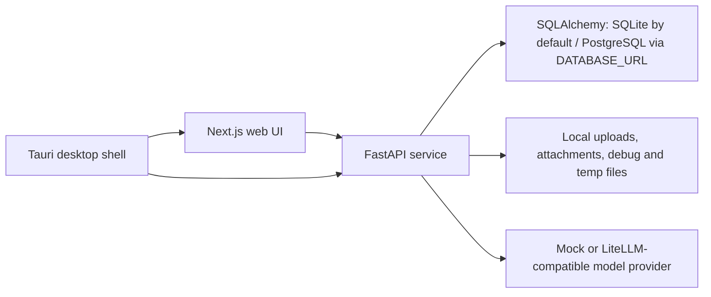

# Architecture

## Monorepo structure

- `apps/web`: Next.js 16 App Router frontend for navigation, plan generation, study dialog, persona/scene editing, Tavern interaction, settings, usage audit, and the global Debug Overlay.
- `services/ai`: FastAPI backend for persistence, document ingestion, OCR, Study Unit cleanup, planning, persona/scene APIs, Study Chat, Tavern orchestration, and debug evidence.
- `packages/shared`: TypeScript contracts consumed by the web application, including Tavern and Harness evidence projections.
- `apps/desktop`: Tauri 2 desktop shell, Rust sidecar integration, bundle scripts, icons, and platform packaging configuration.
- `docs`: implementation-facing architecture, contract, workflow, and user documentation.

## Runtime shape

The product is local-first and has four cooperating runtime boundaries:

- The web frontend and FastAPI backend run separately during development.
- The desktop build packages the exported web surface and Python backend sidecar through Tauri.
- Structured records are database-authoritative. The default database is local SQLite; setting `DATABASE_URL` selects PostgreSQL.
- Uploaded binaries, chat attachments, debug artifacts, and runtime temporary material remain under `services/ai/data/` unless a storage root is configured.
- Planning is deterministic under the mock provider and uses the configured LiteLLM/OpenAI-compatible connection for real model work.

There is no background queue, authentication layer, Live2D runtime, or TTS service in the current repository.

## Core boundaries

### Web

The frontend owns presentation and client-side workflow coordination:

- upload/process/plan/study flows;
- Persona Spectrum and Scene Setup editors;
- Tavern room setup, ordered transcript, target selection, direct/facilitated turns, recovery controls, and bounded history paging;
- snake_case wire-to-camelCase projections;
- request identity, stale-response fencing, and strict response decoding where adopted;
- a global `DebugOverlay` mounted by `apps/web/app/layout.tsx`.

Debug is not a standalone `/debug` route. The overlay reads the current page/debug context and exposes document parsing, plan traces, and related diagnostics without changing routes.

The Learning Workspace is split into:

- page composition in `apps/web/components/learning-workspace.tsx`;
- async orchestration in `apps/web/hooks/use-learning-workspace-controller.ts`;
- reducer transitions in `apps/web/lib/learning-workspace-reducer.ts`;
- pure state helpers in `apps/web/lib/learning-workspace-state.ts`;
- provider-level page-cache persistence in `apps/web/lib/learning-workspace-page-cache.ts`;
- plan-view mapping in `apps/web/lib/plan-panel-data.ts`.

The root layout still mounts `LearningWorkspaceProvider` on every route. Moving that provider down to only its consumers is tracked by `PERF-001`.

Tavern uses a separate client boundary:

- `apps/web/components/tavern-workspace.tsx`: page orchestration and the seven standard Workspace blocks;
- `apps/web/lib/tavern-decode.ts`: fail-closed legacy-v1 Tavern wire decoder;
- `apps/web/lib/tavern-workspace-state.ts`: message/run reconciliation and monotonic state helpers.

This Tavern decoder does not complete repository-wide frontend Harness adoption: other domains still use permissive response normalizers, and Tavern v2/v3 trace forwarding remains open under `HRN-WEB-001`.

### AI service

FastAPI owns application identities, persistence, model orchestration, and authoritative state effects:

- storing document, plan, session, persona, scene, settings, usage, and Tavern records;
- extracting PDF text and invoking OCR fallback;
- cleaning raw Sections into plan-facing Study Units;
- generating planning context and recording model/tool traces;
- compiling teaching and Tavern persona prompts through separate boundaries;
- returning structured citations and Character Events for Study Chat;
- assigning Tavern speakers, schedule order, run lineage, message sequence, and revisions;
- validating and committing Tavern actor output one scheduled speaker at a time.

Model-owned schemas may propose content and bounded effects only. Application IDs, speaker identity, revision, sequence, timestamps, and committed state belong to the service.

### Shared contracts and Harness

`packages/shared` holds frontend-facing contracts for learning records, personas/scenes, Character Events, Tavern aggregates, and Harness evidence. Python Pydantic models remain the backend wire authority.

Harness Engineering is a repository-wide lifecycle, not a Tavern synonym:

1. prepare typed, bounded input;
2. snapshot and digest versioned context;
3. execute an unreliable worker/model;
4. strictly decode a domain proposal;
5. validate invariants;
6. perform bounded recovery;
7. atomically commit validated effects or persist terminal failure evidence;
8. emit trace/eval evidence.

V2/v3 evidence schemas and the v3 context builder are foundations only. No production workflow currently calls `build_harness_context`; non-Tavern component versions intentionally remain placeholders, and Tavern production evidence remains legacy v1 pending a separately tested migration. See `harness-engineering.md` and `harness-schema-ownership.md`.

Learning-plan text uses a stable cross-layer contract:

- `course_title`: textbook-grounded plan header;
- `objective`: learner-authored goal;
- `overview`: summary paragraph;
- `today_tasks`: actionable tasks;
- `schedule[].title`: primary executable directory;
- `schedule[].schedule_chapters[].title`: nested learning chapter directory.

See `plan-text-contract.md` before changing these meanings.

## Main flows

### 1. Document ingestion and cleanup

`POST /documents` stores the upload and creates a document shell.

`POST /documents/{id}/process` or `/process/stream` then runs:

1. PDF text extraction;
2. OCR fallback when extraction is insufficient or forced;
3. raw Section detection and Chunk generation;
4. heuristic cleanup into ordered Study Units;
5. document/debug persistence and stream evidence.

Document and debug writes are still separate operations rather than one atomic Harness commit. This is tracked by `HRN-DOC-001`.

### 2. Plan generation

`GET /documents/{id}/planning-context` exposes cleaned Study Units, detail context, and available planner tools.

`POST /learning-plans` or `/learning-plans/stream` runs:

1. deterministic first-pass construction;
2. model planning when enabled;
3. optional use of the six registered planning tools for detail reads, clarification, completion estimates, Study Unit revision, page text, and multimodal page images; the effective set is filtered by configuration and runtime context;
4. schedule normalization against known Study Units;
5. plan and planning-trace persistence.

The planning proposal/tool boundary and document/debug/trace/plan commit are not yet one v3 Harness transaction. This is tracked by `HRN-PLAN-001`.

### 3. Study interaction

`POST /study-sessions` creates or restores one document/persona/Study Unit scope. `POST /study-sessions/{id}/chat` returns a structured reply, citations, Character Events, and the refreshed session.

The frontend never parses performance instructions out of roleplay text. Character performance remains structured so a future renderer can consume it independently.

Study Session storage still uses aggregate read-modify-write. Tool-driven state effects can also occur before final reply validation, and turn/follow-up writes are not one transaction. Concurrent append and typed effect commit work remains under `AUD-001` and `HRN-STUDY-001`.

### 4. Tavern interaction

Tavern is independent from Study Session and has no textbook/citation requirement.

1. `POST /tavern/rooms` snapshots 1–6 personas and an optional scene into a durable room.
2. `POST /tavern/rooms/{id}/turns` starts a direct or facilitated idempotent run under an expected room revision.
3. The server derives the speaker schedule from participant `display_order`.
4. Each actor reply is strictly decoded and semantically checked before a message is appended.
5. Partial/failed/blocked steps remain durable and can receive a scoped child retry.
6. Lease heartbeat, owner/claim fencing, bounded takeover, resume, and cancel prevent stale workers from committing.

Cancel fences the result and future recovery calls, but the current synchronous provider request may continue until provider timeout. A recent run listing is bounded (default 50) and is not an authoritative retry-chain aggregate.

The browser `Tavern Workspace` implements:

- `Tavern Header`;
- `Tavern Session Panel`;
- `Tavern Setup Panel`;
- `Tavern Conversation Panel`;
- `Participant Roster`;
- `Interaction Composer`;
- `Reliability Details`.

Tavern functional/state checks cover create/direct/facilitated/recovery paths, a populated real-backend wire, composition-event fencing, and a 390px no-overflow inspection. The independent UX release gate remains open for mobile primary-action order, real per-step roster state, terminal replay recovery prominence, and a reproducible device-level IME/viewport pass under `UX-001`.

## Character layer

The structured Character Event protocol reserves:

- `emotion`;
- `action`;
- `intensity`;
- `speech_style`;
- `scene_hint`;
- `line_segment_id`;
- `timing_hint`.

The current frontend renderer is a placeholder adapter. This keeps Study UI, character shell, and debug evidence separable for future Live2D/TTS work.

## Persistence layout

`Database` and SQLAlchemy are authoritative for structured records. Important tables include:

- documents, learning plans, study sessions, personas, persona cards;
- scene setup/library/reusable nodes and session-scene state;
- document debug, planning traces, stream reports, runtime settings, model-tool config, and token usage;
- normalized `tavern_rooms`, `tavern_participants`, `tavern_messages`, `tavern_runs`, and `tavern_run_steps`.

`LocalJsonStore` is a compatibility/database wrapper. It reads and writes database rows but still mirrors several legacy aggregates to JSON through its legacy adapter. New append-heavy domains must not use aggregate `save_list`; Tavern uses its normalized repository instead.

Local files under `services/ai/data/` include:

- `uploads/`: uploaded textbook files;
- `chat_attachments/`: Study Chat attachments;
- `document_debug/`: compatibility/debug artifacts;
- `planning_trace/`: planning traces;
- stream/debug compatibility mirrors;
- `_tmp/`: OCR and runtime temporary files;
- `cache/`: inspectable cache material.

Runtime settings in the configured database are authoritative. A legacy JSON mirror may exist, but deleting only that file does not reset the database record.

## Current constraints and risks

- single-user and no authentication;
- frontend and backend remain separate processes in web development;
- no background queue, Live2D, or TTS runtime;
- OCR cleanup remains heuristic-heavy;
- tool-enabled model calls increase provider latency and timeout pressure;
- legacy Study Session aggregate writes can lose concurrent turns;
- production Harness v3 adoption is incomplete outside schema/context foundations;
- Tavern prompt/token/scene-depth budgets and eval metrics remain open;
- `npm run lint:web` invokes removed Next.js 16 behavior and is tracked by `QG-001`.
