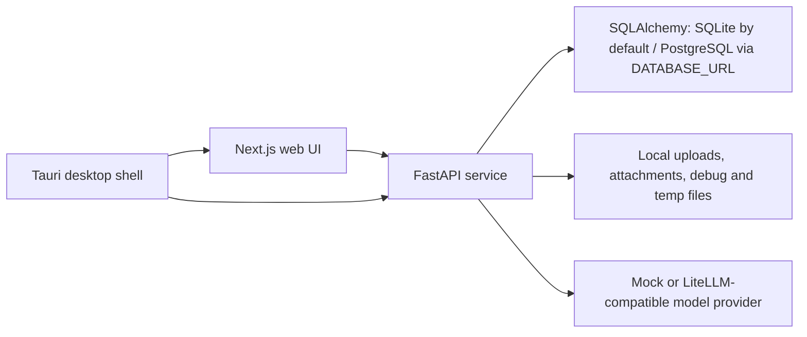

# Architecture

## Monorepo structure

- `apps/web`: Next.js 16 App Router frontend for navigation, plan generation, study dialog, persona/scene editing, Tavern interaction, settings, usage audit, and the global Debug Overlay.
- `services/ai`: FastAPI backend for persistence, document ingestion, OCR, Study Unit cleanup, planning, persona/scene APIs, Study Chat, Tavern orchestration, and debug evidence.
- `packages/shared`: TypeScript contracts consumed by the web application, including Tavern and Harness evidence projections.
- `apps/desktop`: Tauri 2 desktop shell, Rust sidecar integration, bundle scripts, icons, and platform packaging configuration.
- `docs`: implementation-facing architecture, contract, workflow, and user documentation.

## Runtime shape

The product is local-first and has four cooperating runtime boundaries:

- The web frontend and FastAPI backend run separately during development.
- The desktop build packages the exported web surface and Python backend sidecar through Tauri.
- Structured records are database-authoritative. The default database is local SQLite; setting `DATABASE_URL` selects PostgreSQL.
- Uploaded binaries, chat attachments, debug artifacts, and runtime temporary material remain under `services/ai/data/` unless a storage root is configured.
- Planning is deterministic under the mock provider and uses the configured LiteLLM/OpenAI-compatible connection for real model work.

There is no background queue, authentication layer, Live2D runtime, or TTS service in the current repository.

## Application lifecycle

`create_app(settings=...)` builds an application without opening a database.
Its FastAPI lifespan constructs one `Container`, runs explicit startup recovery,
and closes it on exit or startup failure. Container construction configures
logging before database and provider initialization; construction alone does not
run recovery. Closing cancels registered streams and disposes database resources.
Routes resolve the container from `Request.app.state` through `get_container`;
internal orchestration receives it explicitly. Two applications can therefore
use independent databases and runtime settings in one process.

Route tests use instance-level dependency overrides in `tests.support.api`.
`npm run test:ai:lifecycle` separately tests real lifespan and import behavior;
route fault tests do not implicitly initialize the normal runtime database.

## Study Chat application boundary

`StudyChatApplication` owns admission, protected context, attachment staging,
tools/effects, runtime execution and committed receipt read-back. It receives
explicit dependencies and a frozen execution context; HTTP routes parse inputs,
map application errors and project public DTOs. Server-only grading material is
kept in the committed payload and filtered at that public projection boundary.
`StudySessionRepository.commit_chat_operation_turn` remains the single owner of
the atomic Session/Turn/effects/receipt/terminal-trace transaction.

Study decode, application/commit and API projection tests run independently via
`test:ai:study:decode`, `test:ai:study:application` and `test:ai:study:api`.

## Core boundaries

### Web

The frontend owns presentation and client-side workflow coordination:

- upload/process/plan/study flows;
- Persona Spectrum and Scene Setup editors;
- Tavern room setup, ordered transcript, target selection, direct/facilitated turns, recovery controls, and bounded history paging;
- snake_case wire-to-camelCase projections;
- request identity, stale-response fencing, and strict response decoding where adopted;
- a global `DebugOverlay` mounted by `apps/web/app/layout.tsx`.

Debug is not a standalone `/debug` route. The overlay reads the current page/debug context and exposes document parsing, plan traces, and related diagnostics without changing routes.

The Learning Workspace is split into:

- page composition in `apps/web/components/learning-workspace.tsx`;
- async orchestration in `apps/web/hooks/use-learning-workspace-controller.ts`;
- reducer transitions in `apps/web/lib/learning-workspace-reducer.ts`;
- pure state helpers in `apps/web/lib/learning-workspace-state.ts`;
- provider-level page-cache persistence in `apps/web/lib/learning-workspace-page-cache.ts`;
- plan-view mapping in `apps/web/lib/plan-panel-data.ts`.

The root layout still mounts `LearningWorkspaceProvider` on every route. Moving that provider down to only its consumers is tracked by `PERF-001`.

Tavern uses a separate client boundary:

- `apps/web/components/tavern-workspace.tsx`: page orchestration and the seven standard Workspace blocks;
- `apps/web/lib/tavern-decode.ts`: fail-closed Tavern wire decoder with legacy v1/v2 compatibility and strict v3 evidence support;
- `apps/web/lib/tavern-workspace-state.ts`: message/run reconciliation and monotonic state helpers.

Domain-owned fail-closed client boundaries now cover Document, Planning,
Persona/Scene, Study, Tavern, and versioned Document/Planning streams. They bind
response identity, enums, finite numbers, nullability, ordering, ranges,
cross-record references, duplicate IDs, derived projections, and each domain's
operation/recovery versions before rendering. Frontend Decoder registration,
`FRONTEND_REQUEST` evidence and v1/v2/v3 trace routing are implemented. Actual
Study/Tavern HTTP read-back after service restart is covered by decoder tests;
remaining native UI and independent acceptance work is tracked in `TODO.md`.

### AI service

FastAPI owns application identities, persistence, model orchestration, and authoritative state effects:

- storing document, plan, session, persona, scene, settings, usage, and Tavern records;
- extracting PDF text and invoking OCR fallback;
- cleaning raw Sections into plan-facing Study Units;
- generating planning context and recording model/tool traces;
- compiling teaching and Tavern persona prompts through separate boundaries;
- returning structured citations and Character Events for Study Chat;
- assigning Tavern speakers, schedule order, run lineage, message sequence, and revisions;
- validating and committing Tavern actor output one scheduled speaker at a time.

Model-owned schemas may propose content and bounded effects only. Application IDs, speaker identity, revision, sequence, timestamps, and committed state belong to the service.

### Shared contracts and Harness

`packages/shared` holds frontend-facing contracts for learning records, personas/scenes, Character Events, Tavern aggregates, and Harness evidence. Python Pydantic models remain the backend wire authority.

Harness Engineering is a repository-wide lifecycle, not a Tavern synonym:

1. prepare typed, bounded input;
2. snapshot and digest versioned context;
3. execute an unreliable worker/model;
4. strictly decode a domain proposal;
5. validate invariants;
6. perform bounded recovery;
7. atomically commit validated effects or persist terminal failure evidence;
8. emit trace/eval evidence.

Document/OCR/Study Unit, Planning, Persona/Scene, Study and Tavern use production v3 lifecycle boundaries. Frontend strict decoders and all 13 stage eval registrations are implemented. The shared flow is shown in [Harness architecture](harness-architecture.md); remaining acceptance and product work lives only in [TODO](../TODO.md).

Learning-plan text uses a stable cross-layer contract:

- `course_title`: textbook-grounded plan header;
- `objective`: learner-authored goal;
- `overview`: summary paragraph;
- `today_tasks`: actionable tasks;
- `schedule[].title`: primary executable directory;
- `schedule[].schedule_chapters[].title`: nested learning chapter directory.

See `plan-text-contract.md` before changing these meanings.

## Main flows

### 1. Document ingestion and cleanup

`POST /documents` stores the upload and creates a document shell.

`POST /documents/{id}/process` or `/process/stream` then runs:

1. PDF text extraction;
2. OCR fallback when extraction is insufficient or forced;
3. raw Section detection and Chunk generation;
4. heuristic cleanup into ordered Study Units;
5. atomic document/debug projection commit and stream evidence.

Processing first admits a versioned request into the independent
`document_process_operations` journal and marks the Document `processing` in
the same transaction. Cleanup then runs without persisting either projection.
Only after parsing and cleanup succeed are the Document projection, Debug
projection, projection digests, and terminal operation receipt committed in one
database transaction. A failed or interrupted operation records explicit
`not_committed` truth, and startup recovery terminalizes abandoned `running`
operations so a process exit cannot strand the Document indefinitely. JSON
files are best-effort compatibility mirrors after the authoritative database
commit. This atomic boundary has passed independent fault revalidation;
extraction/OCR/cleanup v3 trace, protected replay, and eval remain tracked by
`HRN-DOC-001`.

### 2. Plan generation

`GET /documents/{id}/planning-context` exposes cleaned Study Units, detail context, and available planner tools.

`POST /learning-plans` or `/learning-plans/stream` runs:

1. deterministic first-pass construction;
2. model planning when enabled;
3. optional use of the six registered planning tools for detail reads, clarification, completion estimates, Study Unit revision, page text, and multimodal page images; the effective set is filtered by configuration and runtime context;
4. schedule normalization against known Study Units;
5. one atomic Document/Debug/Planning Trace/Learning Plan commit plus terminal
   operation receipt.

Each of the six Planning tools now decodes a strict v1 argument contract and
projects a strict v1 result. Malformed JSON, extra fields, and wrong primitive
types return a typed field path without executing the tool. Final model output
decodes as `LearningPlanProposalV1`; it contains only content and allowed Study
Unit/Section references, never plan/schedule/chapter IDs, revision, state, or
timestamps. One bounded repair is allowed. The application assigns committed
schedule/chapter IDs and rejects unknown/duplicate Study Unit references,
out-of-range chapters/slices, unordered anchors, and unknown Section refs
instead of silently dropping them.

Every plan-generation intent now carries a stable client request ID and, for a
document-backed plan, the expected Document `updated_at` watermark. The
`learning_plan_operations` journal admits one active operation per Document,
records provider start plus Document/Debug base digests, and commits the revised
Document, matching Debug projection, Planning Trace, Learning Plan, and
versioned committed snapshot in
one database transaction. Duplicate requests read the original committed
snapshot; payload drift, active siblings, stale Document state, and missing
Debug prerequisites fail closed. Startup recovery terminalizes abandoned work,
and compatibility JSON files are mirrored only after the authoritative commit.
This ownership and atomic-commit boundary has passed independent schema/fault
revalidation. It is not v3 operation evidence; protected replay and workflow
adoption remain tracked by `HRN-PLAN-001`.

### 3. Scene generation and saves

`POST /scene-setup/generate` decodes model output only as strict
`scene-tree-proposal-v1`. The proposal contains bounded content, tags, a
zero-based selected path, and optional allow-listed reusable-node references;
it cannot contain layer/object/reuse IDs, revisions, timestamps, or persistence
state. Depth, layer/object counts, per-node children, selected path, primitive
types, extra fields, and total text budget fail closed. After validation the
application resolves authorized reusable references and assigns every committed
layer, object, and reuse identity.

User-authored `PUT /scene-setup` and Scene Library create/update requests use a
separate strict `scene-committed-save-v1` DTO. It requires application IDs plus
an `expected_revision`, validates global ID uniqueness and selected/collapsed
references, and never accepts a caller-authored Scene Profile. The service
rebuilds that profile from the validated tree and commits through row CAS;
stale editors receive `409 scene_revision_conflict`. Legacy records decode with
revision `0`, and migration `20260824_0011` adds authoritative revision columns.
This ownership/CAS slice has passed independent model-wire, public-save, and
concurrency revalidation. Protected context/replay, v3 traces, and eval remain
tracked by `HRN-SCENE-001`.

### 4. Study interaction

`POST /study-sessions` creates or restores one document/persona/Study Unit scope. `POST /study-sessions/{id}/chat` returns a structured reply, citations, Character Events, and the refreshed session.

The frontend never parses performance instructions out of roleplay text. Character performance remains structured so a future renderer can consume it independently.

Study Session persistence is database-authoritative and uses a per-session revision CAS with bounded retry. Turns carry application-owned IDs plus a contiguous session-local sequence; legacy aggregate turns receive deterministic compatibility identities when decoded, while partial legacy identities fail closed. All Session reads validate row/payload projections. Legacy list import inserts only absent records and rejects same-ID divergence, so it cannot replace runtime state or delete siblings. Committed Turn identity/content is prefix-immutable except for the dedicated interactive-answer fields. Concurrent turn, follow-up, memory, affinity, confirmation, and projected-PDF updates no longer overwrite a stale whole-session list.

Interactive questions now separate strict model proposal, private committed grading spec, public prompt/result projection, and durable Attempt identity. Unanswered API payloads expose only the question/options/callback flag; answer keys, accepted answers, normalization rules, and explanation remain inside the private Session record. `POST /study-sessions/{id}/attempt` accepts only Turn ID, expected Session revision, stable client attempt ID, and submitted answer. The server applies the versioned Unicode/case/whitespace policy, then commits the result and `study_question_attempts` receipt in the same database transaction. Same identity + same normalized answer is an idempotent read-back; identity/payload drift, a second attempt identity for the same Turn, cross-Session targeting, stale revision, and partial commit fail closed. Historical aggregate questions migrate during internal decode, while historical `study-chat-exchange-v1` payloads retain their original digest and are independently projected through the current redacted API DTO; new Chat operation payloads use `study-chat-exchange-v2`.

The UI does not present a verdict before persistence. Each Turn owns a local submitting/failed state; after the narrow Attempt response, the browser reads the current Session and requires the exact attempt/Session/Turn/before+committed revision/result projection before displaying “recorded.” Concurrent answers on different Turns are fenced at read-back: a late lower-revision response cannot replace a newer Session snapshot, a valid append-only Turn suffix is accepted, committed Turn-prefix content cannot drift outside answer state, and a response for a Session that is no longer active is not applied to the current view. Automatic continuation is built from the committed result rather than a browser verdict. A failed request preserves the answer and reuses the same attempt identity.

Study Chat adds a separate durable operation-admission boundary above the Session CAS. Both plain and attachment chat requests carry a stable browser-owned `client_request_id` plus `expected_session_revision`. Before provider work or attachment file writes, the backend stores a versioned canonical request fingerprint and attachment manifest in `study_chat_operations`; same-key payload/revision drift fails closed. Request v2 derives attachment/file identities and an operation-owned staging path from operation + input slot. Committed read-back verifies the Turn attachment projection and staged file digest, while terminal non-commit recovery can clean the fixed directory after a restart; request v1 remains readable as historical compatibility. Duplicate committed requests and `GET /study-sessions/{id}/chat-operations/{client_request_id}` read the original terminal receipt instead of invoking the model again. The receipt state machine is `admitted` / `running` / `committed` / `not_committed` / `uncertain`: only an execution-free `not_committed` operation can be safe to retry, while ambiguous or active operations must be queried under their original identity. `provider_started_at` is persisted before model/provider execution; because provider idempotency/read-back is unsupported, an ambiguous outcome after that point remains `uncertain` and cannot be reclaimed. A committed receipt binds its result to the committed Session revision and Turn identity/watermark.

The typed database-effect slice now covers memory, affinity, follow-up create/complete/cancel, projected-document/image set/focus/overlay/clear, and the two plan-confirmation tools. One discriminated proposal union feeds a single append-only operation batch, so every Session database effect shares global slots and `(operation, slot)`-derived identities. Memory, affinity, follow-up, and projected-state reads overlay the authoritative Session with all earlier prepared slots, giving the model read-your-writes without changing persisted state. Tool results explicitly report `effect_state=prepared` and `committed=false`; learner-message cancellation is prepared before model tools, so a newly scheduled follow-up is not accidentally canceled by the same request.

Before commit the server revalidates the complete batch identity, slots, adapter/contract versions, Session/Plan/Scene targets, schedule membership, and attachment projection source membership. It then applies Session slots with the final validated Turn, Session revision, operation receipt, durable effect-journal terminalization, and terminal v3 trace in one database transaction; Scene replacement adds row CAS plus an exact committed Scene snapshot/read-back in that boundary. Any adapter, validation, CAS, or response-build failure rolls the transaction back. Replayed committed operations read the original receipt rather than applying effects again. Attachment files use operation-owned staging, bounded cleanup/compensation, and committed digest read-back. Provider-generated artifacts retain a separate external failure boundary, and a generated-image tool result is explicitly `completed_uncommitted` until the final Session commit. The operation-scoped protected snapshot is authorized and resolved before the single provider call, and the complete reply, citations, Character Events, and nested tool payloads pass the strict v3 adapter. The operation commit policy proves only the Session/Turn primary output; it does not claim every Scene, file, or provider effect. Provider ambiguity remains `uncertain`.

### 5. Tavern interaction

Tavern is independent from Study Session and has no textbook/citation requirement.

1. `POST /tavern/rooms` snapshots 1–6 personas and an optional scene into a durable room.
2. `POST /tavern/rooms/{id}/turns` starts a direct or facilitated idempotent run under an expected room revision.
3. The server derives the speaker schedule from participant `display_order`.
4. Each actor reply is strictly decoded and semantically checked before a message is appended.
5. Partial/failed/blocked steps remain durable and can receive a scoped child retry.
6. Lease heartbeat, owner/claim fencing, bounded takeover, resume, and cancel prevent stale workers from committing.

Cancel fences the result and future recovery calls, but the current synchronous provider request may continue until provider timeout. A recent run listing is bounded (default 50) and is not an authoritative retry-chain aggregate.

The browser `Tavern Workspace` implements:

- `Tavern Header`;
- `Tavern Session Panel`;
- `Tavern Setup Panel`;
- `Tavern Conversation Panel`;
- `Participant Roster`;
- `Interaction Composer`;
- `Reliability Details`.

Tavern functional/state checks cover create/direct/facilitated/recovery paths, authoritative roster/retry derivation, structured recovery/error transport, composition-event fencing, keyboard focus return, and a 390px no-overflow inspection. Recovery lineage, provider-call fencing, mutation errors, badges, and real per-step states have passed a non-implementer live browser/wire matrix. `UX-001` remains open for the no-Persona/no-Room viewport, device-level IME, full focus order, and a fresh 390×844 device-level visual/touch measurement; completed 44px static contracts do not substitute for that device measurement.

## Character layer

The structured Character Event protocol reserves:

- `emotion`;
- `action`;
- `intensity`;
- `speech_style`;
- `scene_hint`;
- `line_segment_id`;
- `timing_hint`.

The current frontend renderer is a placeholder adapter. This keeps Study UI, character shell, and debug evidence separable for future Live2D/TTS work.

## Persistence layout

`Database` and SQLAlchemy are authoritative for structured records. Important tables include:

- documents, document process operations, learning plans, study sessions, personas, persona cards;
- scene setup/library/reusable nodes and session-scene state;
- document debug, planning traces, stream reports, runtime settings, model-tool config, and token usage;
- normalized `tavern_rooms`, `tavern_participants`, `tavern_messages`, `tavern_runs`, and `tavern_run_steps`.

`LocalJsonStore` is a compatibility/database wrapper. It reads and writes database rows but still mirrors several legacy aggregates to JSON through its legacy adapter. New append-heavy domains must not use aggregate `save_list`; Tavern uses its normalized repository instead.

Local files under `services/ai/data/` include:

- `uploads/`: uploaded textbook files;
- `chat_attachments/`: Study Chat attachments;
- `document_debug/`: compatibility/debug artifacts;
- `planning_trace/`: planning traces;
- stream/debug compatibility mirrors;
- `_tmp/`: OCR and runtime temporary files;
- `cache/`: inspectable cache material.

Runtime settings in the configured database are authoritative. A legacy JSON mirror may exist, but deleting only that file does not reset the database record.

## Current constraints and risks

- single-user and no authentication;
- frontend and backend remain separate processes in web development;
- no background queue, Live2D, or TTS runtime;
- OCR cleanup remains heuristic-heavy;
- tool-enabled model calls increase provider latency and timeout pressure;
- Document processing has durable admission, atomic Document/Debug projection commit, digest read-back, and startup recovery, and v3 evidence for extraction/OCR/cleanup stages;
- Study Chat has production v3 context, trace, protected replay, deterministic eval, durable request admission, transactional Session/Scene database effects, and operation-owned attachment staging/read-back, while provider uncertainty remains explicit;
- current production lifecycle coverage is shown in `harness-architecture.md`; deterministic implementation gates do not certify independent quality or every platform;
- Tavern prompt/token/scene-depth budgets and deterministic evals are enforced; representative provider performance and billing acceptance remain in `TODO.md`;
- `npm run check` runs shared/Web reliability and type gates; `npm run check:release` adds the full backend suite and production Web build. `npm run lint:web` is only a compatibility alias.

## Planned changes

The next incremental releases are planned in [Architecture refactor](plans/architecture-refactor.md) and [Unified diagnostics](plans/unified-debug.md). These plans are not implemented behavior in 0.3.0.
