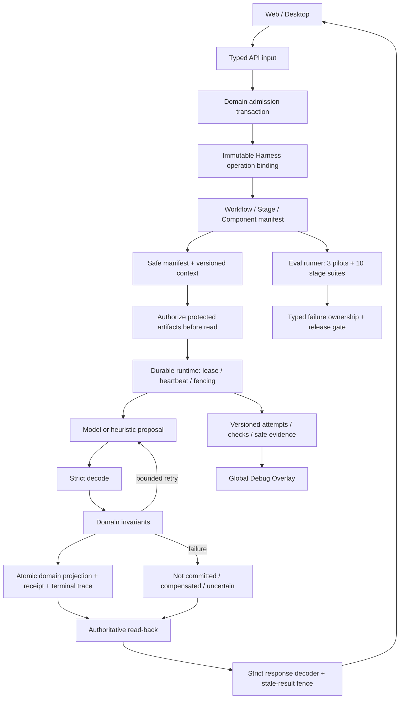
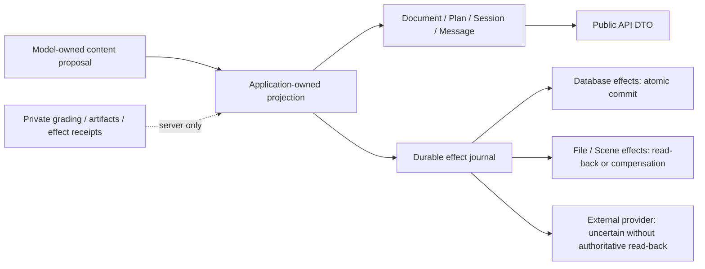

# Harness 架构

Harness 是跨工作流的可靠性边界。当前生产实现覆盖 Document/OCR/Study Unit、Planning、Persona/Scene、Study 和 Tavern；前端对响应和历史 trace 严格解码。剩余工作统一见 [TODO](../TODO.md)，工程不变量见 [AGENTS](../AGENTS.md)。

The model does not allocate committed IDs, revisions, ordering, timestamps or
effect receipts. Commit proof is scoped to a registered operation projection;
Study Session/Turn and Tavern Message policies prove their primary output, not
every external side effect. Historical v1/v2 evidence stays read-only. Content
digests provide integrity, not authorization or replay availability.

| Boundary | Source of truth |
| --- | --- |
| Stage routing and registrations | `services/ai/app/models/harness_manifest.py`, `packages/shared/src/harness-manifest.ts` and shared golden fixtures |
| Admission, claims and terminal records | `services/ai/app/persistence/harness_operation_repository.py`, `harness_runtime_repository.py` |
| Runtime lifecycle and shared execution | `services/ai/app/services/harness_runtime.py`, `harness_broad_adoption.py` |
| Domain proposal/runtime DTOs | `services/ai/app/models/persona_generation.py`, `scene_generation.py`, `document_processing.py`, `planning_runtime.py` |
| Domain adapters | `services/ai/app/services/persona_harness_adapter.py`, `scene_harness_adapter.py`, `document_harness_adapter.py`, `planning_harness_adapter.py` |
| Transaction finalize port | `services/ai/app/models/harness_runtime_commit.py`; domain repositories own the Session and the atomic commit |
| Protected artifacts and effects | `services/ai/app/persistence/harness_artifact_repository.py`, `harness_effect_repository.py` |
| Model / committed / API ownership | Domain model modules and `packages/shared/src/`; repository-wide rules in `AGENTS.md` |
| Eval execution | `services/ai/app/services/harness_eval_runner.py`, `harness_stage_evals.py` |
| Performance limits | [Performance budgets](performance-budgets-v1.md) and `services/ai/app/models/harness_performance.py` |

Run `npm run eval:harness:pr` for all 13 suites, `npm run eval:harness:stages --
--output-dir /tmp/harness-stage-eval` for stage reports, and
`npm run test:acceptance:recovery-limits` for crash/size regression coverage.
`npm run check:release` is the full release gate. Deterministic regression
results do not certify independent model quality.

`HarnessProposalRuntimeService` retains the versioned manifest route anchors and
delegates to domain-owned adapters. DTOs and contract constants live in models;
Document/Planning repositories depend on `HarnessTransactionFinalizer`, not the
application runtime. Its read-back/finalize/failure methods all receive the
existing domain Session; the port exposes no transaction factory.

`npm run test:ai:harness:contracts` checks the four domain schema/constant
baselines and persistence import boundary without a database or provider;
`npm run test:ai:harness:commit` separately runs operation binding and atomic
commit/failure tests. Existing manifest/golden fixtures and trace versions are
unchanged by this relocation.
