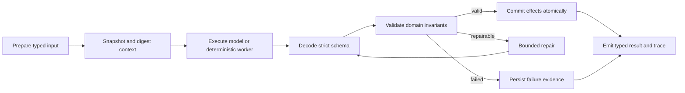

# Harness Engineering

## Scope

Harness engineering is a repository-wide reliability discipline. Tavern interaction is the first new workflow to adopt the contract from its initial schema, but the same lifecycle must progressively cover:

- document extraction, OCR fallback, cleanup, and Study Unit arrangement;
- learning-plan prompt assembly, tool execution, strict parsing, and persistence;
- persona and scene generation;
- study chat, tool effects, citations, memory, and Character Events;
- Tavern speaker scheduling, actor generation, and message commit;
- frontend response decoding, request ordering, recovery, and debug reporting.

The harness is not one prompt and not one validator. It is the versioned boundary around an unreliable or stateful operation.

## Canonical lifecycle

Every adopted workflow should make these concerns explicit:

1. typed, bounded input owned by the application;
2. versioned prompt/parser/heuristic and stable context snapshot;
3. strict output schema with application-owned identity and IDs;
4. deterministic invariant checks after parsing;
5. bounded recovery with a named strategy and attempt ceiling;
6. state effects proposed before validation and committed only after validation;
7. an observable trace suitable for debug replay and regression evaluation;
8. idempotency, optimistic revision checks, or a transactional append boundary where writes occur.

## Shared evidence schema

Python: `services/ai/app/models/harness.py`

TypeScript: `packages/shared/src/harness.ts`

The wire contract has three deliberate versions:

- `HarnessTraceV1` is the legacy Tavern validation summary. Its historical `version` combines policy and prompt information, and it has no trace identity or commit evidence. It remains readable but must not be described as replay-complete.
- `HarnessTraceV2` is the first strict evidence envelope and remains frozen for compatibility. It has trace/operation/parent identity, independent output-contract and named context-component/policy/prompt versions, snapshot references, ordered attempt records, output digest, terminal error, explicit commit/rollback evidence, and an RFC 3339 UTC start/completion interval.
- `HarnessTraceV3` preserves the v2 lifecycle fields while requiring `HarnessContextEnvelopeV3`: a closed workflow/stage pair, registered component set, typed subject/snapshot references, service-owned operation ID, named input/context/digest contracts, and a trace-visible context digest that validators recompute. V3 is the target for future workflow adoption; it does not rewrite historical v2 evidence.

Unknown explicit trace-schema versions are rejected. Missing `trace_schema_version` means legacy v1; old records are not assigned invented v2/v3 identities, timestamps, attempts, or commit claims. New workflow integrations should emit v3, while the existing Tavern production path remains v1 until a separate runtime migration is tested.

`HarnessContextEnvelope` is the already-registered v2 wire shape and remains unchanged. `HarnessContextEnvelopeV3` adds the stronger context foundation. Its input and snapshot digests are computed only over explicit `HarnessSafeManifest` DTOs whose exact fields have been reviewed; `Any`, open maps/objects, unordered sets, formatted/path-like values, and secret-bearing field names are rejected. Full hidden prompts, textbook/OCR source text, user guidance, transcripts, credentials, file paths, filenames, and attachments belong in protected artifacts, never in trace-visible manifests. `HarnessProposalEnvelope` is metadata only: each workflow still requires its own strict proposal DTO.

`app.services.harness_context.build_harness_context` is the v3 workflow-neutral construction boundary. It selects a closed `(workflow, stage)` registry, fills required component versions, canonicalizes references, and returns only a trace-safe evidence envelope. Placeholder component versions intentionally block Document/OCR/Study Unit/Planning/Persona/Scene/Study Chat/frontend adoption until their owning modules publish truthful versions. Tavern has registered names for fixture validation, but its production path still emits v1 and is not thereby migrated.

The builder establishes integrity identity, not replay availability. `HarnessSnapshotRefV3` is only an integrity reference until `HRN-CTX-ARTIFACT-001` provides an authorized, immutable, retention-aware resolver with typed missing/expired/forbidden/digest-mismatch outcomes. SHA-256 detects changes; it does not provide confidentiality, and low-entropy secrets must not be hashed into public evidence. Python backend code is currently the sole canonical digest authority. TypeScript consumes wire evidence but does not generate canonical digests; browser support would require an explicit shared canonical-bytes specification and cross-language vectors.

Resource identity is not evidence by itself. Each closed `HarnessResourceType` needs a machine-readable policy that separately states whether context freshness requires an authoritative resource revision and whether commit evidence is revision-based, append-sequence-based, or unsupported until migration. A missing revision must not be replaced by a constant `0`; a parent aggregate revision must not be attached to an embedded `Study Unit` or page as though it were that resource's own revision. Until `SCH-HRN-REV-001` lands, v3 business-flow adoption is blocked on this ambiguity even though fixtures can instantiate the context schema.

Protected artifact policy is similarly explicit:

- an artifact ID is opaque, immutable, scoped to an authorized subject, and bound to a versioned contract and digest;
- authorization is checked before content is read, and retention/expiry is part of the resolver result;
- read-back recomputes the digest and returns typed `resolved`, `not_found`, `expired`, `forbidden`, `digest_mismatch`, or `schema_unsupported` evidence;
- trace-visible refs never contain source text, prompts, transcript content, file paths, credentials, or other secrets;
- `document_debug` and `planning_trace` are inspectable, removable caches, not durable replay artifacts.

The implementation route is `resource evidence registry -> operation/stage vocabulary -> protected artifact resolver -> workflow-neutral operation runtime -> per-domain adoption`. `HRN-CTX-001` tracks completion of that whole rollout; it is not a circular prerequisite that prevents individual domains from using the runtime primitives as they become available.

Workflow-specific policies remain in their domain schema. For example, Tavern limits participant messages and checks cross-speaker impersonation, while document parsing checks page coverage, extraction density, OCR availability, and Study Unit bounds.

See `harness-schema-ownership.md` for the workflow ownership registry, nullability rules, proposal boundaries, and compatibility policy.

## Adoption matrix

| Workflow | Existing reliability pieces | Missing harness boundary |
|---|---|---|
| Document parsing | OCR fallback, warnings, debug record | versioned checks, stage traces, replay fixtures, performance budgets |
| Planning | strict-ish JSON, model recovery records, tool trace | true JSON schema validation, effect boundary, unified trace, eval matrix |
| Persona/scene generation | Pydantic normalization, retry | prompt/version digest, semantic invariants, regression fixtures |
| Study chat | reply recovery, tool trace, citations | transactional tool-effect proposals, request revision/idempotency, strict decoder |
| Tavern | normalized room/run/step schema, low-trust persona compiler, strict actor decode, server-owned scheduler, semantic checks, bounded recovery trace, per-actor commit, partial state, scoped child retry, leased resume/cancel fencing, strict browser v1 decode | v3 runtime/artifact migration, total prompt budget, authoritative retry-chain view, eval matrix |
| Frontend API | Tavern fail-closed decoder, request/room fencing, monotonic terminal reconciliation | repository-wide runtime decoders, timeout/cancel semantics, trace forwarding |

## User-facing transparency

Ordinary UI should show concise recovery state, not raw codes or prompts:

- passed: no interruption or a low-noise checked indicator;
- repaired: explain that one response was corrected and allow details to expand;
- failed: preserve user input, name the failed stage, and offer a scoped retry;
- debug: show check codes, versions, digests, attempts, durations, and raw trace excerpts.

Harness self-checks are evidence, not a promise that content is objectively correct.

## Evaluation and release gates

Each workflow must add fixtures for malformed schemas, boundary violations, retry exhaustion, duplicate requests, concurrency, and state-commit failure. CI should report at least:

- schema-valid rate before and after repair;
- recovery and failure rates;
- state-commit consistency;
- p50/p95 stage duration;
- workflow-specific accuracy, grounding, or identity-consistency metrics.

No workflow should be described as harnessed until its failure path and protected artifact replay/evaluation path are tested, not merely its happy-path prompt or its ability to instantiate a v3 context fixture.

The matrix records incremental adoption, not a Tavern-only rollout. A completed Tavern slice or the existence of the v2/v3 evidence schemas does not change the status of parsing, planning, persona/scene generation, Study Chat, or frontend decoding; each remains open until its own effect, failure, and replay boundaries pass the same rubric.

Tavern's `context_digest` is one domain-specific implementation of the snapshot step: it covers room title, scene, harness policy, roster order, and participant prompt hashes, while `terminal_sequence` and room revision cover transcript and mutation drift. Other workflows must define their own versioned context envelope rather than reusing Tavern fields or treating one digest function as a universal answer.

The current production Tavern records still carry legacy v1 traces. Lease recovery, cancel fencing, strict frontend decode, or a field named `context_digest` do not change that version statement. V3 adoption closes only when protected snapshots, resource evidence, v3 attempt/commit traces, compatibility decoding, and eval fixtures are emitted by the real Tavern path.
