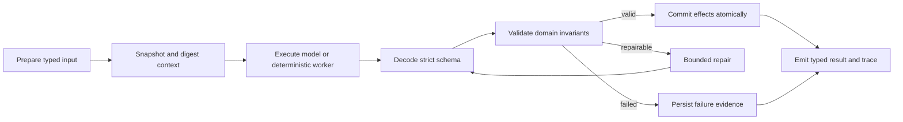

# Harness Engineering

## Scope

Harness engineering is a repository-wide reliability discipline. Tavern interaction is the first new workflow to adopt the contract from its initial schema, but the same lifecycle must progressively cover:

- document extraction, OCR fallback, cleanup, and Study Unit arrangement;
- learning-plan prompt assembly, tool execution, strict parsing, and persistence;
- persona and scene generation;
- study chat, tool effects, citations, memory, and Character Events;
- Tavern speaker scheduling, actor generation, and message commit;
- frontend response decoding, request ordering, recovery, and debug reporting.

Active dependencies, claimable tasks, evaluation milestones, and production
adoption gates are maintained only in `harness-roadmap.md`.

The harness is not one prompt and not one validator. It is the versioned boundary around an unreliable or stateful operation.

## Canonical lifecycle

Every adopted workflow should make these concerns explicit:

1. typed, bounded input owned by the application;
2. versioned prompt/parser/heuristic and stable context snapshot;
3. strict output schema with application-owned identity and IDs;
4. deterministic invariant checks after parsing;
5. bounded recovery with a named strategy and attempt ceiling;
6. state effects proposed before validation and committed only after validation;
7. an observable trace suitable for debug replay and regression evaluation;
8. idempotency, optimistic revision checks, or a transactional append boundary where writes occur.

## Shared evidence schema

Python: `services/ai/app/models/harness.py`

TypeScript: `packages/shared/src/harness.ts`

The wire contract has three deliberate versions:

- `HarnessTraceV1` is the legacy Tavern validation summary. Its historical `version` combines policy and prompt information, and it has no trace identity or commit evidence. It remains readable but must not be described as replay-complete.
- `HarnessTraceV2` is the first strict evidence envelope and remains frozen for compatibility. It has trace/operation/parent identity, independent output-contract and named context-component/policy/prompt versions, snapshot references, ordered attempt records, output digest, terminal error, explicit commit/rollback evidence, and an RFC 3339 UTC start/completion interval.
- `HarnessTraceV3` preserves the v2 lifecycle fields while requiring `HarnessContextEnvelopeV3`: a closed workflow/stage pair, registered component set, typed subject/snapshot references, service-owned operation ID, named input/context/digest contracts, and a trace-visible context digest that validators recompute. V3 is the target for future workflow adoption; it does not rewrite historical v2 evidence.

Unknown explicit trace-schema versions are rejected. Missing `trace_schema_version` means legacy v1; old records are not assigned invented v2/v3 identities, timestamps, attempts, or commit claims. New workflow integrations should emit v3, while the existing Tavern production path remains v1 until a separate runtime migration is tested.

`HarnessContextEnvelope` is the already-registered v2 wire shape and remains unchanged. `HarnessContextEnvelopeV3` adds the stronger context foundation. Its input and snapshot digests are computed only over explicit `HarnessSafeManifest` DTOs whose exact fields have been reviewed; `Any`, open maps/objects, unordered sets, formatted/path-like values, and secret-bearing field names are rejected. Full hidden prompts, textbook/OCR source text, user guidance, transcripts, credentials, file paths, filenames, and attachments belong in protected artifacts, never in trace-visible manifests. `HarnessProposalEnvelope` is metadata only: each workflow still requires its own strict proposal DTO.

`app.services.harness_context.build_harness_context` is the v3 workflow-neutral construction boundary. It accepts an admitted `HarnessOperationBindingV1`, derives the operation ID from that binding, selects the exact executable workflow-manifest entry, fills required component versions, canonicalizes references, and returns only a trace-safe evidence envelope. Arbitrary caller-supplied operation strings are not accepted. Component registrations without an audited contract use explicit `null`, so context construction fails; a `pending-*` string is not treated as a version. Tavern has registered names for fixture validation, but its production path still emits v1 and is not thereby migrated.

`HARNESS_WORKFLOW_MANIFEST` is the versioned governance layer over the closed operation-stage registry. Every stage has one exact entry containing owner module/adapter, input/proposal/output contracts, component contracts, prompt/policy/toolset slots, attempt ceiling, provider/tool/token/time budgets, artifact/effect allowlists, commit-policy key, decoder route, eval route, and eval-suite registrations. A slot is explicitly `registered`, `not_applicable`, or `unregistered`; unknown, placeholder, missing, or inconsistent values fail closed. Only the narrow Tavern actor foundation is currently executable, and its eval suites remain explicitly unregistered. A manifest entry is routing/configuration evidence, not production-adoption evidence.

Durable Harness identity is allocated at the same database admission transaction as the domain operation. `harness_operation_bindings` is an append-only, server-owned one-to-one map for Document processing, Learning Plan generation, Study Chat, and Tavern Run operations. The four domain rows carry a unique immutable foreign identity, and database/application guards reject route forgery, cross-domain rebinding, duplicate admission, or binding mutation. Context, terminal state, Tavern parent/child lineage, artifact grants, and eval samples use this admitted identity; provider `tool_call_id` never does. Legacy rows remain typed `legacy_unbound` and are terminalized without provider execution or an invented ID. If product retention later deletes a domain row, the immutable binding remains as the admission tombstone; domain lookup returns `not_found` while lookup by Harness ID retains the original mapping.

`HarnessStage` names a domain operation boundary, while `HarnessAttemptPhase` names work inside one stage. Page extraction, Section detection, chunk building, and one planning tool call are stages because each has its own producer, failure boundary, timing, and evaluation route. Generate/decode/validate/repair/commit/rollback remain attempt phases; `page_parsed`, `sections_built`, `model_tool_call`, and similar NDJSON values are stream event types. They must not be promoted to stages. The machine-readable operation-stage registry is shared through `packages/shared/fixtures/harness/operation-stage-registry-v1.json`; its eval routes are stable routing keys for the future eval runner, not evidence that those eval suites already exist.

The current registered algorithm contracts for page extraction, Section detection, chunk building, the planning tool catalog, and its runtime identify the reviewed application behavior. They do not encode the installed PyMuPDF/OCR/model package version, which belongs in a typed context or protected snapshot. `ToolManifestRegistry/tool-manifest-v1` is the single catalog for all six Planning and thirty-one Study tools. Each stage-qualified entry binds ownership, strict input/result DTOs, provider schema digest, ordered effect boundary, sensitivity/projection policy, call/size/timeout budgets, serial execution policy, dependencies, capabilities, aliases, and retirement replacement. Provider schemas and Python/TypeScript projections are checked against one golden catalog. Runtime calls are strictly decoded and result-adapted, operation/round call ceilings are enforced, parallel provider calls are disabled, and protected Planning content is returned to the model only through the provider projection while trace/public evidence stays content-free or redacted. This strict tool boundary does not make Planning or Study v3-adopted.

The builder establishes integrity identity, not replay availability. `HarnessSnapshotRefV3` becomes replayable only when its workflow registers protected content with the authorized, immutable, retention-aware resolver and resolves the exact operation-scoped grant. The resolver returns typed missing/expired/forbidden/digest-mismatch outcomes. SHA-256 detects changes; it does not provide confidentiality, and low-entropy secrets must not be hashed into public evidence. Python backend code is currently the sole canonical digest authority. TypeScript consumes wire evidence but does not generate canonical digests; browser support would require an explicit shared canonical-bytes specification and cross-language vectors.

Resource identity is not evidence by itself. `HARNESS_RESOURCE_EVIDENCE_POLICIES` is the closed, machine-readable registry for resource semantics plus context, commit, and rollback capabilities. Its Python and TypeScript projections are checked against one shared golden JSON registry. Context subjects fail closed unless their policy has an implemented freshness proof. `not_committed` may still name any closed resource as an attempted target because that is intent evidence, not a successful write claim; `committed` requires its registered revision or single-message sequence proof, and v3 `rolled_back` remains unavailable until a resource registers read-back or compensation proof. A missing revision must not be replaced by a constant `0`, and a parent aggregate revision must not be attached to a Study Unit or page as though it were that resource's own revision.

The first supported resource evidence is deliberately narrow:

- `tavern_room` is a revisioned control aggregate. Its revision covers room metadata/roster updates and run-admission CAS; it does not cover transcript drift, resource creation, hard deletion, or every run/step state transition.
- `tavern_message` is an append-only committed resource. The generic resource ref permits exactly one sequence point for one message, but truthful production adoption remains blocked until a versioned committed-projection DTO/digest binds the room, message, and sequence and an operation policy binds permitted resource sets. Message IDs are not accepted as v3 context freshness evidence until a protected transcript-anchor snapshot and resolver bind room, anchor, sequence, and projection digest.
- all other registered resources remain unsupported for context and successful commit evidence until their owning workflow migrates. They may be named only as honest failed attempts with no fabricated revision.

V3 operation claims also fail closed through `HARNESS_OPERATION_COMMIT_POLICIES`. The full key is workflow, stage, output-contract name/version, and committed-projection contract name/version; a generic resource capability cannot authorize a business operation. The first policy is intentionally limited to Tavern `actor_reply` using `TavernActorReply/tavern-actor-reply-v2`. It permits exactly one attempted/committed `tavern_message`, a single-sequence proof, and `TavernPersonaMessageCommittedProjection/tavern-persona-message-committed-projection-v1`. Its `primary_output_only` evidence scope proves the persona Message projection only: the same short transaction also advances Room `last_sequence`, completes the Step, and may terminalize the Run, so this policy must never be presented as full transaction-effect coverage. Begin-run, Room create/delete, failure finalization, and cancel have no successful operation policy and therefore remain fail closed.

The committed projection contains application-owned operation, effect-batch, room, message, run, step, reply-anchor, persona, content, performance, sequence, request, and timestamp fields but never embeds its Harness trace. The operation and effect-batch identity come from versioned server-only commit metadata written atomically with the persona Message; they are not supplied by the validating trace. Its complete canonical DTO is protected material because it contains conversation content. The trace-safe `TavernPersonaMessageCommitBinding` omits content and carries the canonical projection digest. `get_actor_commit_read_back` reads Message/Run/Step/Participant/reply-anchor records from one database snapshot; `validate_harness_operation_commit` rebuilds the projection inside the validator, revalidates Persona snapshot hashes, roster order, full schedule and same-Room earlier reply anchor, then binds it to trace resource evidence. Supplying a second caller-labeled “authoritative” projection or rebinding an old commit to a new operation/effect batch is not accepted. The internal commit metadata is excluded from API serialization and OpenAPI. The existing `TavernActorReply/tavern-actor-reply-v1` v3 fixture remains a context-foundation compatibility record; it is readable but cannot be called operation-commit adopted.

Protected artifact policy is similarly explicit. The authorization contract chooses a single-user local-installation principal resolved by the server, not a bearer token. Grants are operation-scoped and bind one principal to exact artifact type/ID/contract/permission scopes plus issue, expiry, and revocation time. Audit results bind both requested and granted operation/principal identity. Missing principal, cross-principal or cross-operation rebinding, expired/revoked grants, and scope mismatch fail closed without putting secrets into evidence. `HarnessArtifactRepository` persists opaque immutable content and contract registrations, checks authorization before loading protected bytes, retains deletion tombstones, verifies SHA-256 on read-back, and returns typed single/batch resolution results. `HarnessArtifactEvalResolver` is the protected-replay bridge used by registered eval suites.

- an artifact ID is opaque, immutable, scoped to an authorized subject, and bound to a versioned contract and digest;
- authorization is checked before content is read, and retention/expiry is part of the resolver result;
- read-back recomputes the digest and returns typed `resolved`, `not_found`, `expired`, `forbidden`, `digest_mismatch`, or `schema_unsupported` evidence;
- trace-visible refs never contain source text, prompts, transcript content, file paths, credentials, or other secrets;
- `document_debug` and `planning_trace` are inspectable, removable caches, not durable replay artifacts.

The implementation route is `resource evidence registry -> operation/stage vocabulary -> protected artifact resolver -> workflow-neutral operation runtime -> per-domain adoption`. `HRN-CTX-001` tracks completion of that whole rollout; it is not a circular prerequisite that prevents individual domains from using the runtime primitives as they become available.

`HarnessEffectJournalRepository` is the workflow-neutral durable effect boundary. One admitted Harness operation owns one deterministic batch ID, and every global slot owns one deterministic effect ID. The journal freezes the adapter, proposal contract/digest, and canonical target set on first preparation; a retry may reuse the slot only with the exact same identity. SQLite and PostgreSQL enforce the immutable fields and terminal rows, while claims use the database clock, bounded leases, owner/claim fencing, and at most three claims. Expired unstarted claims become `not_committed`; an expired claim after execution began becomes `uncertain` unless an adapter supplies authoritative recovery evidence.

`HarnessEffectTerminalEvidenceV1` records exactly one `committed`, `not_committed`, or `uncertain` result with provider correlation, read-back capability/outcome, exact committed-projection digest or compensation evidence, and ordered UTC timestamps. A provider adapter with unsupported read-back cannot produce `committed` evidence. The Study database-effect collector now prepares through this journal when invoked from the production route, and its terminal read-back records share the final Session/Scene/Turn/operation database transaction. The existing attachment cleanup and provider uncertainty boundaries remain intact; broader per-call Study adoption belongs to `HRN-STUDY-001`.

Workflow-specific policies remain in their domain schema. For example, Tavern limits participant messages and checks cross-speaker impersonation, while document parsing checks page coverage, extraction density, OCR availability, and Study Unit bounds.

See `harness-schema-ownership.md` for the workflow ownership registry, nullability rules, proposal boundaries, and compatibility policy.

## Study Chat durable admission boundary

The Study Chat retry-safety boundary starts with a stable browser-owned `client_request_id` for one user intent and the Session CAS watermark as `expected_session_revision`. Before any provider execution, the server canonicalizes the request (including attachment manifests where present), binds its versioned fingerprint to `(session_id, client_request_id)`, and durably admits a server-owned operation. Reusing the key with a different payload or expected revision fails closed.

Both `/study-sessions/{session_id}/chat` transports return an operation receipt, and `GET /study-sessions/{session_id}/chat-operations/{client_request_id}` reads the same operation without starting work. The closed public states are `admitted`, `running`, `committed`, `not_committed`, and `uncertain`. Only `committed` contains the existing Study Chat exchange under `result`; its Session revision, Turn ID, Turn sequence, and response digest are read back against the committed projection. `admitted`, `running`, and `uncertain` are never safe POST-retry signals. A `not_committed` receipt may set `safe_to_retry=true` only when durable evidence proves the operation was never claimed or executed. After a timeout, disconnect, or ambiguous response, clients query the original key rather than minting a new one or blindly repeating the POST.

Request-schema and stale-revision failures discovered before admission remain 4xx and leave no new operation. After admission but before claim, a second authoritative Session snapshot validates revision, scheduled-follow-up membership, Scene binding, and attachment content/limits; deterministic failure becomes `not_committed`. After execution starts, invalid/empty model output and provider/network/timeout failures become a durable `uncertain` receipt returned with HTTP 200. The provider detail is stored as an operation `error_code`, while the public transport remains receipt-shaped so ordinary HTTP retry logic cannot reinterpret ambiguity as permission to run the model again.

The browser keeps HTTP status and typed error code instead of flattening structured FastAPI details into a string. Only explicit pre-admission 4xx failures can discard the nonexistent pending operation identity and request a Session refresh; the learner draft is retained and a later send receives a new identity. Ambiguous transport/decode/provider failures remain bound to the original key and query-only. If the explicit operation GET returns `404 study_chat_operation_not_found`, the client exits the otherwise-unresolvable query loop and refreshes the Session before allowing another send.

The typed database-effect slice now covers memory, affinity, follow-up scheduling/completion/cancellation, projected-document/image set/focus/overlay/clear, bound-Scene replacement, and plan confirmations. Their strict discriminated proposal union contains bounded effect content but no committed operation, batch, effect, Session revision, verdict, or timestamp identity. A single in-process collector assigns a global append-only slot plus `(operation_id, slot)`-derived effect identity across every proposal kind. Session and Scene reads apply prepared slots over authoritative state so repeated writes and dependent tool calls are visible in model order without an early database write.

The final transaction first validates the full operation/batch/slot/adapter/contract/target set—including authoritative Plan schedule, learner-attachment membership, and Scene digest/identity/tree projection—then applies every database effect in slot order with the Scene row CAS, validated Turn, Session revision, operation result, and a server-only `StudyChatCommittedEffectBatchV1`. Read-back binds projections to immutable receipt snapshots plus authoritative current watermarks; public receipts do not serialize this internal evidence. A validation, adapter, response-build, CAS, or receipt failure rolls back every database slot.

Attachment request v2 persists a bounded manifest before writing files, derives attachment/file identities and a fixed staging path from operation + input slot, and verifies committed files by scoped path and SHA-256. Partial writes and terminal non-commit states are compensatable after restart. Generated-image execution uses an application-derived provider-effect identity and is explicitly `completed_uncommitted`; `study_provider_execution` has unsupported authoritative read-back, so ambiguity after durable `provider_started_at` remains `uncertain` and cannot be reclaimed. These adapters establish truthful file/external semantics but do not turn provider work into exactly-once execution. The in-process proposal batch is still not a public effect receipt or v3 Harness trace, so protected replay, v3 attempt/commit evidence, eval routing, and independent live-wire decoder closure remain open.

## Adoption matrix

| Workflow | Existing reliability pieces | Missing harness boundary |
|---|---|---|
| Document parsing | OCR fallback, warnings, debug record | versioned checks, stage traces, replay fixtures, performance budgets |
| Planning | strict `LearningPlanProposalV1`, six strict tool argument/result contracts, bounded repair, atomic operation commit/read-back | v3 runtime/artifact integration, unified trace, grounding/tool-correctness eval matrix |
| Persona/scene generation | Persona normalization; strict Scene proposal/committed-save split, tree budgets, app-owned IDs, Scene save CAS | prompt/context version digest, protected replay, v3 terminal trace, eval matrix |
| Study chat | strict nested Session/Chat decoder, independently revalidated safe-retry, tool trace, citations, Session/Scene CAS commit, durable request admission, operation-owned attachment staging/read-back, truthful provider uncertainty, mixed typed effects, durable database-effect preparation and atomic terminal read-back | independent live-wire decoder closure, per-provider-call journal integration, public effect-evidence policy, protected replay, v3 context/attempt/commit evidence, eval matrix |
| Tavern | normalized room/run/step schema, low-trust persona compiler, strict actor/browser decode, server-owned scheduler, semantic checks, authoritative retry-chain projection, per-actor commit, partial state, scoped child retry, leased resume/cancel fencing, provider-preflight prompt budgets, independent recovery browser/wire matrix | no-Persona/no-Room viewport, device-level IME, full focus order and 390×844 visual/touch measurement; v3 runtime/artifact migration; real-tokenizer/provider thresholds; eval matrix |
| Frontend API | domain-owned fail-closed Document/Planning/Persona/Scene/Study/Tavern decoders, versioned Document/Planning stream state machines, subject/revision/field fencing, shared adversarial v1 release gate | remaining endpoint decode inventory, independent live-wire closure, Frontend Decoder component registration, v2/v3 trace forwarding and `FRONTEND_REQUEST` resource evidence |

## User-facing transparency

Ordinary UI should show concise recovery state, not raw codes or prompts:

- passed: no interruption or a low-noise checked indicator;
- repaired: explain that one response was corrected and allow details to expand;
- failed: preserve user input, name the failed stage, and offer a scoped retry;
- debug: show check codes, versions, digests, attempts, durations, and raw trace excerpts.

Harness self-checks are evidence, not a promise that content is objectively correct.

## Evaluation and release gates

The shared evaluation wire foundation is `HarnessEvalCaseV1`, `HarnessEvalRunV1`, `HarnessEvalSampleV1`, and `HarnessEvalReportV1` plus versioned metric, grader-result, environment/system-config, raw-sample reference, and failure-taxonomy records. Stable case/run/sample/report identities bind suite/version, route, provenance/sensitivity/split, complete tested-system configuration, admitted Harness operation, repetitions/seeds, budgets, and content-free evidence digests. Candidate failures are distinct from runner, case-data, grader, and metric failures; infrastructure failure cannot be counted as candidate success. Python remains the canonical digest/identity authority, while TypeScript strictly decodes the wire and cross-record links.

`HarnessEvalRunner` executes only versioned suite registrations and exact manifest `eval_route` adapters. Fixture and synthetic cases have no artifact or network dependency; protected replay must pass through an authorized resolver and match the case digest. Samples are stable and ordered, aggregate JSON preserves failure ownership, PR mode accepts only deterministic mock execution, and live-provider execution requires an explicit manual/nightly profile plus flag. `npm run eval:harness` accepts a registry factory and selected suites; the profile-specific aliases are `eval:harness:pr`, `eval:harness:manual`, and `eval:harness:nightly`.

`HarnessEvalGraderRegistry` binds every grader contract to an implementation contract and configuration digest. Deterministic graders are the release default. A model grader is permitted only for a named subjective rubric and binds its model/configuration, prompt, rubric, output, and failure-policy contracts. It cannot gate a release until held-out human-reviewed calibration reports agreement, false-positive, and false-negative rates, and candidate model/adapter identity cannot equal the grader. Versioned baselines and the first product suites remain Wave 2 work.

Each workflow must add fixtures for malformed schemas, boundary violations, retry exhaustion, duplicate requests, concurrency, and state-commit failure. CI should report at least:

- schema-valid rate before and after repair;
- recovery and failure rates;
- state-commit consistency;
- p50/p95 stage duration;
- workflow-specific accuracy, grounding, or identity-consistency metrics.

No workflow should be described as harnessed until its failure path and protected artifact replay/evaluation path are tested, not merely its happy-path prompt or its ability to instantiate a v3 context fixture.

The matrix records incremental adoption, not a Tavern-only rollout. A completed Tavern slice or the existence of the v2/v3 evidence schemas does not change the status of parsing, planning, persona/scene generation, Study Chat, or frontend decoding; each remains open until its own effect, failure, and replay boundaries pass the same rubric.

Tavern's `context_digest` is one domain-specific integrity input: it covers room title, scene, harness policy, roster order, and participant prompt hashes. Room revision covers metadata and run-admission CAS, while `terminal_sequence` is the transcript watermark used by retry checks; neither alone is replay-complete transcript evidence. Other workflows must define their own versioned context envelope rather than reusing Tavern fields or treating one digest function as a universal answer.

The current production Tavern records still carry legacy v1 traces. Lease recovery, cancel fencing, strict frontend decode, or a field named `context_digest` do not change that version statement. V3 adoption closes only when protected snapshots, resource evidence, v3 attempt/commit traces, compatibility decoding, and eval fixtures are emitted by the real Tavern path.
