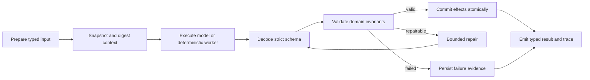

# Harness Engineering

## Scope

Harness engineering is a repository-wide reliability discipline. Tavern interaction is the first new workflow to adopt the contract from its initial schema, but the same lifecycle must progressively cover:

- document extraction, OCR fallback, cleanup, and Study Unit arrangement;
- learning-plan prompt assembly, tool execution, strict parsing, and persistence;
- persona and scene generation;
- study chat, tool effects, citations, memory, and Character Events;
- Tavern speaker scheduling, actor generation, and message commit;
- frontend response decoding, request ordering, recovery, and debug reporting.

The harness is not one prompt and not one validator. It is the versioned boundary around an unreliable or stateful operation.

## Canonical lifecycle

Every adopted workflow should make these concerns explicit:

1. typed, bounded input owned by the application;
2. versioned prompt/parser/heuristic and stable context snapshot;
3. strict output schema with application-owned identity and IDs;
4. deterministic invariant checks after parsing;
5. bounded recovery with a named strategy and attempt ceiling;
6. state effects proposed before validation and committed only after validation;
7. an observable trace suitable for debug replay and regression evaluation;
8. idempotency, optimistic revision checks, or a transactional append boundary where writes occur.

## Shared trace schema

Python: `services/ai/app/models/harness.py`

TypeScript: `packages/shared/src/harness.ts`

`HarnessTrace` is intentionally workflow-neutral:

- `version`: harness implementation/version identifier;
- `workflow` and `stage`: stable routing keys such as `planning/model_reply` or `tavern/actor_reply`;
- `status`: `passed`, `repaired`, `failed`, or `skipped`;
- `schema_name`: exact decoded contract;
- input/context digests: reproducibility without copying sensitive prompt text into ordinary responses;
- checks: named invariant results with stable codes;
- attempts and recovery strategy: bounded recovery evidence;
- duration: performance/evaluation input.

Workflow-specific policies remain in their domain schema. For example, Tavern limits participant messages and checks cross-speaker impersonation, while document parsing checks page coverage, extraction density, OCR availability, and Study Unit bounds.

## Adoption matrix

| Workflow | Existing reliability pieces | Missing harness boundary |
|---|---|---|
| Document parsing | OCR fallback, warnings, debug record | versioned checks, stage traces, replay fixtures, performance budgets |
| Planning | strict-ish JSON, model recovery records, tool trace | true JSON schema validation, effect boundary, unified trace, eval matrix |
| Persona/scene generation | Pydantic normalization, retry | prompt/version digest, semantic invariants, regression fixtures |
| Study chat | reply recovery, tool trace, citations | transactional tool-effect proposals, request revision/idempotency, strict decoder |
| Tavern | normalized schema and strict actor DTO | compiler, scheduler, validator/repair, atomic run lifecycle, evals |
| Frontend API | response normalizers | runtime decoder, timeout/cancel, stale-response rejection, trace forwarding |

## User-facing transparency

Ordinary UI should show concise recovery state, not raw codes or prompts:

- passed: no interruption or a low-noise checked indicator;
- repaired: explain that one response was corrected and allow details to expand;
- failed: preserve user input, name the failed stage, and offer a scoped retry;
- debug: show check codes, versions, digests, attempts, durations, and raw trace excerpts.

Harness self-checks are evidence, not a promise that content is objectively correct.

## Evaluation and release gates

Each workflow must add fixtures for malformed schemas, boundary violations, retry exhaustion, duplicate requests, concurrency, and state-commit failure. CI should report at least:

- schema-valid rate before and after repair;
- recovery and failure rates;
- state-commit consistency;
- p50/p95 stage duration;
- workflow-specific accuracy, grounding, or identity-consistency metrics.

No workflow should be described as harnessed until its failure path and replay/evaluation path are tested, not merely its happy-path prompt.
