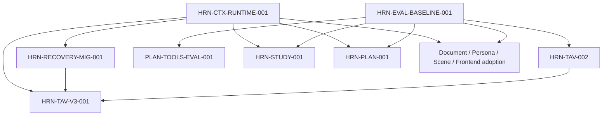

# Harness Roadmap

## Purpose and ownership

This file is the canonical source for unfinished Harness work. It owns the
cross-workflow reliability foundation, model-workflow organization, evaluation
infrastructure, production v3 adoption, and Harness-specific performance gates.
`../TODO.md` keeps product, UX, schema, and runtime work that is owned outside
Harness and links here instead of duplicating checkboxes.

Read these contracts before taking a task:

- `harness-engineering.md` defines the lifecycle and adoption rubric;
- `harness-schema-ownership.md` defines input, proposal, committed-record, and
  API ownership;
- `../AGENTS.md` defines repository-wide implementation constraints.

Priority has the same meaning as the root backlog:

- `P1`: cross-workflow correctness, truthful evidence, or a prerequisite for
  production adoption;
- `P2`: bounded adoption, evaluation, or performance work with clear value;
- `P3`: documentation, bookkeeping, or research validation.

Completed work should be removed from this roadmap after its durable facts and
constraints are moved into `AGENTS.md` or the relevant architecture document.

## Current baseline

The repository already has useful foundations, but no production workflow is
fully v3-adopted:

- Python and TypeScript expose compatible v1/v2/v3 evidence contracts;
- the closed workflow/stage/component registries and shared golden fixtures are
  enforced in tests;
- the executable workflow manifest closes stage ownership, contract, budget,
  effect/artifact, commit-policy, decoder, and eval routing registrations;
- Document processing, Learning Plan generation, Study Chat, and Tavern Run
  allocate one immutable Harness/domain operation binding at durable admission;
- artifact authorization uses a server-resolved local-installation principal,
  exact operation/artifact/contract scopes, expiry/revocation, and content-free
  audit evidence;
- protected artifacts now have opaque immutable storage, authorization-before-
  read resolution, retention/deletion tombstones, digest verification, typed
  batch results, and restart-safe replay;
- the durable effect journal owns stable admitted-operation/global-slot
  identity, database-clock claims, immutable adapter/contract/target bindings,
  crash-safe terminalization, and strict per-effect read-back/compensation
  evidence; the Study database-effect collector writes through this journal and
  terminalizes in the final Session/Scene transaction;
- the shared Tool Manifest owns all six Planning and thirty-one Study tool
  contracts, provider projections, effects, sensitivity, and call budgets;
- strict eval case/run/sample/report and failure-taxonomy contracts bind tested
  system configuration and admitted Harness operations;
- the shared eval runner routes only registered suites/adapters, supports
  deterministic fixture/synthetic and authorized protected-replay inputs, emits
  ordered raw/aggregate JSON, and separates candidate from runner/data/grader
  failures; its versioned grader registry fences self-grading and requires
  held-out human calibration before a model grader can gate a release;
- v3 safe-manifest canonicalization and context digest validation exist;
- resource and operation commit policies fail closed, with the first narrow
  Tavern Message policy registered;
- Document and Planning have atomic committed projections in addition to the
  shared admission identity;
- Study has durable admission, transactional database effects, recoverable file
  staging, and truthful provider uncertainty;
- Tavern production still emits legacy v1 traces;
- `build_harness_context` requires an admitted operation binding and executable
  manifest, but still has no production caller;
- there is no shared operation runtime or versioned evaluation baseline.

These are baseline facts, not completion claims. A strict decoder, component
version, fixture, operation journal, CAS boundary, or effect adapter does not by
itself make a workflow Harness-adopted.

## Program epics

The following IDs are tracking epics and are not directly claimable:

- `HRN-CTX-001`: closes only when workflow governance, operation identity,
  protected artifacts, durable effects, shared runtime, recovery migration,
  every production-domain adoption item, and Harness performance gates are
  complete.
- `HRN-EVAL-001`: closes through `HRN-EVAL-BASELINE-001`, after at least the
  Tavern identity and Planning tool pilot suites use the shared runner and
  grader registry.

## Dependency map

The graph shows hard ordering inside Harness. Product-line prerequisites owned
by `../TODO.md` are listed separately below. Fixture/synthetic evals deliberately
do not depend on the protected artifact resolver; production replay does. The
completed workflow manifest, operation identity, protected artifact resolver,
effect journal/evidence, Tool Manifest, eval wire, runner, and grader registry
are durable prerequisites documented in
`harness-engineering.md` and `harness-schema-ownership.md` rather than active
nodes here.

## Delivery waves

| Wave | Outcome | Claimable work |
|---|---|---|
| 2 — shared runtime | Assemble truthful operations and establish baselines | Operation runtime, recovery migration, eval baseline, pilot suites |
| 3 — high-risk adoption | Migrate the two most stateful model paths | Tavern v3 and Study Chat v3 |
| 4 — broad adoption | Cover remaining model, heuristic, and frontend workflows | Planning, Document/OCR/Study Unit, Persona, Scene, Frontend Decode |
| 5 — performance | Gate cost and latency without weakening correctness | Context, Tavern prompt, and Planning tool performance |

Tasks in the same wave may proceed in parallel only when their listed
dependencies and shared contract ownership do not overlap.

## Wave 2 — runtime, migration, and initial baselines

- [ ] `HRN-CTX-RUNTIME-001` `[P1]` build the workflow-neutral operation runtime;
  builds on the completed artifact resolver, effect journal/evidence, workflow
  manifest, and operation-identity foundation.
  - Assemble durable operation, context, protected artifacts, ordered
    generate/decode/validate/repair attempts, checks, effects,
    commit/rollback, and terminal failure through registered adapters.
  - Persist parent/child trace lineage and make duplicate admission, resume,
    adapter failure, commit failure, rollback/compensation, and read-back
    decidable after restart.
  - Keep domain proposal/invariant/projector logic in domain adapters; the
    shared runtime must not become a permissive generic proposal schema.
  - Production callers may bypass the runtime only while their explicit
    migration task remains open; new adopted workflows cannot add a second
    lifecycle implementation.

- [ ] `HRN-EVAL-BASELINE-001` `[P1]` establish versioned baselines and release
  gates; builds on the completed eval runner and grader registry.
  - Report raw/final schema-valid rate, repair success/rate, failure rate,
    uncertain-effect rate, commit consistency, p50/p95 duration, token/cost and
    tool/provider-call counts, plus suite-specific quality metrics.
  - Bind every baseline and candidate to the complete tested-system config
    digest, fixture/split version, sample count, repetitions/seeds, environment,
    and raw-sample artifact.
  - Use absolute minimums and regression thresholds; insufficient samples,
    broken cases, grader drift, or incomparable configuration must block a
    comparative claim rather than produce a misleading pass.
  - Keep deterministic suites in PR/release CI and live-provider suites
    manual/nightly until their cost and variance budgets are explicit.

- [ ] `HRN-RECOVERY-MIG-001` `[P2]` map legacy recovery to v3 attempts/checks;
  depends on `HRN-CTX-RUNTIME-001`.
  - Bind legacy recoveries to the admitted operation and stage with one
    versioned mapping from domain categories/reasons/strategies to attempt and
    check evidence.
  - Preserve compatible API/debug projections, avoid double-counting metrics,
    and define the final write cutoff and read-only retention path.
  - Never invent historical trace IDs, operation IDs, timestamps, attempts, or
    commit claims.

- [ ] `HRN-TAV-002` `[P1]` establish the Tavern identity and prompt-injection
  eval matrix; depends on the eval core, not Tavern v3.
  - Convert the existing identity/prompt-safety tests into versioned positive,
    negative, boundary, confusable-Unicode, target, impersonation, guidance
    leak, and prompt-injection cases.
  - Report raw/final schema-valid rate, repair, false-positive,
    false-negative, identity-consistency, and prompt-leak rates.
  - Include independent reviewed cases and a held-out split; developer-authored
    unit tests alone do not establish the baseline.

- [ ] `PLAN-TOOLS-EVAL-001` `[P2]` establish the Planning tool baseline;
  depends on the eval core and the completed Tool Manifest.
  - Report eligible batch size, actual call rate, invalid call rate, per-tool
    p50/p95, total wall-clock, grounding, tool correctness, retry, and provider
    call counts.
  - Include malformed JSON, strict argument/result failures, unknown/disabled
    tools, coarse-unit refinement, duplicate calls, and source-anchor drift.
  - Prompt encouragement is not evidence that a tool was called correctly.

## Wave 3 — Tavern and Study production adoption

Every production adoption task shares this close contract:

- the real path uses the protected artifact resolver and shared operation
  runtime;
- each stage has ordered attempts/checks and terminal trace evidence;
- malformed output, invariant failure, repair exhaustion, duplicate request,
  relevant concurrency, commit failure, and protected replay are covered;
- successful commit evidence proves only registered operation/resource scope;
- sensitive content stays in authorized artifacts, not trace-visible evidence;
- legacy records remain readable without fabricated history;
- the domain's versioned eval and regression gates pass independently.

- [ ] `HRN-TAV-V3-001` `[P1]` migrate Tavern production evidence from legacy v1
  to v3.
  - Depends on root-backlog `SCH-TAV-001`, the shared runtime, recovery
    migration, protected artifacts, and `HRN-TAV-002`.
  - Allocate Harness operation identity before actor generation and cover
    parent lineage, partial/failed/not-committed steps, per-step commits, child
    retry, cancel fencing, and truthful Message/Run/Step/Room evidence scope.
  - Expand operation policies only with versioned committed projections and
    authoritative one-snapshot read-back; do not upgrade `primary_output_only`
    Message evidence into a claim about all transaction effects.
  - Legacy v1/v2 and new v3 frontend fixtures must all pass; migration cannot
    rewrite historical evidence.

- [ ] `HRN-STUDY-001` `[P1]` adopt Study Chat into v3.
  - Depends on the shared runtime, protected artifacts, effect epic, eval core,
    and the root-backlog Study operation clock/scanner hardening needed for
    authoritative recovery evidence.
  - Cover prompt/context, strict reply, citations, Character Events, nested
    tools, mixed database/Scene/file/provider effects, commit/rollback,
    provider `uncertain`, and exact committed Session/Turn read-back.
  - Keep grading material and server-only effect receipts out of the public
    projection; the browser renders only persisted Session read-back.
  - Close citation/effect correctness and independent live-wire decode gates.

## Wave 4 — remaining production adoption

- [ ] `HRN-PLAN-001` `[P2]` adopt Planning into v3.
  - Register prompt, toolset, provider/runtime configuration, input/context,
    proposal, committed projection, and protected replay contracts.
  - Emit plan-generation and per-tool stage traces with bounded recovery and
    atomic Document/Debug/Planning Trace/Learning Plan commit evidence.
  - Gate grounding, schedule/Study Unit/Section reference correctness, tool
    correctness, failure paths, and goal-only compatibility.

- [ ] `HRN-DOC-001` `[P2]` adopt extraction, OCR, Section, Chunk, and Study Unit
  cleanup into v3.
  - Record reviewed parser/heuristic contracts separately from installed
    dependency/OCR-engine versions and execution budgets.
  - Emit distinct stage evidence for page extraction, OCR page, Section
    detection, Chunk building, Study Unit cleanup, and the parent process.
  - Validate page coverage, extraction density, OCR fallback, ordering,
    boundaries, source IDs, warning/terminal behavior, and performance budgets.

- [ ] `HRN-SCENE-001` `[P2]` adopt Scene generation into v3.
  - Preserve the strict content-only proposal, allow-list reuse resolution,
    application-owned IDs, recursive budgets, committed-save split, and row
    CAS.
  - Add prompt/context snapshots, attempt/repair/terminal evidence, zero-write
    failures, protected replay, structure/correctness evals, and live-wire
    decoding.

- [ ] `HRN-PERSONA-001` `[P2]` adopt Persona generation and assist flows into v3.
  - Keep Persona/card IDs, source, ordering, timestamps, and committed state out
    of model-owned proposals.
  - Register prompt/context/output contracts and validate slot, identity,
    relationship, naming/address, count, and failure-zero-persistence behavior.
  - Add protected replay, identity/quality evals, bounded recovery, and
    independent API decoding.

- [ ] `HRN-WEB-001` `[P2]` complete Frontend Decode v3 adoption.
  - Inventory every endpoint and stream, moving remaining boundaries through
    `unknown -> strict decoder | typed error` without default-filled records.
  - Register the real Frontend Decoder component contract and
    `FRONTEND_REQUEST` resource/evidence semantics.
  - Add v1/v2/v3 trace forwarding, unknown-version fail-closed fixtures,
    request/subject/revision ordering fences, and independent live-wire cases.
  - Extend the existing `web-strict-decode-adversarial-v1` gate through a new
    versioned catalog rather than silently editing its historical meaning.

## Wave 5 — performance and optimization gates

- [ ] `HRN-CTX-PERF-001` `[P2]` establish context/artifact/runtime budgets;
  depends on a runnable resolver and runtime.
  - Measure canonical bytes, resolved snapshot bytes, reference count, batch
    resolver I/O, attempt/trace overhead, and p50/p95 latency.
  - Any budget exceeded before provider/worker execution must fail closed with
    typed evidence; raw samples and the measurement environment are required.

- [ ] `HRN-TAV-PERF-001` `[P2]` establish the Tavern prompt performance/eval
  gate; depends on Tavern v3, protected artifacts, and eval baselines.
  - Use the worst supported six-person long conversation with a real tokenizer
    and representative provider configuration.
  - Report prompt partitions, trimming, tokens, provider/tool calls, cost,
    p50/p95, repair/failure rates, and content-free trace evidence.

- [ ] `PLAN-TOOLS-PERF-001` `[P2]` decide whether Planning tool batches may run
  in parallel; depends on `PLAN-TOOLS-EVAL-001`.
  - Parallelize only when the entire batch is registered `parallel_safe`, reads
    the same immutable snapshot, has no dependent effects, and preserves stable
    result ordering.
  - Demonstrate lower same-round wall-clock without degrading grounding/tool
    correctness or claiming fewer model rounds.
  - Record fixture, provider/runtime config, raw samples, before/after, and a
    rollback threshold.

## External product-line dependencies

These tasks remain owned by `../TODO.md`; they are referenced here and must not
be duplicated as Harness checkboxes:

| Root task | Harness relationship |
|---|---|
| `SCH-TAV-001` | hard prerequisite for `HRN-TAV-V3-001` truthful Room/Run/Step/Message evidence |
| `STUDY-OP-CLOCK-001` | canonical lease/deadline time for Study terminal evidence |
| `STUDY-OP-SCANNER-001` | corruption/version/digest conclusions consumed by Study read-back and eval |
| `STUDY-OP-RECOVERY-UX-001` | public recovery behavior after truthful operation conclusions |
| `TAV-CANCEL-TRANSPORT-001` | provider transport cancellation capability; does not replace commit fencing |
| `SCH-PLAN-CAS-001` | required for future Plan patch/update operations, not for claiming current Plan creation evidence |
| `PLAN-PATCH-001` | consumes `HRN-PLAN-001` after Plan CAS; it does not expand the Planning adoption scope retroactively |

## Continuous rules

- `HarnessStage`, `HarnessAttemptPhase`, and stream event types are separate
  vocabularies. New values require one atomic update across Python, TypeScript,
  registry, golden fixture, decoder routing, ownership docs, and eval routing.
- A component contract versions reviewed application behavior; it is not a
  provider model, dependency package, or placeholder adoption version.
- Only explicitly reviewed `HarnessSafeManifest` DTOs may enter trace-visible
  digests. Integrity hashes do not provide authorization, confidentiality, or
  replay availability.
- Unknown explicit evidence versions fail closed. Historical v1/v2 rows do not
  gain invented v3 identity, timing, attempt, or commit evidence.
- A generic resource capability never proves operation semantics; successful v3
  claims require a registered full operation key and committed projection.
- Without provider idempotency or authoritative read-back, external execution
  remains `uncertain`; database atomicity must not be described as provider
  exactly-once.
- Eval reports must bind the tested system, budgets, data/split, grader, sample
  count, and raw samples. A headline score without those identities cannot gate
  release.
- Deterministic graders take priority. Model graders require held-out human
  calibration and their own failure evidence.
- `QG-002` / `web-strict-decode-adversarial-v1` remains an immutable release
  gate. New domains or attack classes use a new versioned catalog.
- Developer-authored happy paths do not close UX/reliability or eval findings;
  independent revalidation remains required.
