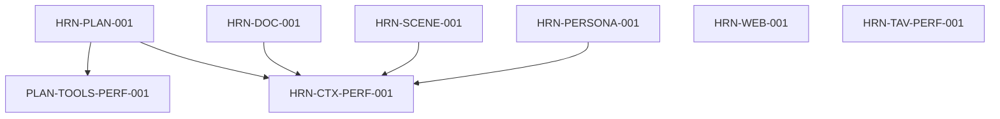

# Harness Roadmap

## Purpose and ownership

This file is the canonical source for unfinished Harness work. It owns the
cross-workflow reliability foundation, model-workflow organization, evaluation
infrastructure, production v3 adoption, and Harness-specific performance gates.
`../TODO.md` keeps product, UX, schema, and runtime work that is owned outside
Harness and links here instead of duplicating checkboxes.

Read these contracts before taking a task:

- `harness-engineering.md` defines the lifecycle and adoption rubric;
- `harness-schema-ownership.md` defines input, proposal, committed-record, and
  API ownership;
- `../AGENTS.md` defines repository-wide implementation constraints.

Priority has the same meaning as the root backlog:

- `P1`: cross-workflow correctness, truthful evidence, or a prerequisite for
  production adoption;
- `P2`: bounded adoption, evaluation, or performance work with clear value;
- `P3`: documentation, bookkeeping, or research validation.

Completed work should be removed from this roadmap after its durable facts and
constraints are moved into `AGENTS.md` or the relevant architecture document.

## Current baseline

The repository has the shared foundations plus production v3 adoption for
Tavern actor generation and Study Chat:

- Python and TypeScript expose compatible v1/v2/v3 evidence contracts;
- the closed workflow/stage/component registries and shared golden fixtures are
  enforced in tests;
- the executable workflow manifest closes stage ownership, contract, budget,
  effect/artifact, commit-policy, decoder, and eval routing registrations;
- Document processing, Learning Plan generation, Study Chat, and Tavern Run
  allocate one immutable Harness/domain operation binding at durable admission;
- artifact authorization uses a server-resolved local-installation principal,
  exact operation/artifact/contract scopes, expiry/revocation, and content-free
  audit evidence;
- protected artifacts now have opaque immutable storage, authorization-before-
  read resolution, retention/deletion tombstones, digest verification, typed
  batch results, and restart-safe replay;
- the durable effect journal owns stable admitted-operation/global-slot
  identity, database-clock claims, immutable adapter/contract/target bindings,
  crash-safe terminalization, and strict per-effect read-back/compensation
  evidence; the Study database-effect collector writes through this journal and
  terminalizes in the final Session/Scene transaction;
- the shared Tool Manifest owns all six Planning and thirty-one Study tool
  contracts, provider projections, effects, sensitivity, and call budgets;
- strict eval case/run/sample/report and failure-taxonomy contracts bind tested
  system configuration and admitted Harness operations;
- the shared eval runner routes only registered suites/adapters, supports
  deterministic fixture/synthetic and authorized protected-replay inputs, emits
  ordered raw/aggregate JSON, and separates candidate from runner/data/grader
  failures; its versioned grader registry fences self-grading and requires
  held-out human calibration before a model grader can gate a release;
- v3 safe-manifest canonicalization and context digest validation exist;
- resource and operation commit policies fail closed, with the first narrow
  Tavern Message policy registered;
- Document and Planning have atomic committed projections in addition to the
  shared admission identity;
- Study resolves a complete protected prompt/context snapshot before its single
  provider call, validates the complete reply/citation/Character Event/tool
  projection, and commits the Session/Turn/effects/operation/terminal trace in
  one database transaction; provider ambiguity remains `uncertain`;
- the shared operation runtime persists immutable stage identity, context,
  parent/child lineage, ordered attempts and checks, database-clock claims,
  terminal v3 traces, rollback delegation, and authoritative restart recovery;
- the versioned eval baseline gate binds complete tested-system configuration,
  fixtures, samples, environment and raw evidence; the checked-in Tavern
  identity, Planning tool, and Study reply suites include held-out cases and
  deterministic PR/release gates;
- legacy model recovery has one fail-closed mapping into existing v3
  attempts/checks, with a final write cutoff and read-only compatibility path;
- Tavern actor generation resolves an operation-scoped protected snapshot,
  emits v3 attempts/checks, and finalizes one Message projection with its
  Step/Run state in one transaction; the commit policy remains
  `primary_output_only`;
- the Tavern soft-reference scanner and Study database clock/effect scanner
  fail closed on the completed Wave 3 persistence boundaries;
- `build_harness_context` requires an admitted operation binding and executable
  manifest; remaining production adoption is tracked in Waves 4 and 5 below.

These are baseline facts, not completion claims. A strict decoder, component
version, fixture, operation journal, CAS boundary, or effect adapter does not by
itself make a workflow Harness-adopted.

## Program epics

The following IDs are tracking epics and are not directly claimable:

- `HRN-CTX-001`: closes only when workflow governance, operation identity,
  protected artifacts, durable effects, shared runtime, recovery migration,
  every production-domain adoption item, and Harness performance gates are
  complete.

## Dependency map

The graph shows active ordering inside Harness. Product-line prerequisites
owned by `../TODO.md` are listed separately below. The completed workflow
manifest, operation identity, protected artifact resolver, effect journal,
shared runtime, recovery migration, Tool Manifest, eval wire/runner/grader,
versioned baseline and pilot suites are durable prerequisites documented in
`harness-engineering.md` and `harness-schema-ownership.md`.

## Delivery waves

| Wave | Outcome | Claimable work |
|---|---|---|
| 4 — broad adoption | Cover remaining model, heuristic, and frontend workflows | Planning, Document/OCR/Study Unit, Persona, Scene, Frontend Decode |
| 5 — performance | Gate cost and latency without weakening correctness | Context, Tavern prompt, and Planning tool performance |

Tasks in the same wave may proceed in parallel only when their listed
dependencies and shared contract ownership do not overlap.

## Wave 4 — remaining production adoption

- [x] `HRN-PLAN-001` `[P2]` adopt Planning into v3.
  - Register prompt, toolset, provider/runtime configuration, input/context,
    proposal, committed projection, and protected replay contracts.
  - Emit plan-generation and per-tool stage traces with bounded recovery and
    atomic Document/Debug/Planning Trace/Learning Plan commit evidence.
  - Gate grounding, schedule/Study Unit/Section reference correctness, tool
    correctness, failure paths, and goal-only compatibility.
  - Plan generation emits one parent v3 trace plus an ordered child trace for
    every validated Planning Tool call; protected call inputs/results are
    authorized snapshots and the deterministic Planning Tool pilot remains a
    release gate.

- [x] `HRN-DOC-001` `[P2]` adopt extraction, OCR, Section, Chunk, and Study Unit
  cleanup into v3.
  - Record reviewed parser/heuristic contracts separately from installed
    dependency/OCR-engine versions and execution budgets.
  - Emit distinct stage evidence for page extraction, OCR page, Section
    detection, Chunk building, Study Unit cleanup, and the parent process.
  - Validate page coverage, extraction density, OCR fallback, ordering,
    boundaries, source IDs, warning/terminal behavior, and performance budgets.
  - Document processing records parent, page extraction, Section detection,
    Chunk building, OCR page, and Study Unit cleanup traces with authorized
    protected snapshots and content-free count/digest evidence.

- [x] `HRN-SCENE-001` `[P2]` adopt Scene generation into v3.
  - Preserve the strict content-only proposal, allow-list reuse resolution,
    application-owned IDs, recursive budgets, committed-save split, and row
    CAS.
  - Add prompt/context snapshots, attempt/repair/terminal evidence, zero-write
    failures, protected replay, structure/correctness evals, and live-wire
    decoding.
  - Scene generation runs through the shared runtime with strict proposal
    validation, bounded recovery, protected replay, and independent API
    decoding.

- [x] `HRN-PERSONA-001` `[P2]` adopt Persona generation and assist flows into v3.
  - Keep Persona/card IDs, source, ordering, timestamps, and committed state out
    of model-owned proposals.
  - Register prompt/context/output contracts and validate slot, identity,
    relationship, naming/address, count, and failure-zero-persistence behavior.
  - Add protected replay, identity/quality evals, bounded recovery, and
    independent API decoding.
  - Card, setting, and slot assist flows share the strict content-only proposal
    runtime; local fallback is represented as repaired evidence and failures
    leave no committed card/slot projection.

- [x] `HRN-WEB-001` `[P2]` complete Frontend Decode v3 adoption.
  - Inventory every endpoint and stream, moving remaining boundaries through
    `unknown -> strict decoder | typed error` without default-filled records.
  - Register the real Frontend Decoder component contract and
    `FRONTEND_REQUEST` resource/evidence semantics.
  - Add v1/v2/v3 trace forwarding, unknown-version fail-closed fixtures,
    request/subject/revision ordering fences, and independent live-wire cases.
  - Extend the existing `web-strict-decode-adversarial-v1` gate through a new
    versioned catalog rather than silently editing its historical meaning.
  - Document, Planning, Persona/Scene, Study, and Tavern response paths use
    strict decoders; v3 Harness traces route through the registered frontend
    decoder component and malformed nested evidence fails closed.

## Wave 5 — performance and optimization gates

- [ ] `HRN-CTX-PERF-001` `[P2]` establish context/artifact/runtime budgets;
  depends on a runnable resolver and runtime.
  - Measure canonical bytes, resolved snapshot bytes, reference count, batch
    resolver I/O, attempt/trace overhead, and p50/p95 latency.
  - Any budget exceeded before provider/worker execution must fail closed with
    typed evidence; raw samples and the measurement environment are required.

- [ ] `HRN-TAV-PERF-001` `[P2]` establish the Tavern prompt performance/eval
  gate; depends on Tavern v3, protected artifacts, and eval baselines.
  - Use the worst supported six-person long conversation with a real tokenizer
    and representative provider configuration.
  - Report prompt partitions, trimming, tokens, provider/tool calls, cost,
    p50/p95, repair/failure rates, and content-free trace evidence.

- [ ] `PLAN-TOOLS-PERF-001` `[P2]` decide whether Planning tool batches may run
  in parallel; depends on `PLAN-TOOLS-EVAL-001`.
  - Parallelize only when the entire batch is registered `parallel_safe`, reads
    the same immutable snapshot, has no dependent effects, and preserves stable
    result ordering.
  - Demonstrate lower same-round wall-clock without degrading grounding/tool
    correctness or claiming fewer model rounds.
  - Record fixture, provider/runtime config, raw samples, before/after, and a
    rollback threshold.

## External product-line dependencies

These tasks remain owned by `../TODO.md`; they are referenced here and must not
be duplicated as Harness checkboxes:

| Root task | Harness relationship |
|---|---|
| `STUDY-OP-RECOVERY-UX-001` | public recovery behavior after truthful operation conclusions |
| `TAV-CANCEL-TRANSPORT-001` | provider transport cancellation capability; does not replace commit fencing |
| `SCH-PLAN-CAS-001` | required for future Plan patch/update operations, not for claiming current Plan creation evidence |
| `PLAN-PATCH-001` | consumes `HRN-PLAN-001` after Plan CAS; it does not expand the Planning adoption scope retroactively |

## Continuous rules

- `HarnessStage`, `HarnessAttemptPhase`, and stream event types are separate
  vocabularies. New values require one atomic update across Python, TypeScript,
  registry, golden fixture, decoder routing, ownership docs, and eval routing.
- A component contract versions reviewed application behavior; it is not a
  provider model, dependency package, or placeholder adoption version.
- Only explicitly reviewed `HarnessSafeManifest` DTOs may enter trace-visible
  digests. Integrity hashes do not provide authorization, confidentiality, or
  replay availability.
- Unknown explicit evidence versions fail closed. Historical v1/v2 rows do not
  gain invented v3 identity, timing, attempt, or commit evidence.
- A generic resource capability never proves operation semantics; successful v3
  claims require a registered full operation key and committed projection.
- Without provider idempotency or authoritative read-back, external execution
  remains `uncertain`; database atomicity must not be described as provider
  exactly-once.
- Eval reports must bind the tested system, budgets, data/split, grader, sample
  count, and raw samples. A headline score without those identities cannot gate
  release.
- Deterministic graders take priority. Model graders require held-out human
  calibration and their own failure evidence.
- `QG-002` / `web-strict-decode-adversarial-v1` remains an immutable release
  gate. New domains or attack classes use a new versioned catalog.
- Developer-authored happy paths do not close UX/reliability or eval findings;
  independent revalidation remains required.
