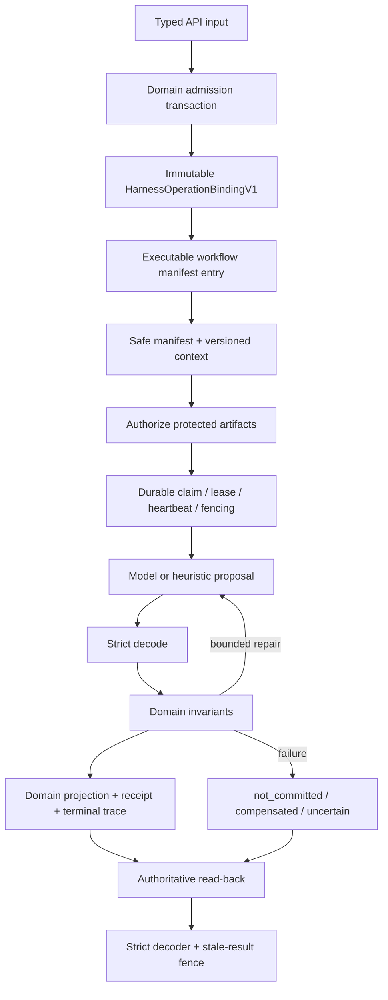
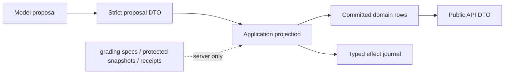

# Harness 工程手册

本目录是 Harness 实现、数据映射、模型输出约束、恢复语义和运行预算的代码对照手册。工程不变量仍以根目录 [AGENTS](../../AGENTS.md) 为准，未完成事项只在 [TODO](../../TODO.md) 维护。

## 用户工作流索引

| 用户工作流 | Harness workflow / 入口 stage | 文档 |
| --- | --- | --- |
| 上传并处理教材 | `document_parse:document_parse`，并包含 page extraction、section detection、chunk building、OCR、Study Unit cleanup 子阶段 | [Document / OCR / Study Unit](document-processing.md) |
| 生成或修订学习计划 | `planning:plan_generation`、`planning:planning_tool_execution`、`planning:plan_revision` | [Planning](planning.md) |
| 生成人设卡或辅助编辑 | `persona:persona_generation` | [Persona generation](persona-generation.md) |
| 生成场景树 | `scene:scene_generation` | [Scene generation](scene-generation.md) |
| Study Dialog 对话 | `study_chat:study_chat_reply` | [Study Chat](study-chat.md) |
| Tavern 直接或引导式互动 | `tavern:actor_reply` | [Tavern](tavern.md) |
| 浏览器严格解码 | `frontend_decode:response_decode` | 本页“前端边界” |

共享数据库结构见 [数据库映射](database.md)，所有 `max_tokens`、调用次数、超时和配置来源见 [配置与预算](configuration.md)。

## 整体生命周期

顺序不能颠倒：先由领域操作 admission 分配 Harness identity，再构造 context；受保护内容必须经过 operation-scoped grant 才能读取；模型只产出 proposal；应用层分配 ID、revision、sequence、timestamp 并提交 projection。注册 manifest 或生成 trace fixture 只是路由证据，不等于生产采用。

## 三组容易混淆的上限

1. `HarnessManifestAttemptCeilingV1` 的 `max_attempts=3`、`max_repair_attempts=2` 限制 Harness runtime 的 generate/repair 生命周期记录。
2. `HarnessManifestExecutionBudgetV1` 登记 provider/tool/token/time 预算。当前 runtime **实际执行** wall time 与 per-call timeout；tool 次数由 Tool Manifest tracker 执行；`max_provider_calls`、`max_input_tokens`、`max_output_tokens` 目前是登记和诊断字段，不是通用计数器。
3. Provider 内部循环和 transport retry 才决定真实请求次数。不能用 `max_attempts=3` 推断只会发三次模型请求。逐工作流上限见 [配置与预算](configuration.md)。

## 模型输出所有权

模型不得分配 committed ID、speaker identity、revision、sequence、timestamp 或 effect receipt。Scene 和 Persona generation 返回候选内容，用户保存是独立写边界。Study 的交互题 grading spec 在提交前保持 server-only。Tavern 的 actor proposal 不能冒充其他 participant，且 committed proof 只证明一个 Message 主输出，不证明事务中的所有 Room/Run/Step 副作用。

## 前端边界

前端通过 `apps/web/lib/*-decode.ts` 严格解码当前响应和历史 read-back；它不是后端 Pydantic 校验的替代品。Scene 的后端限制由 `services/ai/app/models/scene.py` 拥有，TypeScript 中的同值是跨语言解码镜像，必须由跨语言测试保持一致，不能把 Python 模块当作浏览器运行时配置源。

## 权威代码入口

- workflow/stage/contract：`services/ai/app/models/harness_manifest.py`
- operation identity：`services/ai/app/models/harness_operation.py` 与 `services/ai/app/persistence/harness_operation_repository.py`
- durable runtime：`services/ai/app/services/harness_runtime.py`
- protected artifacts / effects：`services/ai/app/persistence/harness_artifact_repository.py`、`harness_effect_repository.py`
- provider 运行限制：`services/ai/app/core/model_runtime_limits.py`
- Tool Manifest：`services/ai/app/models/tool_manifest.py`
- commit policy：`services/ai/app/models/harness.py` 和 `packages/shared/fixtures/harness/operation-commit-policies-v1.json`
- golden manifest：`packages/shared/fixtures/harness/workflow-manifest-v1.json`

验证命令：`npm run test:ai:harness:contracts`、`npm run test:ai:harness:commit`、`npm run eval:harness:pr`、`npm run test:acceptance:recovery-limits`；完整发布门禁为 `npm run check:release`。确定性回归通过不代表真实模型质量或全平台认证。

