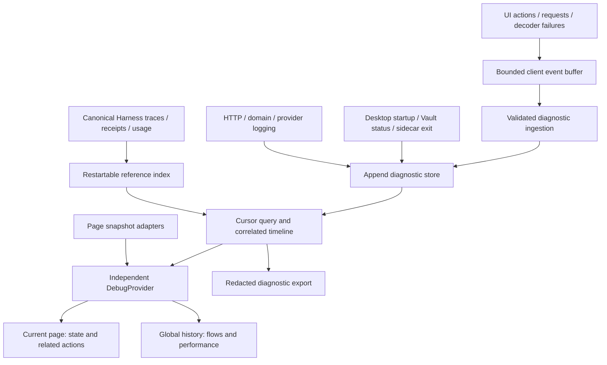

# 统一 Logging 与 Debug 实施计划

状态：实施中；按基础、流程、Debug 视图、审计四阶段分步提交。以下四项以本文件为唯一详细任务来源，根 TODO 仅链接。质量复核仍按用户要求暂缓。

### 统一 logging 与 Debug（按 1 → 2 → 3 → 4 实施）

- [ ] `OBS-FOUNDATION-001` `[P1]` 建立统一诊断事件和关联上下文。
  - Python/TypeScript 共用版本化事件契约；区分客户端 action/page view、服务端 request、真实 Harness operation/trace/attempt 与持久资源身份。
  - 结构化 Python logging、前端请求入口及有界事件存储；在容器构造前初始化 logging。先打通 Persona 生成 → 保存 → 重载的纵向样例。
  - 关联 ID 仅用于诊断，不参与授权或幂等判断；跨线程、流式结束、取消和请求重放都必须正确关联。
  - 2026-09-10 基础切片 A：已建立封闭 Python/TypeScript 事件契约、独立 SQLite 有界异步写入、结构化脱敏 Python 输出及 ASGI 请求/流式终态关联；原生 stream worker 显式复制上下文。10 项诊断/生命周期测试和 shared contracts 门通过。尚待浏览器采集、Persona 纵向关联、摄取/查询及更完整故障门；本项保持未完成。
  - 2026-09-10 基础切片 B：浏览器统一请求采集、关闭浮窗持续记录、100 条批量上传与原 ID 离线重试、摄取白名单、游标查询及 request/action/page-view/flow/source 索引已接入。11 项后端诊断/生命周期测试、Web 类型检查及完整 Web reliability 门通过（原有两个 live-backend 用例按配置跳过）。Persona 跨动作 flow 与真实 Harness 引用仍待接入。
  - 2026-09-10 基础切片 C：Persona 草稿归属 flow，生成/保存/重载分配独立 action，保存后刷新继承已捕获上下文；切换/新建/复制草稿重置 flow。服务端从真实 admission/terminal trace 写入受限 Harness 引用，并记录保存 Persona 的真实 ID/revision；浏览器不能上传权威引用。28 项后端诊断/生命周期/commit 测试、30 项 Persona 回归及 1 项组合关联测试、shared contracts/Web 类型检查通过。尚待完整事件分类/attempt 关联与浏览器端到端验收，第一阶段不提前关闭。

- [ ] `OBS-FLOWS-001` `[P1]` 覆盖全部功能流程和 Harness 性能记录；依赖 `OBS-FOUNDATION-001`。
  - 覆盖 Document/OCR/清洗、Planning/tools、Persona/Scene、Study/题目/附件、Tavern、Settings/Vault、导入导出及桌面启动/sidecar 退出。
  - Harness/operation receipt 保持事实来源；诊断索引引用真实记录，不复制完整 trace 或把 HTTP 200 当提交成功。
  - 记录阶段、尝试、provider/tool 耗时、token 来源、预算、恢复和缺失数据；关联与终态索引支持重启补建和幂等去重。

- [ ] `OBS-DEBUG-001` `[P1]` 改造 Debug 浮窗的页面和全局视图；依赖 `OBS-FLOWS-001`。
  - 独立 DebugProvider + 按 page-view 注册的快照/数据适配器；去除浮窗对 LearningWorkspaceProvider 的强依赖，与 `PERF-WEB-PROVIDER-001` 协同。
  - 页面视图展示当前实体、状态、请求/动作和错误；全局视图按流程、时间、页面、资源及 operation 过滤，并可展开完整关联链。
  - 浮窗关闭不停止记录，不预拉取全部领域数据；检查路由切换卸载竞争、StrictMode 和过期页面快照。

- [ ] `OBS-AUDIT-001` `[P2]` 完成诊断留存、导出与性能审计验收；依赖 `OBS-DEBUG-001`。
  - 本地 append 存储、游标分页、轮转/清理及诊断包导出；内容按白名单脱敏，受保护内容仍走 artifact resolver，凭据及未提交评分材料不得进入全局日志。
  - 样本按 workflow/stage、模型、配置/组件版本分组；输出原始指标、P50/P95、失败/恢复/unknown 数和缺口，父子耗时不能重复相加。
  - 注入离线、断进程、写盘失败、队列溢出、重复上传和大日志量；诊断故障不能改变业务提交结论，性能开销须量测。

## Target architecture

Implementation is tracked by the four tasks above; the root [TODO](../../TODO.md) links here. This section is the target architecture,
not a claim that every component is implemented. The initial server event store
exists under `storage_root/diagnostics/events.sqlite3`; it retains at most 10,000
rows using a 1,000-event queue. Browser ingestion and cursor query are available at `/diagnostics/events`,
including writer health counters. Time/byte retention, exports and global UI
health visibility are still pending. Console logging intentionally excludes
unreviewed formatted messages and exception text.

The collector, query API and Debug UI are separate components. Closing the
floating window does not disable collection. Register page snapshots by unique
page-view identity and ownership token, so cleanup from an old view cannot clear
its replacement. Page snapshots are current in-memory projections; only bounded,
reviewed state summaries or state changes enter persistent diagnostics.

Correlation distinguishes `event_id`, client instance/page-view, logical
`flow_id`/`action_id`, server `request_id`, optional `span_id`/parent span, and
actual Harness operation/trace/attempt and domain resource references. An action
can span requests, retries, streams and navigation. Different requests retain
different request IDs even when the admitted operation is replayed. Client
correlation fields are untrusted diagnostic hints, never authorization or
idempotency identities; resolve canonical Harness links on the server.

Events have a closed name/category, source, severity, outcome/error code,
source timestamp, monotonic duration, ingest sequence and bounded typed
attributes. HarnessStage, attempt phase and stream event remain separate fields.
Capture stream completion/disconnect separately from HTTP response creation;
propagate context explicitly across worker threads. Record app/runtime and model
configuration versions without secrets. Unavailable timings/tokens/costs remain
null with a reason, and measured versus estimated usage stays distinguishable.

Use a diagnostic append repository, not `LocalJsonStore.save_list`. The initial
implementation can use a dedicated local SQLite database with bounded async
writers and cursor indexes; separate it from business transaction scans. Durable
operation correlation links and existing Harness receipts/traces allow the
reference index to resume and deduplicate after restart. Diagnostic events do
not establish commit truth. A logging outage must not roll back or relabel an
already committed business operation. Missing starts/ends, interrupted writer
epochs, dropped events and retention expiry must be visible rather than inferred
as successful execution or complete audit coverage. Desktop events before
sidecar readiness use a bounded local spool and the same event identity when
forwarded later.

Candidate defaults to validate during implementation: 1,000 in-memory client
events, 100 events per upload batch, 16 KiB per event, and persistent retention
of seven days or 200 MiB, whichever is reached first. Diagnostic ingestion and
query traffic must not recursively log themselves. Queue backpressure, dropped
counts and writer health are observable; critical Harness evidence remains in
its existing authoritative storage regardless of diagnostic retention.

Default persistent events contain identifiers, counts, safe state, error codes
and metrics. Do not copy prompts, document/chat content, arbitrary request/response
bodies, credentials or private grading specifications into them. Rich page
inspection and optional content export use the existing authorized artifact
resolver and remain explicitly scoped. Validate safe attributes at emit and
server ingest boundaries, including exception-message sanitization.

The query layer supports page view, flow/action, resource, operation, time,
source and severity filters. Audit exports include schema/app versions, filters,
coverage/drop indicators, raw metric observations and available linked Harness
records. Group P50/P95 by workflow/stage, provider/model and configuration;
report sample counts and unknown/failed outcomes. Parent duration includes child
work, and parallel spans must not be summed as wall-clock time.

## Integration order

First establish application lifecycle logging (`ARCH-LIFECYCLE-001`) and a Persona generate/save/reload vertical slice. Add workflow emitters through adapters without moving domain transaction ownership. Coordinate DebugProvider routing with `ARCH-WEB-001` / `PERF-WEB-PROVIDER-001`; they are one ownership change, not duplicate implementations.
