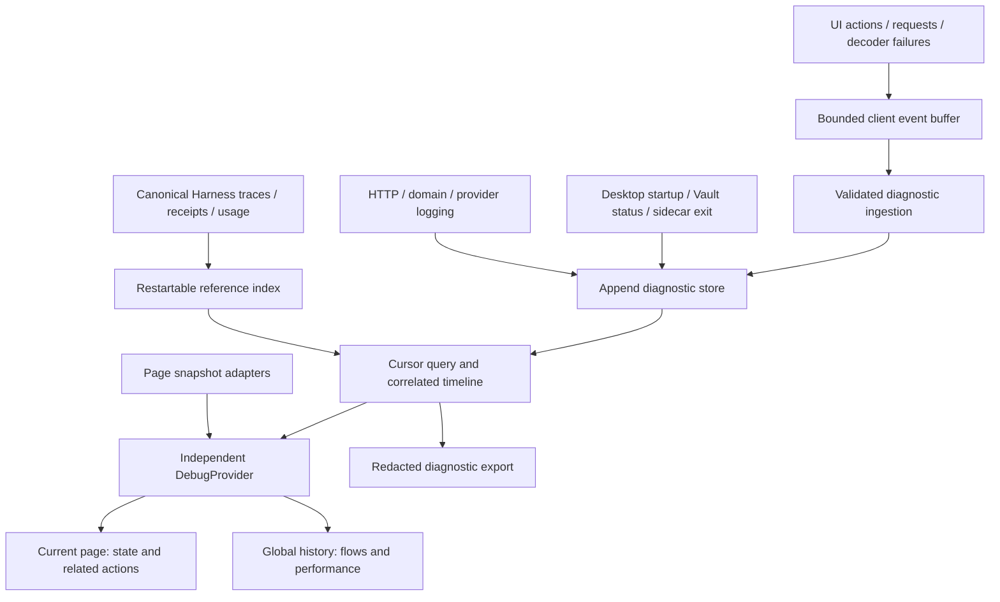

# 统一 Logging 与 Debug 实施计划

状态：实施中；按基础、流程、Debug 视图、审计四阶段分步提交。以下四项以本文件为唯一详细任务来源，根 TODO 仅链接。质量复核仍按用户要求暂缓。

### 统一 logging 与 Debug（按 1 → 2 → 3 → 4 实施）

- [x] `OBS-FOUNDATION-001` `[P1]` 建立统一诊断事件和关联上下文。
  - Python/TypeScript 共用版本化事件契约；区分客户端 action/page view、服务端 request、真实 Harness operation/trace/attempt 与持久资源身份。
  - 结构化 Python logging、前端请求入口及有界事件存储；在容器构造前初始化 logging。先打通 Persona 生成 → 保存 → 重载的纵向样例。
  - 关联 ID 仅用于诊断，不参与授权或幂等判断；跨线程、流式结束、取消和请求重放都必须正确关联。
  - 2026-09-10 完成：事件分类及 severity/outcome/error code 有 Python/TypeScript 共享样本；诊断 request、flow/action/page-view 与真实 Harness operation/trace/attempt、保存后的 Persona ID/revision 分开记录。浏览器上传不能伪造权威引用。
  - 验收：31 项后端诊断/生命周期/commit/Persona 测试、4 项客户端诊断测试、Persona 组合关联测试、shared contracts/Web 类型检查及生产构建通过。Chromium 使用独立临时数据库与真实 mock 后端走通生成→保存→刷新→重载；Debug 关闭仍记录，日志无提示词/人格正文。重放读请求分配新 request ID，取消与 worker context 传播有回归门。
  - 可复跑：`npm --workspace @vibe-learner/web run test:diagnostics:browser`（先 `npm run build:web`）；`services/ai/tests/test_diagnostics.py`、`apps/web/tests/diagnostics.test.ts` 与 `persona-diagnostics.test.jsx`。分步实现记录通过 Git 历史查询。跨流程重启索引、留存/导出与性能验收仍由后续三项负责。

- [ ] `OBS-FLOWS-001` `[P1]` 覆盖全部功能流程和 Harness 性能记录；依赖 `OBS-FOUNDATION-001`。
  - 覆盖 Document/OCR/清洗、Planning/tools、Persona/Scene、Study/题目/附件、Tavern、Settings/Vault、导入导出及桌面启动/sidecar 退出。
  - Harness/operation receipt 保持事实来源；诊断索引引用真实记录，不复制完整 trace 或把 HTTP 200 当提交成功。
  - 记录阶段、尝试、provider/tool 耗时、token 来源、预算、恢复和缺失数据；关联与终态索引支持重启补建和幂等去重。
  - 2026-09-10 索引切片：新增独立 `harness-index.sqlite3`，分页扫描 canonical runtime、原子保存 checkpoint 和受限指标投影，重启去重并周期补扫晚到提交；来源删除/异常有明确缺口。request→operation 关联单独持久化，事件列表清理后仍可查询。37 项诊断/index/生命周期/Harness runtime/commit 测试及 shared contracts/Web 类型门通过。模型、usage、费用当前诚实标记未被 canonical trace 记录；provider/tool 指标、完整流程覆盖、查询 UI 与性能量测仍待后续切片。

  - 2026-09-10 Provider 切片：统一 LiteLLM transport 记录父调用和逐次重试 span、monotonic 耗时、timeout/max-attempts、恢复次数及严格 provider-reported token；缺失/非法 token 保持 null，父调用不重复携带子 usage。指标引用已 prepare 的真实 Harness trace，退出 runtime 后恢复上下文。37 项 provider/SDK/diagnostic/runtime 测试、4 项客户端分类测试及 shared contracts/Web 类型门通过；没有真实上游费用证据，不声明 cost 或完整 endpoint 配置覆盖。

  - 2026-09-10 Tool 切片：Planning 六工具与 Study 三十一工具在原 decode/budget/runtime/result 边界记录 start/finish/failure、Manifest 契约/预算及耗时；未知名称脱敏，参数/结果/评分材料不记录，provider tool-call ID 只作独立关联。嵌套 provider span 归属工具 span，工具成功明确不声明效果提交。34 项后端专项测试（含全部 37 工具拒绝路径）和完整 `npm run check` 通过，包含全部 13 个 Harness suite。其余前端/桌面事件及完整配置、审计指标仍待完成。

  - 2026-09-10 本地动作切片：JSON 导入读取/导出交接、Settings 保存队列及六个 Vault 入口记录明确动作名和结果；保存上下文显式传入 Vault/HTTP，嵌套本地 span 保留父子关系。日志不包含文件名、正文、凭据或异常原文；诊断 ID 分配失败不阻止本地动作。9 项客户端诊断测试、1 项 Vault 入口测试、18 项后端诊断测试、完整 Web reliability 与 shared/type 门通过。Vault 测试覆盖不可用/锁定入口，真实 native 创建/解锁和桌面启动/退出仍待后续验收。

  - 2026-09-10 桌面切片：Rust 在 sidecar 就绪前写入 256 文件有界 spool，记录启动、就绪、异常退出与关闭；后端严格校验后持久化，再删除原文件，离线/重启沿用事件 ID 并去重。Rust/Python 共享协议样本，5 项 Rust 测试（含真实 Unix 子进程退出/清理）、20 项后端专项测试及 shared/Web 类型和 9 项客户端诊断测试通过。写盘/线程启动失败不阻断业务；日志不包含路径、命令参数或异常原文。当前验收限本机 Unix；跨平台、真实 native Vault 成功路径及 crash-safe 多进程丢失计数仍未认证。

  - 2026-09-10 页面切片：全部九个现有路由使用固定 page_path 白名单和独立 page-view 记录进入/离开；异步请求保留捕获时的页面，重复清理不会覆盖新页面。查询支持 page_path；不持久化任意 URL/query。21 项后端测试、11 项客户端诊断测试、实际 React Collector StrictMode/路由切换/卸载测试及 shared/Web 类型门通过；崩溃缺少离开事件不推断成功，缺口审计仍由第四阶段负责。

  - 2026-09-10 解码切片：API 响应以 Response 实例保留关联，JSON 语法、现有领域解码器和 Document/Planning 流契约拒绝记录独立 decode_failed；标量/null、页面切换后返回也关联原请求。原异常与 Tavern 明确终态重放边界保持，正文/异常/评分内容不进入诊断。5 项实际 API 诊断测试、21 项后端测试、完整 Web reliability、stream decoder 回归及 shared/Web 类型门通过；这些测试不证明尚未接入严格解码器的遗留 normalizer 已具备严格契约。

- [ ] `OBS-DEBUG-001` `[P1]` 改造 Debug 浮窗的页面和全局视图；依赖 `OBS-FLOWS-001`。
  - 独立 DebugProvider + 按 page-view 注册的快照/数据适配器；去除浮窗对 LearningWorkspaceProvider 的强依赖，与 `PERF-WEB-PROVIDER-001` 协同。
  - 页面视图展示当前实体、状态、请求/动作和错误；全局视图按流程、时间、页面、资源及 operation 过滤，并可展开完整关联链。
  - 浮窗关闭不停止记录，不预拉取全部领域数据；检查路由切换卸载竞争、StrictMode 和过期页面快照。

  - 2026-09-10 快照归属切片：Learning 与其他页面的快照共用稳定注册接口，按真实 page-view 与 owner fencing 发布；旧 owner 更新/卸载不可覆盖新页，路由变化立即隐藏不匹配快照。修复 PageDebug Context 更新反馈循环，以及设置加载前误清空浮窗打开偏好的问题。5 项 React 快照/StrictMode/路由测试、完整 Web reliability、生产构建及 Chromium Persona→Settings→Model Usage 切换/刷新验证通过；关闭浮窗仍记录的 Persona 纵向样例保持通过。全局诊断 timeline、关联筛选与 lazy query 尚待接入，本阶段保持未完成。

  - 2026-09-10 查询切片：事件查询新增 operation/workflow/stage、资源、severity 与显式时区范围筛选，持久 request 关联支持跨事件查询，游标增加有界 has_more。事件/关联内容读取重验，故障返回明确不可用状态并区分 read/write failure；索引查询只读并支持 workflow/stage。24 项后端诊断/index/生命周期测试及 shared/Web 类型门通过。历史关联缺少 workflow/stage 的覆盖限制、源时间语义与资源筛选范围已写入 API 文档；前端严格查询适配器和 timeline 尚待完成。

  - 2026-09-10 前端查询适配器切片：events/index/operation-links 使用后端模型生成的共享白名单，严格验证嵌套字段、分类、attempt 完整性及单页游标/重复身份；传输上限 2 MiB、5 秒 timeout 与调用方 abort 共存，查询不递归记录，故障不回显原文。6 项前端查询测试、3 项后端查询/模型漂移测试及 Web 类型门通过，覆盖真实 Python provider/tool/attempt/desktop DTO 样本。适配器尚未接入浮窗，timeline 与跨页结果合并仍待后续切片。

  - 2026-09-10 时间线 UI 切片：Debug 新增当前页面/全局视图，页面请求按需展开；全局事件支持页面、来源、级别、workflow/stage、operation/request/action/flow、资源与本地时间筛选，Harness 索引单独按需加载。operation→request→events 可展开；事件/索引分别最多显示 500/250 条，分页去重，切换/关闭中止请求且 fence 迟到响应。4 项 React 时间线测试、完整 Web reliability、生产构建和 3 项 Chromium 场景通过；浏览器发现的三行布局与控件标签问题已修复，390px 无横向溢出且截图已检查。全流程覆盖和独立总验收仍未结束，本阶段暂不关闭。

- [ ] `OBS-AUDIT-001` `[P2]` 完成诊断留存、导出与性能审计验收；依赖 `OBS-DEBUG-001`。
  - 本地 append 存储、游标分页、轮转/清理及诊断包导出；内容按白名单脱敏，受保护内容仍走 artifact resolver，凭据及未提交评分材料不得进入全局日志。
  - 样本按 workflow/stage、模型、配置/组件版本分组；输出原始指标、P50/P95、失败/恢复/unknown 数和缺口，父子耗时不能重复相加。
  - 注入离线、断进程、写盘失败、队列溢出、重复上传和大日志量；诊断故障不能改变业务提交结论，性能开销须量测。
  - 2026-09-10 事件留存切片：数据库入库时间驱动七天/一万行/64 MiB UTF-8 正文上限，启动、写入及空闲周期清理；删除计数/最高删除序号与清理同事务，查询与覆盖信息取同一快照。旧库未知入库时间明确标记，半完成迁移可恢复，前端展示历史缺口。30 项后端测试（含真实子进程在清理提交前后退出）、7 项查询/5 项时间线测试、shared/Web 类型门、生产构建和 3 项 Chromium 场景通过。此限制只覆盖事件正文；索引、关联表、WAL/物理空间、writer epoch、导出和开销量测仍待完成。

  - 2026-09-10 故障隔离切片：诊断 writer/index/spool 线程启动失败不阻断业务生命周期；重复启动不产生额外 writer，终止后拒收并清空未处理队列，失败事件事务回滚后可继续写入。34 项后端回归通过，其中真实应用在三个诊断线程均启动失败时仍完成设置持久化、人格生成与 canonical Harness 终态；重启读回和队列记账也通过。丢弃/失败计数目前仍为进程内状态，跨崩溃 writer epoch 和持久覆盖证据尚待下一步。

  - 2026-09-10 writer 覆盖切片：每个实际 async writer 保存独立 epoch，逐事务/空闲/正常关闭记录已观察计数；保留 256 行，旧行以同事务汇总计数替代。没有关闭记录仅表示 active-or-interrupted；线程启动前、未落盘队列及检查点间丢失继续明确标为未知，拒绝完整采集声明。新增 `/diagnostics/writers` 与按需“采集覆盖”视图。38 项后端测试（含真实进程退出/重启、退休汇总和损坏记录拒绝）、8 项查询/6 项时间线测试、Web 类型、生产构建及 3 项 Chromium 场景通过。总体磁盘治理、诊断导出、统计与开销量测仍待完成。

  - 2026-09-10 审计统计核心切片：版本化 report 保留原始 metric observation，按 provider call/attempt、tool、Harness stage/attempt 分组，结合实际模型、可用配置/契约及组件版本；nearest-rank P50/P95 与失败/恢复/unknown、用量样本数/缺口分开输出。父子耗时不相加，token 只聚合 provider attempt 的已报告值；冲突 span 不声明指标，缺失保持未知。14 项 audit/provider/tool/index 测试通过，含真实 ProviderObservation 重试输入。详见 `docs/diagnostic-audit.md`；一致快照导出、统计 UI 和开销量测尚未接入。

  - 2026-09-10 诊断导出后端切片：新增 `POST /diagnostics/export`，事件/关联/留存/writer 分页取同一只读快照，Harness 索引/checkpoint 使用独立快照并明确范围与缺口；重验嵌套 DTO 和数据库身份，超限整体拒绝。导出包含版本、筛选条件、白名单记录、原始指标与统计，不包含受保护内容。37 项后端诊断回归及 shared contracts 门通过，涵盖并发删除/索引更新/writer 多页、损坏记录、身份错配、留存后关联与请求/输出边界。浏览器下载、统计 UI、总体磁盘治理及开销验收仍待完成。

  - 2026-09-10 诊断导出 UI 切片：全局 Debug 新增按需生成快照、分组统计和诊断包下载；共享后端 schema 严格校验嵌套 DTO、关联身份、writer 分页及统计计数，32 MiB/15 秒边界和调用方取消不递归采集。刷新清除旧包，筛选/关闭 fence 迟到响应；最多显示 100 组，完整原始指标保留在下载包。10 项查询/7 项 React 时间线测试、完整 Web reliability、7 项后端导出测试、生产构建和 3 项 Chromium 场景通过；真实 Persona 包下载、正文 sentinel 排除及 390px 渲染已验证。原生保存对话框、多平台、总体磁盘及开销验收仍未认证。

  - 2026-09-10 关联/索引留存切片：request→operation 关联按首次入库七天/一万行/4 MiB 留存；Harness 索引按可用 canonical 更新时间或首次观察七天/五千行/32 MiB 留存，过期源记录在重复补扫时不重新入库，后续真实更新可重新纳入。清理/计数同事务，旧库未知时间有迁移计数；诊断包及 Debug 展示清理缺口。40 项后端回归（含真实进程在清理提交前后退出）、共享契约、10 项查询/7 项时间线、生产构建和 3 项 Chromium 场景通过。限制只覆盖正文/行数，物理 DB/WAL 回收、总体磁盘上限与开销测量仍待完成。

  - 2026-09-10 SQLite 回收切片：新诊断库启用 incremental auto-vacuum，写连接设置 WAL checkpoint/复用目标；提交后按周期回收空闲页并非阻塞尝试 TRUNCATE。旧库 VACUUM 转换有 SQLite progress 协作预算，忙/中断留待重试；维护不接管已有事务，失败不改写事件或业务提交结论。44 项后端回归通过，真实文件测试验证空间缩减、读快照占用后的恢复、迁移中断重试，以及维护失败时 Persona/Harness 仍完成。总体磁盘配额、维护状态对外投影和开销量测仍待完成，尚不声明 200 MiB 总体上限。

  - 2026-09-10 本地量测切片：新增 `npm run bench:diagnostics`，100 样本覆盖真实 middleware 开关/队列满对照、12,000 合成事件写入与 10,000 行保留、1,000 索引、查询及快照导出，记录源代码 digest、环境和原始时长；另测读快照占用 WAL。结果见 [基线](../performance/diagnostic-local-baseline-v1.md)：事件页 P95 1.61ms、operation 筛选 15.96ms、限定导出 16.82ms；完整包单次约 302ms/19.8MB。500 条小事件在读快照占用期间使 WAL 达到 23MB，释放后回收，证明总体配额仍需覆盖 WAL。2 项基准结构/真实路径测试通过；此为本机合成量测，不代替全流程、原生 UI 或性能门认证。

  - 2026-09-10 数据库配额准入切片：事件库 128 MiB、索引库 64 MiB，提交前按主文件/WAL/SHM/journal/锁文件及最坏整库改写保守预留；进程锁、BEGIN IMMEDIATE、禁用 cache spill 和提交前复验覆盖正式写入口及维护。低配额下读快照占用触发拒绝，释放/回收后恢复；超限事务不新增 WAL，旧超限文件不被截断。57 项后端回归及 3 项 Chromium 场景通过，含真实业务/Harness 在配额压力下完成。Windows、多进程桌面 spool、旧超限文件恢复及配额状态投影仍待完成，因此安装目录 200 MiB 总体上限保持未认证。新开销原始样本见 [配额量测](../performance/diagnostic-quota-admission-v1.md)。

  - 2026-09-10 存储状态切片：新增只读、no-store `/diagnostics/storage` 与独立 Debug「存储状态」，展示两库文件长度/预算、配额拒绝/锁不可用及维护观察；缺失文件、未配置索引和文件读取失败有明确缺口。诊断包纳入独立 live observation，不混同其数据库快照；前端严格验证总数、身份、状态与未认证标志，关闭/切换 fence 迟到响应。18 项后端、11 项查询、8 项时间线、共享契约、生产构建与 3 项 Chromium 场景通过。桌面 spool、旧超限恢复和安装目录总体配额仍待完成。

  - 2026-09-10 桌面 spool 恢复切片：Rust/Python 共用进程文件锁；原生 ring 同时约束 256 文件/4 MiB，单记录 16 KiB，双方按文件修改时间清理七天过期记录。驱逐计数使用同步临时文件、原子替换与 Unix 目录同步，恢复完整 checkpoint，残缺 checkpoint 保留旧下限；消费端恢复完整 `.pending`，有界/no-follow 读取并核对文件身份后删除。10 项 Rust 测试（含双进程写入和真实 sidecar 退出）及 36 项后端回归通过；原生构建最低 Rust 1.89。计数仍是已观察下限，Windows/power-loss、原生 Vault、未知旧文件及总体目录配额保持未认证。

  - 2026-09-10 完整检查点：在 `8fdf4f1` 上 `npm run check:release` 通过，包含 715 项后端测试、共享/Web reliability 与类型门、全部 13 个 Harness PR suite 和生产构建。逐项范围审计见 [验收检查点](unified-debug-acceptance.md)：明确保留其他领域资源筛选、跨请求逻辑 flow、完整流程诊断链、旧超限恢复、原生成功路径及前端/原生性能等未完项，不因 release gate 通过而关闭总目标。

## Target architecture

Implementation is tracked by the four tasks above; the root [TODO](../../TODO.md) links here. This section is the target architecture,
not a claim that every component is implemented. The initial server event store
exists under `storage_root/diagnostics/events.sqlite3`; it retains at most 10,000
rows using a 1,000-event queue. Browser ingestion and cursor query are available at `/diagnostics/events`,
including writer health counters. Event payload retention now uses seven days,
10,000 rows or 64 MiB, with durable removal coverage; global UI health is visible.
Operation links and Harness index projections now have independent age/row/payload retention.
WAL reclamation and per-database quota admission are implemented;
the aggregate installation budget remains uncertified.
Snapshot export and grouped statistics are available on demand in global Debug. Console logging intentionally excludes
unreviewed formatted messages and exception text.

The collector, query API and Debug UI are separate components. Closing the
floating window does not disable collection. Register page snapshots by unique
page-view identity and ownership token, so cleanup from an old view cannot clear
its replacement. Page snapshots are current in-memory projections; only bounded,
reviewed state summaries or state changes enter persistent diagnostics.

Correlation distinguishes `event_id`, client instance/page-view, logical
`flow_id`/`action_id`, server `request_id`, optional `span_id`/parent span, and
actual Harness operation/trace/attempt and domain resource references. An action
can span requests, retries, streams and navigation. Different requests retain
different request IDs even when the admitted operation is replayed. Client
correlation fields are untrusted diagnostic hints, never authorization or
idempotency identities; resolve canonical Harness links on the server.

Events have a closed name/category, source, severity, outcome/error code,
source timestamp, monotonic duration, ingest sequence and bounded typed
attributes. HarnessStage, attempt phase and stream event remain separate fields.
Capture stream completion/disconnect separately from HTTP response creation;
propagate context explicitly across worker threads. Record app/runtime and model
configuration versions without secrets. Unavailable timings/tokens/costs remain
null with a reason, and measured versus estimated usage stays distinguishable.

Use a diagnostic append repository, not `LocalJsonStore.save_list`. The initial
implementation can use a dedicated local SQLite database with bounded async
writers and cursor indexes; separate it from business transaction scans. Durable
operation correlation links and existing Harness receipts/traces allow the
reference index to resume and deduplicate after restart. Diagnostic events do
not establish commit truth. A logging outage must not roll back or relabel an
already committed business operation. Missing starts/ends, interrupted writer
epochs, dropped events and retention expiry must be visible rather than inferred
as successful execution or complete audit coverage. Desktop events before
sidecar readiness use a bounded local spool and the same event identity when
forwarded later.

Candidate defaults to validate during implementation: 1,000 in-memory client
events, 100 events per upload batch, 16 KiB per event, and persistent retention
of seven days or 200 MiB, whichever is reached first. Diagnostic ingestion and
query traffic must not recursively log themselves. Queue backpressure, dropped
counts and writer health are observable; critical Harness evidence remains in
its existing authoritative storage regardless of diagnostic retention.

Default persistent events contain identifiers, counts, safe state, error codes
and metrics. Do not copy prompts, document/chat content, arbitrary request/response
bodies, credentials or private grading specifications into them. Rich page
inspection and optional content export use the existing authorized artifact
resolver and remain explicitly scoped. Validate safe attributes at emit and
server ingest boundaries, including exception-message sanitization.

The query layer supports page view, flow/action, resource, operation, time,
source and severity filters. Audit exports include schema/app versions, filters,
coverage/drop indicators, raw metric observations and available linked Harness
records. Group P50/P95 by workflow/stage, provider/model and configuration;
report sample counts and unknown/failed outcomes. Parent duration includes child
work, and parallel spans must not be summed as wall-clock time.

## Integration order

First establish application lifecycle logging (`ARCH-LIFECYCLE-001`) and a Persona generate/save/reload vertical slice. Add workflow emitters through adapters without moving domain transaction ownership. Coordinate DebugProvider routing with `ARCH-WEB-001` / `PERF-WEB-PROVIDER-001`; they are one ownership change, not duplicate implementations.

2026-09-10 cumulative flow/resource checkpoint: Persona and Scene draft flows,
Document upload→parse→Planning→initial Session, Study refresh recovery and Tavern
mutation/read-back actions are now correlated. Saved-resource references span
those domains with explicit revision/sequence ownership, and Timeline resource
results link to their request events. Seven real Chromium scenarios plus the
cumulative `check:release` passed. See [current acceptance audit](unified-debug-acceptance.md)
for tested boundaries and remaining fault, native, storage-recovery and performance
work; no top-level item is closed by this checkpoint.

2026-09-10 存储恢复检查点：桌面 spool 已加入有界只读文件统计；事件库与
Harness 索引支持旧超限库原地恢复。先保留正常留存集并回收空页，压缩后仍无法
恢复普通写入时才缩短留存后缀，删除计数随事务保存。恢复有独立的 512 MiB
临时工作空间检查、5 秒协作式 SQL 时限与一分钟重试节流；超出工作空间或读者
占用时安全暂缓，不声称安装目录 200 MiB 总上限。11 项恢复回归包含清理提交
前后及 VACUUM 中真实进程退出；最终 `check:release`（732 后端测试、13 个
Harness suite、共享/Web 门与生产构建）和 7 项 Chromium 场景通过。
[验收记录](unified-debug-acceptance.md)与[本机旧库探针](../performance/diagnostic-legacy-recovery-v1.md)
已归档；安装目录总量核算、其余异常流程、原生成功路径与开销验收继续进行。

2026-09-10 目录核算检查点：诊断目录独立扫描已接入存储状态与导出，覆盖数据库
附属文件、桌面暂存和未知嵌套文件，不暴露文件名或内容。扫描限定 4,096 项、
4 层和 100ms 协作式时限，链接/特殊文件及不完整扫描有明确缺口；部分用量可
证明已超过参考预算，不能证明完整用量低于预算。19 项后端专项测试、
`npm run check`、生产构建与 7 项 Chromium 场景通过，390px 界面已检查。
这完成文件长度观察，组合写入预算与恢复临时超额验证仍继续，详见
[验收记录](unified-debug-acceptance.md)。

2026-09-10 组合存储验证：同一诊断目录的旧库恢复共享进程锁，临时恢复串行执行，
普通数据库写入继续独立准入；writer 退出显式关闭 SQLite 连接，避免依赖 GC
释放锁。真实 Rust 暂存写入与 Python 事件/索引/消费并发探针通过，两库均实际
触发配额拒绝；1,880 个样本中最大已观察长度约 103.22 MiB，保留了丢弃/拒绝和
不完整扫描证据，不声称原子峰值或未知文件、临时恢复均受 200 MiB 硬限制。
最终 release gate（739 项后端测试、13 个 Harness suite、共享/Web 门与构建）
及 11 项 Rust 测试通过，见[组合存储报告](../performance/diagnostic-installation-v1.md)。
异常/分支流程、原生 Vault/导出成功路径和前端/原生开销验收继续进行。

2026-09-10 Study 分支验收：新增附件 multipart 成功/不支持类型拒绝、互动题
版本冲突→重试→持久化读回→自动续接的真实 Chromium 场景，9 项场景与 42 项
后端专项测试通过。评分材料提交前不进入公共题目，附件名/内容、题目与评分
内容不进入诊断记录；HTTP 200 的 `not_committed` 不被当作保存成功。互动题
保存后的 Session 资源引用使用已验证回执中的 identity/revision。自动续接仍
使用独立 flow，继承关联以及其他异常、原生和性能验收继续，见
[验收记录](unified-debug-acceptance.md)。

2026-09-10 自动续接关联：即时互动题 callback 继承已保存答案的 flow，分配独立
的 action；刷新后的查询恢复保留原 flow，不重复提交。诊断映射不进入业务请求
体或持久化 pending 状态，已有请求关联不能被后续提示改绑。暂停后汇入后续
学习动作的 callback 仍随该动作使用独立 flow。`npm run check`、生产构建及
10 项真实 Chromium 场景通过，含真实提交后丢失响应、刷新查询和唯一 Turn
验证。详见[验收记录](unified-debug-acceptance.md)，其他异常/原生/性能项继续。

2026-09-10 Document 异常 HTTP 验收：真实损坏 PDF、强制 OCR 但引擎不可用均
验证 HTTP 200 与业务 stream_error 的区别、失败主操作的 not_committed 证据、
真实阶段身份以及内容/文件名排除；关闭强制 OCR 后的重试可提交同一 Document，
沿用传入 flow 并获得新的 operation。25 项后端专项测试通过；浏览器重试动作
归属、真实 OCR 引擎成功路径与其余异常/原生/性能验收仍继续。

2026-09-10 浏览器更正提交验收：损坏 PDF 显示处理失败并停止计划/Session 请求；
更换文件后重新提交创建新 Document/flow，成功链四个请求共享该 flow。失败解析
无保存成功资源引用且诊断排除文件名、内容和目标。11 项生产 Chromium 场景通过，
见[验收记录](unified-debug-acceptance.md)；其余 OCR/Tavern/原生/性能项继续。

2026-09-10 Tavern 部分失败 HTTP 验收：第二演员失败后父运行保留第一条提交，
原请求读回不再次调用 provider，子重试仅执行剩余演员。诊断引用匹配真实父子
operation/trace 和消息 identity/sequence；502 不被解释为整轮无提交。36 项
专项测试通过；浏览器重试及取消/重启诊断关联仍需验收，详见验收记录。

2026-09-10 Tavern 并发取消验收：真实 HTTP 在 provider 等待时取消，迟到有效回复
被提交围栏拒绝，只有用户消息保留；resume 读回 canceled 且不再调用 provider。
诊断保持各请求身份，资源引用和 not_committed actor trace 均核对持久化记录。
37 项专项测试及强化后的 2 项诊断回归通过，取消 upstream 调用与重启恢复未由
本场景证明；浏览器/重启/OCR/原生/性能验收继续。

2026-09-10 Tavern 取消终态重启读回：关闭整个应用后以同一存储创建新应用，
取消状态与 admission binding 保持，provider 无新调用；旧事件 ID 全部保留，
新读回使用独立请求/事件且匹配持久化资源。2 项诊断回归通过。此为正常应用
重启证据，不能替代进程崩溃/租约接管，后者及其他未完成验收继续。

2026-09-10 Tavern 进程退出/租约接管诊断验收：子进程提交第一演员后在第二调用
处 os._exit；新应用恢复过期 claim，仅执行剩余演员，旧消息和 operation 不变。
旧已落盘诊断缺少请求结束事件，新恢复请求关联同一操作；trace 和消息序号核对
canonical 数据。9 项诊断/跨域进程恢复测试通过。测试先排空诊断队列并推进
指定 lease 到过期，不声称未落盘日志无损或真实 provider exactly-once。
其余浏览器分支/OCR/原生/性能和最终验收继续。
