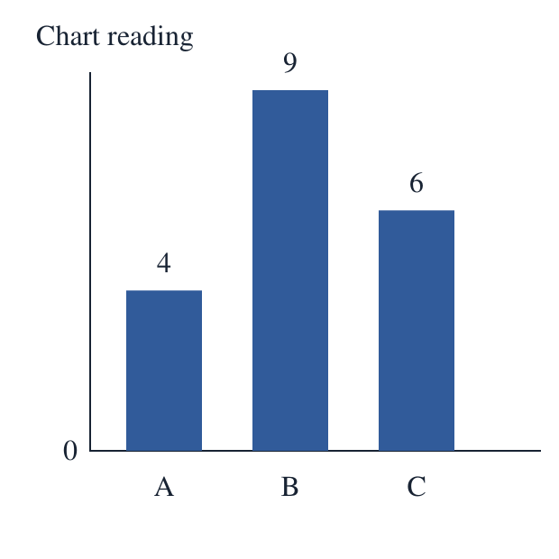

# 教学制品完整性修复（实验级）

2026-09-12。已补齐 role exploration 的 chart 交付缺口；无新增模型调用，无生产 schema 或默认配置变更。此修复提供受控柱状图任务的可验证交付，不代表 M3 新一轮成功率或任意自然语言题目的依赖识别能力。

## 原因与边界

旧指标只要求事实、时长、非空 learner_prompt 与指定禁词。review/self-revise 删除 4/9/6 后，仍将依赖未交付图表的题目记为 completed。现在不能用模型宣称有图、文件名、非空文本或文件存在代替交付证据。

- Application case source 明确给出类型化 chart 数据（A=4、B=9、C=6）；绘图不读取评分 gold。`ArtifactRequirement` 绑定完整 source SHA-256、公开图数据和独立类型化任务要求：按顺序交付 maximum(A,B,C)、difference(C,A)。少题、重复题、改操作/标签或逆序均拒绝；这些是应用任务要求，不是 gold 答案。
- Model proposal 仅包含教学事实、活动、文字草稿及结构化 `chart_questions`（maximum/difference 与来源类别）。不接受 application-owned asset ID、路径或 digest。
- Application 从结构化问题生成最终公开题干，与确定性 SVG 一起放入 `learner.html`；自由 `learner_prompt` 保留为 proposal 审计，不作为 chart lane 的实际公开问题。校验类别集合、操作参数、最终题干与结构化问题一致性。
- `delivery.json`、`chart-data.json`、`chart.svg` 和 `learner.html` 读回时均以受控 source 重新生成并比较实际字节及 digest。缺图、页面未引用图、伪造 hash、改图后同步改 hash、错误 source 绑定均失败。输出 evidence 只引用 runner 支持的 JSON：manifest 与 artifact-bundle.json；bundle 携带已验证磁盘读回的 SVG、data JSON、HTML 实际 UTF-8 内容、MIME 与 SHA-256，允许完整导出与重建。真实 HTML 同时保留本地预览。
- 新证据版本 `role-exploration-v2`；历史 v5 原始记录保持不变。未给旧模型输出补造结构化问题，也未把本地 fixture 归作模型结果。

## 本地验证

运行：

```bash
PYTHONPATH=services/ai:tools/model-quality/integrations:tools/model-quality services/ai/.venv/bin/python -m unittest discover -s tools/model-quality/integration_tests -p 'test_role*.py'
```

15 个测试通过，覆盖正常交付、缺失/删除资产、仅有文件而无交付、错误 digest、同步伪造图与 digest、公开页面不引用资产、source 绑定错误、未声明标签、缺少/重复/逆序结构化问题、严格模型 ownership 边界、非法数据，以及 run_sample 的通过/拒绝路径。其余原有 role schema 与审核错误测试仍通过。新增真实 worker + MeteredTransport fake response + ledger/checkpoint 测试确认 completed、1 次 fake wire，经过 AdapterResult 模型校验和 runner 逐 evidence JSON 读回；source_state 检查冻结 manifest 的 source_files 包含 role_artifacts.py。

[真实交付预览](evidence/m3-artifact-completeness-20260912/learner.html)、[manifest](evidence/m3-artifact-completeness-20260912/delivery.json)、[source requirement](evidence/m3-artifact-completeness-20260912/source-requirement.json)。使用 PyMuPDF 将 SVG 转成 PNG 并目视：三柱 A/B/C、数值 4/9/6 可读，比例/顺序正确，无文字重叠。这是制品级目视 QA，不是产品浏览器验收。



[历史派生重审](evidence/m3-artifact-completeness-20260912/historical-reassessment.json) 记录三个 v5 chart 样本的原文件路径、SHA-256、原始 status 与最终草稿。三个样本均缺少实际交付 manifest，重新判为 `artifact_delivery_unproven`。baseline 即使文本写有读数，也未满足 chart-reading 任务的实际图表交付要求。原先 12/12 有限字段指标不再被引用为教学制品可用性通过。

后续新 live 实验必须使用更新的 prepare_role_exploration case source/request；旧无类型化 source 的 `media-chart` case 将 data_failed。结构化问题约束缩小了任意文字编写空间，因此新旧分数不能直接相减宣称模型改进。还需独立复核及新模型实际执行，才能评价审核协作在有真实图表时的收益。

独立代码复核修正：最初直接把 learner.html 返回为 evidence 引用，违反核心 JSON evidence 协议，会将正常样本变成 metric_failed；现已改用上述 JSON bundle 并补 worker 回归。恢复 common.source_manifest 导出，避免新辅助文件遗漏于完整源码冻结。未修改核心 protocol。

## 后续状态（2026-09-12 归档整理）

上文“还需独立复核及新模型实际执行”为该报告初始阶段状态。后续已完成[独立源码复核](m3-bridge-artifact-independent-review-2026-09-12.md)、[三臂真实交付与浏览器检查](m3-grounding-repair-results-2026-09-12.md)。独立留出、任意自然语言制品依赖识别及生产 Study UI 验收仍未完成。
