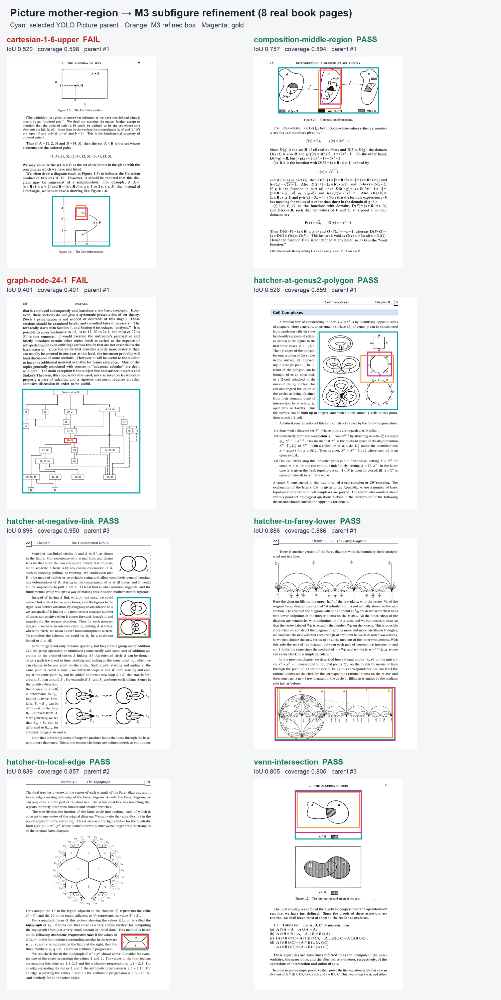

# M3 数学书页定位、Reflection 与坐标校准

本轮把先前在合成图和自然照片上的定位诊断扩展到 OCR 文本中夹有多个相似数学图形的真实书页。结果支持将“严格边界定位”和“教学中的有效指示”分成两个指标：严格 bbox 门用于裁剪、标注和下游区域操作；教学指示门允许框落在正确且唯一的目标内部或略宽，只要学习者不会误认目标。后者由本轮单一维护者目视复核，仍不是独立专家评分。

主开发集有 **12 个目标任务、8 个独立页面**。其中原始集为 8 页各 1 个目标；复用集在 3 张 Bartle 页面上增加 4 个目标，所以任务数增加不代表新增 4 页。Hatcher 同页校准另有 12 个任务，但全部复用已有 4 张页面，每页各标一个图形、公式和字母。所有页面与标注均为开发资料，不是 held-out、盲测或专家认证 benchmark。

## 主书页实验

原始 8 任务的严格门为 `IoU >= 0.5` 且 `coverage >= 0.8`。Direct、OCR 加闭合轮廓候选、GroundingDINO 候选三臂都接收完整原页和同一份图像 OCR；候选臂由 M3 选择编号。一次超出输入预留的 Layout 样本在出网前停止，之后在独立 recovery campaign 中补齐，原停止记录保留。

| 方法 | 严格通过 | 主要失败 |
| --- | ---: | --- |
| Direct | 0/8 | 小目标框成文字内部、相似图或相邻正文的纵向漂移、框过宽或过窄 |
| OCR + 闭合轮廓 + M3 | 3/8 | Hatcher 稀疏线图常无完整图形候选；有些候选只覆盖内部 |
| GroundingDINO + M3 | 1/8 | 仅 Venn 图有合格候选；通用开放词汇先验未覆盖多数数学线图 |

[逐任务、逐轮机器可读审核](evidence/m3-book-grounding-errors-20260912/task-round-audit.json)保留严格状态、IoU、coverage 和实际框。图中前三个 Direct 虽未过紧框门，目视均能唯一指示正确目标：`graph-node-24-1` 圈住正确节点内的 `24.1`，`venn-intersection` 明确指向上方交集图，`composition-middle-region` 完整包住中间 B 且没有进入 A/C。按新增的教学指示 rubric，Direct 为 **3/8**；此人工二级结果不替换原始严格 `0/8`。Cartesian 上下框、genus-2 相邻多边形、negative-link 下方正文和 local-edge 上方正文会让学习者指错对象，仍失败；Farey Direct 只覆盖下图上部并混入上方正文，也不算完整教学指示。

这一区分影响产品决策：只显示一个指示框时可评估教学指示成功；要裁剪图片、生成 mask、绑定可点击区域或把框作为后续模型输入时，仍应使用严格边界门。

## Reflection 轮次

Reflection 每轮只接收完整原页、同一份 OCR、目标请求和上一轮最后一个合法预测，不接收 gold。每轮是新的 wire；非法输出后下一轮携带最后一个合法框。

| 轮次 | 原始 8 任务严格通过 | 相对上一轮新增 | Wires / reported tokens |
| --- | ---: | ---: | ---: |
| Direct R0 | 0/8 | — | 已计入主批 |
| R1 | 2/8 | +2 | 8 / 30,931 |
| R2 | 3/8 | +1 | 8 / 30,846 |
| R3 | 3/8 | 0 | 8 / 29,710 |

R1 修复 Venn 交集图和复合映射中间区域；R2 再修复 Farey 下图；R3 无新增通过。第三轮没有把已通过样本降为失败，但 Venn 的 IoU 从 `.787` 降到 `.727`、coverage 从 `.888` 降到 `.813`，`graph-node-24-1` 也从 `.424` 降到 `.352`。因此第三轮已经平台化并出现数值回退，不适合无条件继续迭代。应保存每轮评分，选择历史最佳合法候选，并设置最大两轮或无改善提前停止。

同页复用的 4 个 Bartle 目标结果为 Direct `1/4`、Layout `3/4`、DINO `0/4`；Reflection 为 `1/4 -> 1/4 -> 1/4`。扩大轮次没有修复这组目标，只改变了框。该批证明可以从同一页构造多个目标任务，但不能把这些高度相关样本当作 page-disjoint 泛化证据。

主书页、复用和 Reflection 共 68 wires、320,296 reported tokens。所有 campaign 已保存执行源码并完成终态恢复检查。

## Hatcher 纵向漂移与同页坐标校准

Direct 的四个 Hatcher 图形显示成对的纵向特征漂移：Algebraic Topology 两例向下偏 `+0.094H`、`+0.107H`；Topology of Numbers 两例向上偏 `-0.107H`、`-0.123H`。横向中心偏差只有约 `-0.014W` 到 `+0.034W`。这不像统一的图像原点错误，更像页面结构、文本锚点和目标特征之间的坐标绑定偏差。

为区分页面版式和目标类型，本轮在同一 4 页上分别标注一个图形、公式和单字母，共 12 个目标；每个目标比较未加标记的完整原页与同一页的 `0.1` 间距坐标网格。该路线已经归档为负面结果，清理时删除了重复标注图与中间配对图，只在本报告保留汇总指标。

| 指标 | 原页 | 坐标网格 |
| --- | ---: | ---: |
| 严格通过 | 1/12 | 1/12 |
| 合法配对中的纵向中心绝对误差中位数 | .074H | .011H |
| 有效框配对 | 9 | 9 |
| 纵向中心误差缩小 | — | 7/9 |

三个图形配对和两个公式配对的纵向中心误差全部缩小；四个字母配对中两个改善、一个不变、一个变差。网格把 `genus2-polygon` 的中心误差从 `+.074H` 降到 `-.010H`，`local-edge` 从 `-.095H` 降到 `+.027H`，但框的宽高和细粒度目标边界仍不合格。`farey-lower` 两臂都通过，网格将 IoU 从 `.679` 提到 `.860`。这支持“漂移包含可校准的坐标落点成分”，但不支持“增加网格即可提高最终严格准确率”。

三个 arm 输出未通过 JSON/完整性解码，只有 9 个任务形成合法 plain/grid 框配对。主校准 campaign 在第 21 个 wire 遇到一次 HTTP 529，账本保留该未知用量请求并停止发放；随后降为 2 并发，在两个独立 recovery campaign 中补齐 4 个缺口。合计 25 wires，其中 24 个是所需 arm 结果，另 1 个是保留的不确定尝试；94,832 reported tokens，另有 1,202,048 tokens 的保守未知预留，账本 operational charged-or-reserved 为 1,296,880。

**负面结论，已归档，不采用坐标网格。** 虽然合法配对中的纵向中心误差缩小，但严格通过率仍为 `1/12 -> 1/12`，字母结果不稳定，也没有形成跨页面、跨目标类型的一致校准规律。该臂只保留为“中心漂移与边界误差可分离”的诊断，不进入下一轮默认方案。

## 边缘候选

固定多尺度 Canny、闭合与膨胀只在本地生成候选，不调用 M3，也不在生成时读取 gold。严格 proposal recall 为 `3/8`，与原 Layout 的 `3/8` 相同，GroundingDINO 为 `1/8`。Edge 命中 Venn、Cartesian 和 Farey；Layout 命中章节节点、Venn 和 Cartesian，二者并集理论上覆盖 `4/8`。

全页 Edge 每页产生约 132–304 个候选，直接交给 M3 会扩大编号拥挤和 token 成本。可行路线是先用文档版面模型限制 Picture/Formula 区域，再在区域内运行边缘候选，按 OCR caption 邻近度、包含层级、面积和重复框去重。当前只能说 Edge 与 Layout 召回互补，尚未证明最终准确率提升。

## DocLayout-YOLO 母图与子图裁剪

本地隔离安装 `doclayout-yolo==0.0.4`，冻结 [DocLayNet + DocSynth300K 权重](https://huggingface.co/juliozhao/DocLayout-YOLO-DocLayNet-Docsynth300K_pretrained) revision `51b2c54a642013022382c3d2bd76e84b07656b4a`、SHA-256 `0ddfc7f411ec23aab661091ca8da6b25abe7bdce6afa3a515811c92d7ccfb1db`。CPU、`imgsz=1120`、`conf=.05` 对 8 页批量推理约 9.1 秒。代码为 AGPL-3.0；权重卡标 Apache-2.0。项目自身为 GPL-3.0，GPL-3.0 第 13 条允许与 AGPLv3 作品组合，但网络部署仍需履行组合中 AGPL 部分的附加义务。DocSynth300K 数据卡没有公开 `license` 字段或许可正文，因此项目许可证不能替代训练数据许可证明。

职责边界固定为：YOLO 只提供 `Picture` 和独立 `Formula` 版面候选；正文、行内公式锚点和单字母由 OCR 通道负责。Hatcher 四个行内公式没有生成任何 `Formula` 候选，进一步说明不能把行内数学定位交给该版面类别。

页级 `Picture` 母框对 8 个图形目标的 containment recall 为 **8/8**，但直接把母框当最终答案只有 **3/8** 通过严格门。对所有母框裁切、放大，再用同一 YOLO 递归一次，二级 tight candidate recall 为 **4/8**；一级与二级候选并集为 **5/8**。递归新增解决 genus-2 polygon 和 negative-link，但仍不能拆出章节依赖图中的单节点、Cartesian 图中的小矩形和 composition 的中间区域。离线结果见[母框 pilot](evidence/m3-book-grounding-errors-20260912/doclayout-yolo-pilot.json)与[递归候选审核](evidence/m3-book-grounding-errors-20260912/doclayout-yolo-recursive.json)。

随后进行一次 M3 真实实验：模型接收原页、全部 `Picture` 母框和母框放大联系表，一次调用同时选择 `proposal_id` 并返回相对母框的 `local_box`，再确定性映射回整页。结果严格通过 **6/8**，8 wires、44,094 reported tokens、0 unknown usage：

| 任务 | IoU | Coverage | 结果 |
| --- | ---: | ---: | --- |
| graph-node-24-1 | .401 | .401 | 失败，局部框仍过小 |
| venn-intersection | .805 | .805 | 通过 |
| cartesian-1-6-upper | .520 | .598 | 失败，中心正确但框过小 |
| composition-middle-region | .757 | .894 | 通过 |
| hatcher-at-genus2-polygon | .526 | .859 | 通过 |
| hatcher-at-negative-link | .896 | .950 | 通过 |
| hatcher-tn-farey-lower | .886 | .886 | 通过 |
| hatcher-tn-local-edge | .839 | .857 | 通过 |

这证明 `Picture` 层可以作为母图召回层，并能通过 crop 放大后选取内部子图。推荐的下一候选架构为：页级 YOLO → 对每个母框递归一次并与一级候选合并/NMS → M3 优先离散选择已有子候选 → 无紧框时才返回母框内 `local_box`。当前 6/8 来自一次开发批，尚未与“递归候选优先＋自由框回退”做同配置配对，也不是 page-disjoint held-out 结果。

### 0.3.5 后单轮 Reflection 消融

在 `v0.3.5` 标签创建后，另取上述两个 DocLayout 母框内细化失败样本做一次小型 R0→R1 配对消融。R1 接收完整页面、同一份 OCR、目标请求和已冻结的 DocLayout-refined R0 页面框；prompt 不含 gold，每个样本只允许一条新 wire。

- `graph-node-24-1` 的 R1 完全重复 R0，IoU 与 coverage 均保持 `.401`，仍只包住节点内部文字附近，未扩展到完整矩形节点。
- `cartesian-1-6-upper` 的 R0 为 IoU `.520`、coverage `.598`；R1 在 `max_tokens=2048` 处以 `finish_reason=length` 结束，未形成可解码 JSON，因此不能计作改善。

汇总为 R0 `0/2`、R1 `0/2`，改善到严格通过 `0/2`；2 wires、9,990 reported tokens、0 unknown usage。脱敏结果见[发布后单轮 Reflection 消融](evidence/m3-book-grounding-errors-20260912/postrelease-reflection-ablation.json)。含私有 Bartle 书页 crop 的 R0/R1/gold 对照图只保存在本地 ignored runs，不进入公开证据。

该小样本不支持为子图细化默认增加通用 reflection。若继续实验，应单独比较关闭 thinking 或更短的 verifier schema，以避免结构化答案被 reasoning/输出长度耗尽；同时保留历史最佳合法框，不能让无效 R1 覆盖 R0。

## DINOv2 与文档模型调研

截至 2026-09-12，在本次 arXiv、GitHub repository index 和 Hugging Face model index 的公开检索范围内，没有找到同时满足以下条件的现成模型：真正使用 DINOv2 backbone；在 DocLayNet、PubLayNet、RVL-CDIP、PubTables-1M、arXiv scientific figures 或学术书页上做定位微调；公开权重和可复现训练代码；许可说明完整。这个结论只描述本次检索范围，不等于此类模型绝对不存在。

- [Meta DINOv2](https://github.com/facebookresearch/dinov2) 是 Apache-2.0 的通用自监督视觉表征，本身没有文本条件，也不是文档检测器。
- [MoVA](https://arxiv.org/abs/2404.13046) 把 DINOv2 作为多个视觉专家之一并覆盖 document/chart 内容，但不是文档数据上微调的 DINOv2 检测器。
- [DocLayout-YOLO](https://github.com/opendatalab/DocLayout-YOLO) 提供 [DocLayNet + DocSynth300K 权重](https://huggingface.co/juliozhao/DocLayout-YOLO-DocLayNet-Docsynth300K_pretrained)和训练入口，属于文档版面 YOLO 路线；权重卡标 Apache-2.0，代码为 AGPL-3.0，DocSynth300K 数据许可仍需单独核对。
- [Docling Heron](https://huggingface.co/docling-project/docling-layout-heron) 是 RT-DETRv2 文档版面模型，可直接输出 Picture、Formula、Table、Text 等类别；权重 Apache-2.0、[Docling](https://github.com/docling-project/docling) 代码 MIT，但报告包含专有训练资料，训练集不能完整复现。
- [Table Transformer](https://huggingface.co/microsoft/table-transformer-detection) 针对 PubTables-1M 表格；[DiT RVL-CDIP](https://huggingface.co/microsoft/dit-base-finetuned-rvlcdip) 和 [Donut RVL-CDIP](https://huggingface.co/naver-clova-ix/donut-base-finetuned-rvlcdip) 是文档分类/生成路线。它们都不是 DINOv2，也不直接解决一般数学图定位。
- [GroundingDINO](https://github.com/IDEA-Research/GroundingDINO) 与 [Grounded-Segment-Anything](https://github.com/IDEA-Research/Grounded-Segment-Anything) 名称中的 DINO 不等于 DINOv2。本轮 `1/8` 表明自然图开放词汇检测不能直接外推到稀疏数学线图。
- 用户指定的 [Image Generators are Generalist Vision Learners / Vision Banana](https://arxiv.org/abs/2604.20329) 将视觉任务统一为 RGB 生成输出，适合研究生成式标注接口，但不是 DINOv2 或现成学术书页检测器。

优先级更高的下一实验是验证“DocLayout-YOLO 一级/递归候选优先＋M3 母框内自由框回退”，再与 Heron、Layout/Edge union 比较。若验证 DINOv2，应作为独立研究臂：冻结 patch 特征，加轻量 box/mask head 或 adapter；8 个页面不足以支撑微调结论，必须先扩展按书和章节分组的 page-disjoint 标注集。

## 采用边界

工程已加入默认关闭的 DocLayout-YOLO 外部子进程路径、严格候选 DTO 和纯读 Study 工具；Harness 组件登记为 `study-chat-toolset-v2` 与 `study-visual-grounding-v1`。它没有修改默认视觉路径，也没有把外部包或 Torch 加入主依赖。坐标网格已作为负面结果归档；Reflection 只保留最多两轮并保存历史最佳。开发集 6/8 支持候选路径进入工程验证，但尚不足以认证独立质量或默认启用。正文、行内公式锚点和单字母继续由 OCR 负责。
