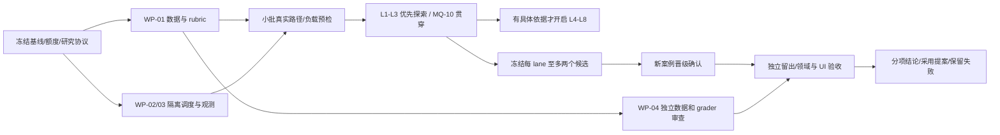

# MiniMax-M3 高并行探索计划（2026-09-12）

## 状态与研究目标

初始研究工作包括计划和首批 **provider-free 本地诊断证据**；随后已完成下节所述的独立运行器与 4 请求 M3 基础设施预检。领域质量实验尚未启动，下文的扩容与各 lane 方案仍不是已完成结果。用户最后更正：**首日仅有 2000M tokens = 2G = 2,000,000,000 = 20 亿可用**，其余额度以后陆续到账；此前 71G 不再作为首日可用额度。RPM/TPM、并发上限、准确到账/到期时间及额度计量方式尚未核验。本文件不创建持续自动化。

目标是**尽快得到可以决策的结论并留下实验证据**，不以耗尽额度为目标。24 小时是最长资源窗口，不是刻意等待或持续调用的时长。`2e9 / 86400 ≈ 23,148 tokens/秒` 仅用于判断额度与吞吐的数量级，不是运行目标或供应商保证；不为消耗额度填充上下文、重复已解决案例或生成无人审核的无用样本。

代码审计基线固定为 `7157af0c55b0f78f829397efc62c214f35f44ff0`。开始实测时从该版本建立隔离基线，记录候选提交、dirty tree digest 和全部有效配置；若改用更新版本，明确建立新 campaign 并重跑基线，不混合比较。此处没有把历史探针输出重新算作当前版本复现。

详细问题、现有失败和关闭标准仍以 [MQ-01 至 MQ-10](TODO.md) 为唯一状态源，已采用行为见[模型运行时质量](../model-runtime-quality.md)。外部假设与 ACL 资料见[Agentic design 研究](agentic-design-research-2026-09-12.md)。研究价值以新案例上的内容和效果改善衡量；模型名称、更多 agent、schema 合法或提交率都不能替代质量证据。

## 基础设施落地（2026-09-12 后续）

按用户要求，新增可复用的独立工具 [Model Quality Lab](../../tools/model-quality/README.md)，拥有自己的 `pyproject.toml`、`uv.lock`、CLI 和故障测试，不接入项目通用测试或生产 Harness。首版覆盖 WP-01/02/03 的最小可执行切片：合成文本案例协议、配对随机化、逐样本 spawn 进程/数据库/存储、共享 SQLite wire 预算与限流、样本 checkpoint、uncertain 不重放和脱敏报告。项目领域适配器需要另行接入；旧探针不能绕过计量 transport 后直接并发运行。

18 项独立本地回归覆盖跨进程预算竞争、未知 usage 预留、崩溃/异常/超时、活 worker 恢复 fencing、配置冻结、跨 campaign 累计限额、错误归属和报告重建。M3 国内官方源真实预检仅 4 请求，观测峰值在途 4，全部 HTTP 200 和精确文本检查通过；provider 报告 total tokens 合计 748，恢复后 wire 仍为 4。P50/P95 为 1005/1454 ms（nearest-rank，样本太少，不用于容量推断）。见[冻结配置与脱敏证据](evidence/m3-parallel-infrastructure-preflight-2026-09-12.json)。这不是第 122 轮领域质量研究，不关闭 MQ 条目。

首版采用滑动 60 秒限流，遇认证/过载即停发；后续自动控制与领域适配见下节。自适应 token bucket、阶段子池、加权 lane 公平调度、跨主机分片与独立 grader 仍未实现。供应商计费权重与绝对单次预留上界仍未知，因此预算闸属于操作性控制，不能声明 2G 绝对不超额。全日后续批次必须沿用同一资源账本，不能通过创建新文件重置累计开销。

## 自动扩容与领域适配（同日后续接入验收）

独立运行器现已增加可选的自动并发控制：共享账本保存控制状态，真实窗口至少 60 秒/30 个完成请求，连续两个健康窗口且有排队工作才升档；429/529 在 wire 结束事务内立即降并发/速率并按 Retry-After 冷却，P95 恶化降档、连续基础设施高失败率停发。总预算与 RPM/TPM 硬上限不随扩容增加。26 项通用回归通过，另保留 32 个 fake worker 的实际升档决策证据；短窗口仅允许 fake，不能解释为 M3 容量测量。

项目专属适配位于 `tools/model-quality/integrations/vibe_learner`，显式使用服务依赖环境，不接入通用应用测试：Study 合成 PDF → Chat admission → 记忆效果/receipt → 重启 read-back；Tavern direct → actor commit graph → replay → 重启 read-back。SDK 网络入口接入全 wire 账本，Embedding/Responses 旁路拒绝；工具消息允许通过，但图片仍不支持。领域源码、适配源码与依赖另有冻结摘要。2 项本地领域集成回归通过，含“已说保存但没有 memory_upsert”负例。

本批 4 个 M3 样本仅新增 4 次 wire、13,055 provider total tokens。Tavern 2/2 通过；Study 2/2 的 Turn 提交与重启读回成功，但均未调用记忆写入工具、专门记忆为空，模型却声称已保存，因此为 **candidate_failed**，不是运行器故障，也不是记忆成功。它们是合成接入验收的重复样本，不计为独立留出质量集。恢复检查零新增请求。

沿用此前资源窗口，通过显式预算 amendment 保留原有 4 wire/748 tokens；累计为 8 wire/13,803 tokens，没有新建账本重置开销。自动策略已启用，但本次 live 数量不足成窗，实际控制保持并发 2，没有自动升档或容量认证。详见[自动扩容与领域接入证据](evidence/m3-autoscale-domain-adapters-2026-09-12.json)。MQ-02 的失败继续开放；Planning、Scene、facilitated、图片适配和阶段子池不在本次已验收范围。

## 真实容量测量（同日后续）

本次[真实请求容量测量](evidence/m3-live-concurrency-capacity-2026-09-12.json)使用生产 Tavern prompt/schema 与重复合成短样本：4 并发两个有效窗口共 201 请求，全部 HTTP 200，约 96 请求/分钟，窗口 P95 为 3.69–4.03 秒；8 并发约 47 秒内 147 请求出现 1 次 HTTP 429，已停发，未测 16/32/64。供应商硬限制仍未知，429 不能区分并发、RPM 或 TPM；该结果不外推到长 Study/Planning 或图片。前两次仪器修正前的 156 请求窗口不足，保留成本与失败分母，不计为有效容量证据。当前账本保留 provider_overload 停止状态，质量门不变。

探针独立入口为 `model_quality.capacity`，仅允许声明线程安全且无领域写入的适配器。每档要求连续两个至少 60 秒且至少 30 次完成的窗口；首次 429 立即停止升档并排空在途请求。4 并发 proposal 检查通过 198/201，HTTP 成功不等于内容通过；8 并发 proposal 通过 143/147。触发 429 请求开始时，前 60 秒含 168 次 admission、8 次在途；这些请求最终已知 total tokens 为 212,950，不能解释成精确 TPM 配额。此次含无效预跑共 504 次请求，计入实际 usage 或未知预留共 660,309 tokens；含此前预检的账本累计为 512 次、674,112 tokens，429 的 17,152 tokens 为保守预留而非实际计费。新增容量回归后，独立通用测试 29 项、容量适配回归 2 项通过。

## 已有能力与需要先做的工作

| 项目 | 基线已经具备 | 仍需完成 |
| --- | --- | --- |
| 快速 provider 探针 | `minimax_quality_probe.py` 的 4 个 Tavern 合成案例、native/SDK 和候选开关、JSONL flush | 它串行执行，只有 proposal，明确没有 admission/commit；不能充当全领域质量 runner |
| 真实领域探针 | Study/Planning/Tavern 探针使用生产调用与领域接口，部分保存 receipt/read-back/trace | 统一可移植 case 输入、完整有效配置、逐 wire 尝试统计和失败记录；不能直接复用旧临时书本路径 |
| 隔离实验 | `minimax_study_event_isolated.py`、`minimax_memory_write_pairs.py` 已实现每 sample 独立数据库 | 统一推广到所有记忆/效果实验；普通 Study run 内的多个案例或重复可能共享数据库 |
| Harness eval | typed identity/config digest、失败归属、受保护源解析、grader registry、聚合指标 | runner 当前串行，全批结束才写 raw/aggregate；没有 concurrency、shard、checkpoint 或 resume CLI |
| 调用预算 | eval 契约记录调用/token/时长/成本上限；生产 transport 有期限检查和有界重试 | runner 核心未统一消费预算字段；需跨进程限速、额度预留和停止闸，不能把字段存在当作执行保证 |
| 多模态与 usage | Planning 已应用 DB 中的有效 multimodal 配置；探针记录部分图片和 raw usage 元数据 | 统一脱敏 wire 观测；逻辑调用数不等于 HTTP 尝试数，缺失 cached/reasoning/失败 usage 必须标 unknown |

以下 WP 是本计划中的实现工作包，不新增根 TODO，不代表已经完成：

- **WP-01 协议与数据包（90 分钟上限）**：冻结 case schema、因子、gold facts、rubric、配对 key、数据分组和配置清单；先用合成可重放资料。若无法建立可判定 gold，收窄该 lane。
- **WP-02 进程调度与账本（120 分钟上限）**：独立 worker 进程、全局 RPM/TPM/调用闸、唯一路径、样本 checkpoint、uncertain 恢复、失败分类。先以 fake transport 验证限额、crash 和恢复，不碰生产重试策略。
- **WP-03 观测与汇总（90 分钟上限，与 WP-01 并行）**：统一有效配置、wire 请求计数、usage 未知值、调用类型、延迟、图片元数据、receipt/read-back 引用和案例级配对报告。
- **WP-04 独立评审准备（整个窗口持续）**：冻结预留案例，制定人审规范、评分校准与争议裁决；未取得独立审查证明前不注册成正式 `held_out`/`calibration`。

在没有统一计量的旧探针路径上，仍只能运行少量相互隔离的串行进程并人工控制总量；独立运行器已支持经过计量 transport 的固定并发小批，但不代表下述自动扩容方案全部落地。现有探针大量使用进程全局 `unittest.mock.patch`，禁止在线程池中同时调用它们的 `run()`。

## 八条研究 lane

每条 lane 先复现当前基线，再做单因素筛选，最多晋级两个候选。**首日重点为 L1/MQ-01、L2/MQ-02、L3/MQ-03，加上 MQ-10 的数据、评分与证据纪律**；其他五条线保留为研究菜单，只在反例、已准备资料或前三条的结果提供具体依据时开启。表中 time-box 是探索上限，不是必须花完的时长；足以决策就提前收尾，不为了八线齐开消耗资源。

| Lane / 对应 MQ | 可证伪假设与比较因子 | 产出及 time-box | 晋级或弃用条件 |
| --- | --- | --- | --- |
| L1 引用 / MQ-01 | 错引可分为检索不足与证据不蕴含；比较现有词法、查询规范化/候选检索、证据核验后引用、oracle 检索；中英法、否定、无关、无来源分层 | 至少 24 个独立案例的检索 recall、引用 precision/entailment、正确无引用率；2 小时 | 新案例减少错引且不靠全部弃答；若只增召回却恶化蕴含，或只在旧词法反例有效，弃用 |
| L2 写入忠实度 / MQ-02 | 把逐字内容透传与摘要事实检查分开，可减少字符篡改和错误“已保存”声明；比较现有生成、确定性原文路径、事实核验、receipt 后状态表述 | 至少 24 个独立源的字符 diff、事实增删、typed effect/receipt/read-back 对照；2 小时 | 逐字字符完全一致、无无据事实、声明与效果一致；只提高 Turn 提交率或把通用“记下”当专门记忆写入则不晋级 |
| L3 记忆与时间 / MQ-03 | oracle 取回能区分检索错误与阅读绑定错误；比较当前窗口、多证据回取、事件表、先找更新再回答；对象、记录/生效时间、取消/重启、长距否定交叉 | 至少 30 个独立事件族，seed 成功率、证据覆盖、时间/对象绑定与 abstention 分开；3 小时 | 在新对象及中段/远处更新上稳定改善；跨样本污染、丢 seed 失败或把未知时间补成确定值直接淘汰 |
| L4 来源与教学计划 / MQ-04、MQ-09 | 图像或 OCR 补充证据的收益依赖版面及教学方法；同源文本/图像 × 人格方法；小样本另比原 OCR/实验 Vision，不同时改变所有因素 | 12 个独立教材片段，正文/注释/续页、物理/印刷页、时长算术、活动方法 rubric；3 小时 | 以图片实收和专家来源复核证明收益；将续译误判双译本、短源过拆或只提高结构估分则淘汰；Vision 仍只是诊断候选 |
| L5 调度与 agentic 结构 / MQ-05 | 额外分解/核验仅在可识别困难案例上值得成本；比较下节五种结构及按难度路由，控制工具集/限额/上下文 | 至少 24 个独立长短任务，首次成功、修复、轮次、工具重复、质量—成本曲线；3 小时 | 等预算下有质量收益，或相同质量下总成本/延迟更低；靠加预算、隐藏 selector 成本或漏失败得到的优势无效 |
| L6 人格与格式 / MQ-06 | 先固定任务权限、后应用人格措辞可减少越权和虚构；比较原始提示、边界约束、有限独立检查；正常/冲突请求及不同关系 | 至少 24 个独立关系/任务组合，事实 grounding、权限遵循、人格、Markdown 分项；2 小时 | 新人物关系保持效果且人格不坍缩；多解释/邀请、编造历史或损坏列表/围栏/公式则不晋级；浏览器渲染另验 |
| L7 Study 教学与工具 / MQ-07 | 题目准备、公开呈现与提交判分分阶段核验，可减少泄题及错误续接；工具选择、draft/null、正确/错误/边界答案、视觉坐标对照 | 24 个独立教学案例，实际工具/效果、公开 prompt 泄漏、判分语义、定位及后续任务；3 小时 | 先确保 server-only 答案不外泄和 persisted read-back；覆盖次数不能替代 31 工具逐项质量，发现泄漏立即停止该候选 |
| L8 缓存与压缩 / MQ-08 | 结构化证据保留或按需回查可能优于单纯减少 token；比较原文、当前窗口、结构摘要、摘要+回查；冷暖/前缀实验单独分组 | 20 个独立长历史，事实保留、更新/否定、回查、cached_tokens 和全链路耗费；2 小时 | 计入摘要/回查后仍改善成本或延迟且事实无实质退化；usage 不足只报告未知，不能据输入 token 下降宣称省钱 |

图片生成不塞入 L4 的 M3 理解对照：M3 图片理解、Vision OCR、image-01 生成分别需要能力和配置证据。MQ-09 的生成适配、受保护制品授权、Document 生命周期和平台打包保留为原 TODO 的后续工程验收，不能用本次探索关闭。

## Agentic 结构的公平对照

在 L5 使用同一 case、可用证据、工具契约、目标 rubric 和随机交错顺序。建议请求预算网格 `R ∈ {1, 2, 4, 8}`，同时固定每 case 的输入/输出 token 上限和端到端期限；具体 token 值由预检决定。工具执行、检索和提交边界保持一致；只有 proposal 研究的结果与完整领域运行分别报告。

| 结构 | R=4 内的示例结构 | 必须计入的成本与对照 |
| --- | --- | --- |
| S0 单次生成 | 一次直接生成；可使用同等 token 上限 | 输入基线；不为了凑请求数发无意义调用 |
| S1 单 agent 多轮 | 同一 agent 最多三次观察/工具轮，再成稿 | 全部历史重传、工具结果、自然修复；与固定结构区别在自适应决策 |
| S2 固定 pipeline | 证据抽取→提案→核验→修订 | 每步同一可用源；核验失败也记入分母，不能把流水线成本排除 |
| S3 独立候选+选择 | 三个独立 proposal→一个 selector | 候选数、独立随机性、selector 可见证据与选择成本；另设随机选一个候选，量出“多采样”和“会选择”的差异 |
| S4 有限 critic | proposal→一次 critic→一次修订，必要时确定性终检 | 限一次修订，比较无 critic、只重采样、给 oracle 缺陷的对照；不允许无限反思 |

这首先是**相同请求和 token 上限**的比较，不代表每组实际消耗相等。S0 只发一次时，不能写成与四请求结构“实际等调用”；同时报告预算使用率、实际 token/wire 开销分层以及质量—成本前沿。R=1 时多步结构不可行，记为不适用。需要严格相同实际成本的结论时，在预注册的成本区间配对分析，不能事后只筛成功且便宜的样本。

所有分解调用只能生成领域允许的 proposal；应用 ID、revision、sequence、时间戳和 effect receipt 仍由应用产生。选中候选后只进入一次合法提交路径；其余候选不执行有状态工具。需要状态副作用的 S1/S2/S4 使用独立数据库和真实领域恢复策略，不凭外层 agent 新增重复写入。

## 首日 2G token 硬上限与请求预算

以 **token 为主预算**，首日硬上限 `B_token = 2e9`，wire 请求数为第二道约束。运行前填写输入/输出分项限额、`B_wire`（如存在）、货币上限（如适用）、`T_expiry`、RPM、TPM、provider 并发上限和本机 RAM/CPU 上限。未知项保持 unknown；需核对赠送额度实际计量口径，不能默认缓存 token、reasoning token 或不同模型具有相同权重。任何一个已知硬上限先触顶，就停止发新请求。

下表是 **2G 内按需使用的阶段初始配额**，不是消耗任务；实际批次远小于整池，预检或结论充分就释放未使用预留。调整用途须写入 batch ledger 并说明决策价值，不能默默把留出预算转成反复调参。没有可验证问题或材料时，预算保持未花。

| 用途 | 比例 | token 上限 | 说明 |
| --- | ---: | ---: | --- |
| 协议、能力与负载预检 | 5% | 0.10G = 100,000,000 | 预检一旦足以确定能力和容量就结束，不为达到比例继续调用 |
| 有界探索 | 35% | 0.70G = 700,000,000 | L1/L2/L3 初始上限 0.22/0.18/0.22G；其余 0.08G 仅在有依据时开启 L4–L8 |
| 晋级确认 | 25% | 0.50G = 500,000,000 | 每条启用 lane 最多两个冻结候选，优先新实体/资料迁移 |
| 独立留出 | 20% | 0.40G = 400,000,000 | 先保留；未完成独立审查不假装运行正式 held-out |
| 案例生成、评分诊断与校准辅助 | 10% | 0.20G = 200,000,000 | MQ-10 优先；M3 草拟/诊断不能充当 M3 自己的正式独立 judge |
| 传输重试与指定故障复现预留 | 5% | 0.10G = 100,000,000 | 预留不足则停止派发或明示重新分配，不能溢出总额 |
| **合计** | **100%** | **2.00G = 2,000,000,000** | 输入/输出、请求和时间硬上限同时生效 |

供应商请求上限未知。**最多 10,000 次 wire 请求仅为可缩放的批次模板**，不是首批必跑量或产品配额；实际先做能验证路径的最小批。六类用途示例为 `500 + 3,500 + 2,500 + 2,000 + 1,000 + 500 = 10,000`，其中探索请求优先 L1/L2/L3，未启用方向不发请求。以每请求预留输入 8,000、输出 4,000 tokens 为例，一万次需预留 `120,000,000 = 0.12G`，占首日 6%；输入 128,000、输出 8,000 时则需 `1.36G`，占 68%。若预留超过可用池或有更小批已足以决策，缩小或取消批次，不能只看请求数。

batch ledger 记录每笔**实际到账**、到期、额度口径、已花、在途预留、释放和剩余量；后续资源只有确认到账后才扩容，不预支未来额度。扩容也必须绑定新的明确问题和可审核案例。没有建立等待到账后自动继续的定时任务或持续自动化。

每个 wire 请求只记一个用途，防止重复计数：实验的记忆 seed、摘要生成、内部 selector/critic 属该实验用途；外部 rubric 辅助属于评分用途；传输重试单列预留。非 M3 独立 judge/人工时间另外记账，并合并到端到端研究成本，不能假定能使用 M3 额度支付。若关闭标准依赖尚未到位的人审，保留质量门开放。

先以各 lane 预检的 `平均 wire/sample`、token 分布和可审核案例供给估算可完成独立 case 数，再锁定规模。用全部尝试（包括失败）计算，不从成功样本倒推。额度宽裕时优先扩大**独立任务、文档、关系和语言覆盖**，之后才增加重复；开发轮建议每案例 2–3 次随机重复，不把重复 seed 算成新的独立案例。

### 吞吐可行性核算

记实测平均每请求额度 token 为 `t`、平均在途时长为 `L`、并发为 `C`、待完成批次请求数为 `N`。理想吞吐上界为 `C × t / L` tokens/秒，批次最短执行时间参考 `N × L / C`；实际还需计入 RPM/TPM、轮次依赖、排队和本机限制。容量估算服务于**更快完成有价值批次**，不反向推导必须消耗 2G。

以下纯算术场景用于识别数量级，**不是 M3 实测数据**，未包含限流、重试、排队和准备时间：

| 假设平均 token/请求、时长 | 并发 | 理想 tokens/秒 | 1,000 次请求的理想时长 |
| --- | ---: | ---: | ---: |
| 16,000 tokens、20 秒 | 4 | 3,200 | 约 83.3 分钟 |
| 16,000 tokens、20 秒 | 8 | 6,400 | 约 41.7 分钟 |
| 16,000 tokens、20 秒 | 16 | 12,800 | 约 20.8 分钟 |
| 16,000 tokens、20 秒 | 32 | 25,600 | 约 10.4 分钟 |

该例的一千次请求实际 token 合计仅 0.016G；高并行可以缩短完成时间，但不能改善样本独立性或评分正确性。任务若在低档并发下已很快结束，就不继续测试最大并发。大上下文只在研究问题确实需要时使用，不追求理论全量消耗。

## 并发、自适应与停止规则

campaign 的并发是独立样本并发，不改变产品内工具调度；生产 Planning 同轮最多三次详情读取仍按顺序执行。独立工作进程数与同时在途 HTTP 请求数分别控制，PDF 渲染/OCR 另设 CPU 小池，避免上游容量足够而本机先失稳。

- 从 `4 → 8 → 16 → 32 → 64` 按需分档；当前批次已有足够吞吐则停止升级。64 后只有稳定观测、真实配额支持、明确的完成时间收益且确有经验证的待跑案例队列时，才考虑 `128 → 256`。这些均为待验证档位，不是已知能力，首日不以测出最大并发为目标。
- 已知配额时，目标吞吐 `λ = 0.7 × min(RPM/60, TPM/(60 × E[token/request]))`，在途请求参考 `C = ceil(λ × E[latency_seconds])`，再取 provider/本机上限。token 口径按 provider 文档确认；额度未知时从低档实测，不计算虚假极限。
- 全局双 token bucket 约束 RPM/TPM；额度准入另用原子账本检查 `全日累计已花 + 全日在途预留 + 新请求预留 ≤ min(首日累计到账, 2G)`，同时检查对应阶段池。预留必须按已核验供应商计量方式取保守上界，覆盖文本、图像、reasoning、输出和适用额度权重；普通输入估计只能用于吞吐预测。返回后按权威 usage 校正，未知 usage 不释放预留。调度许可覆盖传输重试，不能只包住逻辑 adapter 调用。
- 新批次沿用全日累计已花和在途账本，不重置额度。核验不了单次额度上界时，仅发预留充足的小批并人工核账，明确这是操作性预算控制，尚不能声称绝对不超额；供应商硬配额可配置时同时使用。
- 每个观察窗口至少 60 秒且至少 30 个完成请求；连续两个窗口无 429、基础设施失败率无上升且 P95 不超过低负载基线 1.25 倍，才升一档。未满足样本数就继续观察，不能只按时钟升级。
- 出现 429 或过载 529 立即降发放速率/并发、记录 Retry-After 并随机退避；认证 401/403 直接停止该 endpoint。当前 SDK rate-limit 映射可能不保留 status，WP-03 必须同时识别 typed error。不擅自改生产重试为无限重试。
- 若两个窗口基础设施失败超过 5%、本机资源持续超出预算、样本账本出现丢行/重复身份，暂停新派发并检查；业务语义失败留作研究结果，不当作限流失败重试。
- 若候选泄露 server-only 答案、产生错误持久效果或越过身份边界，停止该候选并保留证据；正确性严重回归不能由平均分掩盖。
- 当前问题已足以作出采用/弃用/证据不足的结论时，停止该批新派发、完成 read-back 并立即交付证据；无需等预算或 24 小时窗口结束。没有新可验证假设时不自动续批。
- 到 `T_expiry − 当前端到端 P95 − checkpoint/read-back 缓冲` 停发新样本；缓冲至少 15 分钟，并按最长观察路径调整。已发同步请求可能继续至超时，不声称已强制取消。

长 Planning/图像、记忆 seed、短文本和评分使用独立队列，按 token 权重公平分配，避免单条 lane 占满全部在途请求。配对 block 在相近时间随机 AB/BA；缓存实验单独控制冷暖和稳定前缀，防止高并行引入缓存或排队混杂。

## 隔离、checkpoint 与 uncertain

目录单位为 `campaign/case/variant/repetition`，每个单位独立 DB、storage 和 operation identity。同一案例的记忆 seed 与查询可共享其专属 DB，不与其他案例共享。模板库应冻结并关闭或使用 SQLite backup API；不能直接复制正在写入的 DB/WAL 组合。

账本至少记录：case/variant/pair ID、状态、基线/候选 digest、有效配置、源与 rubric 版本、每次 wire 尝试编号/用途/状态/usage、seed receipt、admission/operation ID、领域 receipt、read-back 引用、评分与失败归属、开始/结束时间。原始受保护资料保持授权引用；公开证据只存安全指标、合成内容和必要结果，不记录密钥、推理正文或完整教材页图。

worker 每完成一个样本写不可覆盖结果并原子更新索引；涉及 admission、seed、effect 和终态时另外持久化恢复点。进程崩溃后先查询原 operation 的 read-back；不要创建新 operation 重放整段写入。不明确的上游结果保留 `uncertain`，严格沿领域现有恢复策略处理，provider exactly-once 仍不成立。

合并分片须验证 sample identity、配置、case set、源 digest 和分母，再按确定性顺序生成报告。现有 Harness run/sample digest 不能通过简单拼接 JSON 伪造；研究账本与正式 Harness artifact 分开，正式转换需已注册 adapter 和真实 admitted binding。

## 阶段 DAG 与短窗口安排



以**最短得到第一轮决策**安排工作；24 小时仅是资源窗口上限，阶段可以提前完成，不等到表中上限再推进：

| 阶段 / time-box | 优先工作 | 退出或扩大条件 |
| --- | --- | --- |
| 本轮本地诊断 / 已形成证据 | [引用、原文窗口与邻域候选](evidence/agentic-preflight-local-2026-09-12.json)三项 provider-free 复现；写入问题保留历史证据，准备 WP-01/03 | 区分新诊断、历史证据和未执行 live 方案；三项运行 exit 0 不代表反例通过，M3 调用为零 |
| 最小运行准备 / 最多 2h | WP-02 与 WP-04 并行，优先复用已有隔离探针 | 隔离、账本和总闸可靠即可小批开始；不为通用平台延迟首个有界实验 |
| Live 最小预检 / 最多 1h | L1/L2/L3 代表路径，按需测 4/8/16 并发 | wire/usage/seed/receipt 完整；够用就停止容量探测；已完成上述 Tavern 短样本 4/8 档，其他路径尚未测量 |
| 首轮决策 / 每 lane 最多 2–3h、并行 | L1/L2/L3 单因素对照；MQ-10 先校准客观比较和 rubric | 冻结至多两个候选；有结论就提前停止；其他 lane 只按依据开启 |
| 确认与独立复核 / 就绪即开始 | 新来源确认、已审核留出、人审及适用浏览器检查 | 不用确认集改写；复核未就绪则交付未验收证据，不假等窗口结束 |
| 收尾 / 每批完成即做 | read-back、异常账本、成本核对和一页结论 | 没有下一条明确问题则结束任务；窗口最迟截止前保留恢复缓冲 |

阶段允许流水衔接，但不得绕过依赖：就绪 lane 可先开始探索，独立 review 不需要等全部模型请求结束。若 WP-02 超出准备上限，缩小探索宽度，不跳过隔离与账本。每批根据未解决问题、剩余额度和期限重算必要规模，不照搬阶段池大小。

这不是全部质量验收能在 24 小时内结束的承诺，也不要求任务运行满一天。人工/平台验收暂不可得时，先交付可重放候选结果和安全证据，保留 MQ-10 未关闭；后续实际到账不会自动触发继续实验。

## 评分、采用和文档产物

分开报告 schema、首次内容正确、修复后正确、admission/commit/read-back、引用与事实、人格/任务权限、渲染、provider 成本、端到端 P50/P95。报告预期样本数、完成数、seed 失败、候选失败、基础设施/数据/grader/metric 失败；所有失败保留原分母，不将 broken 或缺失数据计为成功。

统计单元是独立 case family；同一教材多个页片、同一事件改实体名、同一来源多个重复须标关联组。确认阶段用案例簇配对 bootstrap 给差值区间，二元配对结果可用 McNemar；小样本仅作探索信号。先冻结主指标、严重错误规则、非劣界限和比较范围，再看确认结果；不把几十个候选的最好点估计直接当提升结论。

预留集不得参与 prompt 改写、selector 训练或失败分析后再复用为未见测试；用后即记录暴露状态。正式 `held_out`/`calibration` 需要 independently-reviewed provenance。Harness grader registry 拒绝同候选 model/adapter 自评；M3 可做反例草拟和非权威评分诊断，换角色/提示或多次 M3 投票不会变成独立 judge。模型 grader 要由独立人工样本校准，并保留 agreement、false positive/negative 和争议处理。

“晋级”只表示值得复核，不直接改生产。采用需确认集和独立留出支持、严重错误无新增、边界/合同回归通过，以及适用的人工/浏览器验证；只有成本改善的候选需满足预注册质量非劣界限。证据不足写“不确定”，明确变差写“弃用”，没有实际执行写“未验证”。

产物为一个 campaign manifest、版本化案例/rubric 索引、脱敏逐样本账本、失败集、每 lane 一页结论和待审采用提案；历史证据保持原样。仅回链原 MQ 项，不创建第二份质量状态表。若不采用候选，仍记录对照、失败分母、适用范围及可重放条件。

## 现有命令与源码入口

以下命令只发现现有接口，不启动 provider。没有 `--concurrency`、`--shard`、`--resume` 参数，WP-02 未实现前不得在运行说明中捏造它们。

```bash
cd services/ai
PYTHONPATH=. uv run python tests/acceptance/minimax_quality_probe.py --help
PYTHONPATH=. uv run python tests/acceptance/minimax_study_probe.py --help
PYTHONPATH=. uv run python tests/acceptance/minimax_planning_probe.py --help
PYTHONPATH=. uv run python -m app.services.harness_eval_runner --help
```

正式 live eval 使用现有 `--registry`、`--suite`、`--input`、`--output-dir`、`--profile manual`、`--live-provider`，但需要先有真实注册的 suite/factory 和合法 run/cases，不能拿不存在的注册名拼执行命令。当前 `eval:harness:pr` 的确定性通过也不能替代此次内容质量研究。

审计入口：[probe](../../services/ai/tests/acceptance/minimax_quality_probe.py)、[Study](../../services/ai/tests/acceptance/minimax_study_probe.py)、[Planning](../../services/ai/tests/acceptance/minimax_planning_probe.py)、[独立 Study](../../services/ai/tests/acceptance/minimax_study_event_isolated.py)、[eval runner](../../services/ai/app/services/harness_eval_runner.py)、[eval contracts](../../services/ai/app/models/harness_eval.py)、[transport](../../services/ai/app/services/provider_transport.py)、[SDK](../../services/ai/app/services/provider_sdk.py)、[Harness 架构](../harness-architecture.md)。
