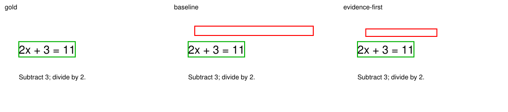
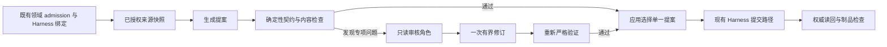

# M3 Planning、多媒体教学与多智能体探索

2026-09-12，按用户重新授权完成并行实验及优化探索。**本轮 77 个实验样本记录、154 次请求尝试，其中 142 次 HTTP 200、12 次 HTTP 400；已知 provider total tokens 为 519,988，实际在途峰值 4。** 样本包括重复、同素材对照和格式诊断，不能视为 77 份独立质量来源。所有批次已终态，0 在途，没有持续自动化。

主要结论是先解决可验证的协议、来源和定位问题：强制首轮读原页没有显示稳定收益，坐标提示未修复框选；简单样例上额外审核角色增加调用成本，没有证明事实收益。生产代码、默认模型和数据库未修改。

## 交付入口

- [Planning 逐项结果](m3-planning-evidence-2026-09-12.md)
- [多媒体与坐标优化](m3-multimedia-results-2026-09-12.md)
- [实际架构与功能入口](m3-planning-multimedia-architecture-2026-09-12.md)
- [另一子 agent 的结果复核](m3-planning-multimedia-revalidation-2026-09-12.md)：未编写这两条领域适配器，但仍属于同任务 Codex 辅助复核，非外部盲评、专家认证或留出基线。
- [分批统计](evidence/m3-planning-multimedia-2026-09-12/round-audit.json)、[角色公开提案与审核](evidence/m3-planning-multimedia-2026-09-12/role-audit.json)、[证据包](evidence/m3-planning-multimedia-2026-09-12/evidence.zip)、[交付校验](evidence/m3-planning-multimedia-2026-09-12/delivery.json)。

## Planning

3 份两页合成材料（方程、概率、Python）× baseline/首轮指定读页工具 ×2 重复，共 12 样本，33 请求、175,250 tokens。全部完成真实 admission、严格生产 proposal 解码、Plan commit、合法物理页范围与重启读回。

| 项目 | baseline | 首轮证据优先 |
|---|---:|---:|
| 提交并重启读回 | 6/6 | 6/6 |
| 工具执行成功/尝试 | 19/24 | 17/24 |
| 请求 | 17 | 16 |
| tokens | 94,169 | 81,081 |

取证要求没有保证工具成功：一个候选样本六次工具均因形状错误被拒绝，仍提交了把 a=0 说成“不构成方程”的不准确表述。概率任务出现“首抽红球”条件遗漏，但实验目标本身简写成“不应都为2/5”，存在诱导，不能全部归因模型。Python 的负索引与缺键异常属于正确的来源外扩展；无依据声称“教材后续章节”才是教材结构断言错误。两类应分开，不笼统算幻觉。

生产 Planning 没有结构化教学分钟字段，不能声称本轮完成教学分钟预算验收。角色微计划里的分钟检查另属实验提案，不是生产 Plan 能力。

**决定：不采用全局强制首轮工具。** 下一步优先保留工具失败的可诊断形状证据，检查全部取证失败后的证据充分性，以及来源条件/教材范围的结构化只读审核。

## 多媒体教学

同一份方程材料的六种操作做 12 样本；框选另追加 4 个同图坐标提示样本。共 44 请求、271,404 tokens，23 次请求实际携带 360×200 PNG 图片。

- 填空题两臂创建及服务端答案正确，实际提交错误答案 999 后评分与重启一致；PDF 投射/高亮通过。
- 指定读取 PDF 文字时，baseline 漏工具，证据优先样本执行成功；仅一对，不能推导通用改进。
- 单选两臂均最终载荷无效，状态 uncertain，未提交题目；不重试、不算实际正确作答验收。
- 首批两个已持久化图片框都在公式上方，目标覆盖率与 IoU 均 0。追加四例中两例没有合法框（工具形状错误），一例仍错位，另一例坐标提示的覆盖率 .612、IoU .256，未达预设 .8/.45。所有框均由另一子 agent 重算，且重建原图核对摘要与目标区域。
- 框选后清除的一臂成功，另一臂工具失败；模型如实说明未生效，口头说明和实际效果分开记。

**决定：不采用坐标提示为定位修复。** 更值得继续验证的是只读 OCR/视觉锚点提案→确定性坐标映射→实际制品复核；当前尚未实现或证明该候选。M3 在本产品可走图片理解，但图像生成能力闸不开放 M3，Study 没有音视频输入分支。没有调用其他图像/音视频 provider，也未做真实浏览器、复杂教材图表或学习增益验收。

## 角色协作与校准

4 个合成微任务（页码/分钟、概率范围、图表数据、公开填空题）比较三臂：单次生成、生成后自我修订两次、生成→独立请求审核→修订。审核者使用同一 M3，不是独立模型质量评审；微任务只产生提案，不写领域状态。自我修订与角色审核均最多三次请求，是同调用次数对照，不是同 token 成本。

必须保留的失败与校准：

| 批次 | 样本 | 请求 | 结果/归属 |
|---|---:|---:|---|
| v1 | 12 | 12 | 实验 json_schema 请求全部 HTTP 400；配置/接入失败，usage 未知，不当作质量失败 |
| v2 | 12 | 13 | 改用生产已有 json_object；严格载荷失败，未保留原始公开提案，不能断言全部同因 |
| v3 | 1 | 1 | 新诊断明确观测到完整 Markdown 围栏包裹正确字段；裸 JSON 解码拒绝 |
| v4 | 12 | 23 | 允许仅剥完整围栏，内部严格 schema 不变；3完成/9失败，观测数字/字符串与 schema 定义回显 |
| v5 | 12 | 28 | 明确“返回数据实例，非 schema 定义”及 facts 字符串类型；同素材校准，12/12有限检查通过 |

v4/v5 仅在实验适配器中处理完整响应围栏，拒绝围栏外前后文、重复键、未知字段及错误类型；未改生产 decoder。v5 同时明确提示与字段含义，不能将提升因果归给某一个措辞，更不能把已曝光素材称留出。

| v5 最终口径 | 单次生成 | 三次自我修订 | 生成—审核—修订 |
|---|---:|---:|---:|
| 精确字段/分钟检查通过 | 4/4 | 4/4 | 4/4 |
| 实际请求 | 4 | 12 | 12 |
| reported tokens | 3,919 | 13,082 | 14,621 |
| 样本 P50/P95 秒 | 3.61/7.69 | 13.09/20.06 | 19.01/28.08 |

延迟含排队，使用 nearest-rank，n=4；不推导容量。审核臂 tokens 约为单次的 3.73 倍。各臂首稿事实和分钟原本就正确，因此没有可观察的事实修复收益。

有限指标只覆盖 exact facts、正整数分钟总和、非空题干和指定答案禁词，不检查完整教学质量。额外复核发现图表任务的 reviewer 和 self-reviser 都曾删除题干中的数值，但实验没有实际交付图表附件，改写后的问题可能依赖缺失图表；这不是已验证的教学改善。此类制品可用性需要加入后续 rubric。

**决定：不默认增加全量 reviewer。** 值得探索按确定性失败触发的只读专项审核（来源条件、页码映射、图像定位），并用实际反例、新素材及同成本自我修订对照验证。当前结果不证明复杂任务中多 agent 无用，只是不支持本轮候选直接采用。

## 可行架构与采用边界

当前 Planning/Study 是单模型顺序工具循环；Tavern 是多个角色按顺序生成；lab worker 才是跨样本并行。建议的研究架构如下，尚未成为生产实现：

生产设计需从既有 admitted operation 和受保护来源开始，候选/审核只拥有内容，不分配 IDs、revision 或 effects。必须复用已建立的生命周期，不能在 provider 调用后补造身份。不要让多个候选各自修改同一个 Session/Plan；只选择一个合法 proposal 进入现有事务，所有分支调用各自计费并保留失败证据。

## 实验基础设施与成本

新增 Planning、多媒体和角色提案适配器；共享 transport 图片默认关闭，只接受显式启用的至多4张小型内联 PNG（每图≤32KiB、头部宽高≤1024，整包含base64字节仍受预留约束）。图片只做头部边界检查，不声称完整PNG解码认证；合成图另已渲染与重建。所有域样本独立spawn进程、SQLite、storage，网络仅国内 api.minimax.cn，密钥仅从环境读取。

复用历史 `m3-window-20260912.sqlite3`；仅审计延期两小时，50M tokens/10008 wire累计上限未增加。历史起点1242次/7,892,181 charged-or-reserved；本轮增加154次/1,769,140；终点1396次/9,661,321，累计45次未知usage（旧33+本轮HTTP400的12）。12个400的1,249,152预留没有释放，已知519,988 reported tokens不冒充供应商账单。

Planning及首批多媒体的resume因共享源码/README dirty摘要变化正确拒绝，新增wire为0；不伪造冻结状态。坐标批与角色v5的终态resume成功且零新增请求。全部8批执行源码快照保留，导出包校验摘要、不导出SQLite、诊断日志或模型推理。

本地验证：38项通用实验测试、18项领域集成测试、14项生产工具目录/图片能力测试通过；图片边界、严格围栏/字段、错误归属和critic不能覆盖最终错误有针对性检查。仅实验工具变更，未运行或声称生产完整release/浏览器门通过。质量待办继续开放，不部署、不修改默认模型。
