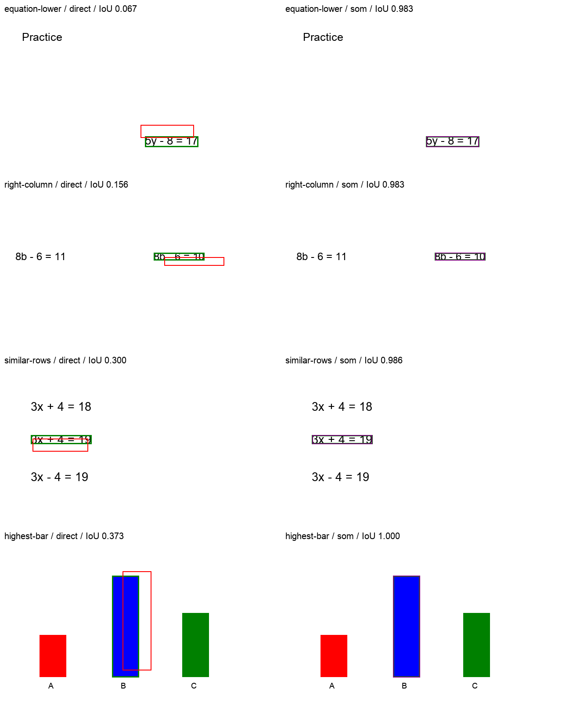
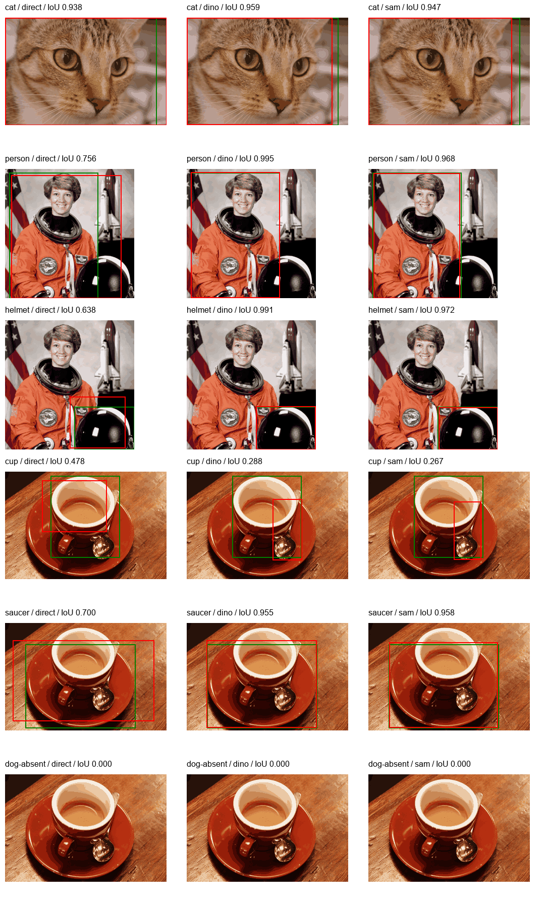
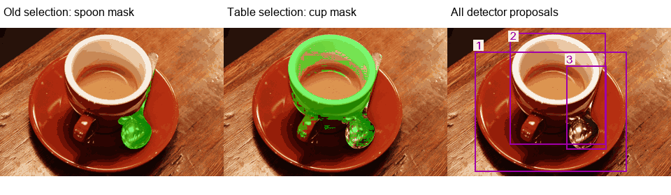

# M3 图像定位：合成区域与真实照片诊断

本阶段完成 50 个真实请求/样本，41,804 reported tokens，未知 usage 为 0：合成 smoke 4、固定合成矩阵 24、自然图三臂 18、灰圆缺候选诊断 2、杯子完整候选表诊断 2。使用同一累计账本及最多 4 在途请求，没有修改生产模型或工具契约。所有批次均冻结源码、保存源码 ZIP，终态 resume 接受且零新增请求。

结论是：把模型的自由坐标回归换成真实检测候选选择，在本批简单合成图上明显减少错位；真实照片仍会选错对象，SAM 的框通过也不代表 mask 分割正确。这是候选方案研究，尚不满足生产教学接入或独立留出验收。用户随后提出的 Bartle 混排书页属于下一组任务，本文件不把照片结果外推到书页。

## 合成矩阵

12 个场景，每个 direct/SoM 两臂；5 个文字、3 个几何、1 个柱形图、3 个无目标/歧义场景。图像均 640×360、约 1.2–7.1 KiB。真实 Tesseract PSM 11 行框与饱和像素连通组件只接收 PNG，不读取 gold、绘图坐标或 PDF 文字框。9 个正例都存在合适检测候选，指标为 IoU≥0.5 且目标覆盖≥0.8。

| 分类 | direct | OCR/几何候选 + M3 编号选择 |
| --- | ---: | ---: |
| 文字 5 | 1/5 | 5/5 |
| 几何 3 | 3/3 | 3/3 |
| 柱形图 1 | 0/1 | 1/1 |
| 无目标/歧义 3 | 3/3 | 3/3 |
| 总计 | 7/12 | 12/12 |
| 请求/token | 12 / 9,958 | 12 / 12,131 |

SoM 增加一张编号图，实际 tokens 增加约 21.8%，不能称等成本。独立前置 smoke 为 4 请求/3,541 tokens：direct 1/2、SoM 2/2；使用相同场景，因此不是独立来源增量。全部输出经严格 JSON/类型/有限坐标检查；只允许完整 JSON Markdown 围栏，不从任意正文提取片段。



[逐样本审核及成本](evidence/m3-visual-grounding-20260912/synthetic-audit.json)。这是简单、干净的开发图像；颜色组件不是物体识别网络，也不是原版 SoM 论文复现。

## 真实照片：DINO 与 SAM2

使用 scikit-image v0.25.2 三张有一手许可说明的图片：NASA public-domain astronaut、CC0 chelsea 猫、CC0 coffee。原图出处、原 SHA、实际输入 SHA、缩放和无抖动 32 色量化均记录；模型实际输入为 256×256 或 320×213 PNG。它们是著名示例图，不是 held-out 数据；6 个指称任务仍只有 3 个图片来源。

CPU float32 本地 GroundingDINO tiny 生成候选框，SAM2 tiny 根据框生成 mask，并按模型自身 predicted IoU 选择一张 mask，再取非零像素紧框。候选查询词是预先从任务写入的配置，不是模型自主任务分解，也不包含 gold。M3 三臂为原图直接坐标、DINO 编号框选择、SAM mask 紧框编号选择，每个样本均最多 1 次 M3 请求。

| 指标 | direct | DINO + 选择 | SAM2 紧框 + 选择 |
| --- | ---: | ---: | ---: |
| 任务通过 | 5/6 | 5/6 | 5/6 |
| tokens | 3,880 | 3,974 | 4,474 |
| M3 wire P50/P95，秒 | 3.641 / 7.552 | 3.638 / 5.464 | 2.612 / 6.696 |
| 加载中位耗时，秒 | .398 | .437 | .482 |
| 检测中位耗时，秒 | 4.485 | 4.694 | 3.582 |
| 分割中位耗时，秒 | 1.609 | 1.313 | 1.000 |

三臂都执行本地检测和分割，以记录 proposal recall/诊断产物；direct 的全部本地模型工作、DINO 臂的 SAM 工作是额外诊断开销，不是部署所必需。上表分项中位数不能相加作为端到端中位数，也不支持缓存或速度收益推断。实际还含权重完整性检查与子进程启动；原始 sample elapsed 保留于 runner report。每个样本独立计算，没有跨臂缓存掩盖成本。



猫几乎占满画面，direct 返回整图仍通过，因此区分力低。杯子在三臂均失败：direct 框不准；两个候选臂都选了 ID3 勺子，而正确杯框 ID2 已存在。这是选择失败，不是检测召回失败。编号 3 落在杯子区域内，多框嵌套可能干扰归属，但小样本不能证明唯一原因。

追加同图杯子诊断只增加**所有候选**的 ID/label/box/confidence 表，不按 gold 筛选、不改模型框或阈值。两次请求均改选 ID2，通过 bbox 门：DINO IoU .982、SAM 紧框 IoU .966；合计 1,992 tokens。该事后诊断保留原三臂失败，不冒充独立改善证据。



**mask 仍有质量问题。** 加表后杯子 mask 包含部分勺区域，并漏掉杯深色下部/把手部分；紧框通过不能称分割通过。没有像素级 mask gold；predicted IoU 是模型置信输出，不是真实 mask IoU。金标由未看检测输出的同任务研究子 agent 目视标注，另经 root 复核，是含边界容差说明的粗 bbox；未事后放宽主评分。碟子框不可避免包含遮挡的杯/勺像素，框边界定义不等于排除这些物体的分割 mask。

## 缺候选时不能谎称没有目标

追加灰圆图确有目标，但颜色组件与真实 OCR 都返回空候选。direct IoU .733、覆盖 .976，通过；SoM 输出未通过严格解码，未能证明其诚实返回 `unlocalized`。两请求合计 1,854 tokens。旧记录没有保存具体 decode 结构错误，不能事后推断它输出了 absent 或 unlocalized；保留 candidate failure，不重试替换。

新协议区分 absent、ambiguous、unlocalized。看见目标但没有候选，必须返回 unlocalized；这仍不是定位成功。初始 24 样本的旧提示曾把缺候选与 absent 合并，因此其 3 个负例通过不能证明这一安全边界；旧冻结数据不重写。后续增加了结构化 decode error telemetry。

## 权重、执行与复现

使用固定 Hugging Face revision：

- `IDEA-Research/grounding-dino-tiny`：`a2bb814dd30d776dcf7e30523b00659f4f141c71`。
- `facebook/sam2-hiera-tiny`：`7c218beaf0bb87874785f32b582f640134fc1c09`。

仅下载约 845 MB safetensors/config/tokenizer；禁用 remote code、离线加载。torch 2.8.0 / torchvision 0.23.0 / transformers 4.57.6，完整 27 包版本与每个权重 SHA 存于 `visual_grounding_runtime.py`。隔离环境为 `/private/tmp/m3-grounded-vision-venv`，不改 services/ai 依赖。MPS 本环境不可用，实际执行 CPU。

SAM2 config 自报 sam2_video，但固定 revision 官方 README 的图像示例使用 `Sam2Model`；保留兼容警告、不改配置。所有实际运行的 missing/unexpected/mismatched/error loading keys 均为空。官方 Vision Banana 论文路线需要专门训练的图像生成模型；本实验不是 Vision Banana 复现。

可按下面步骤重建外部 runtime（不自动执行 live）：

```sh
uv venv /private/tmp/m3-grounded-vision-venv --python 3.12.13
python3 tools/model-quality/integrations/vibe_learner/prepare_visual_grounding_runtime.py --requirements > /private/tmp/m3-grounded-requirements.txt
uv pip install --python /private/tmp/m3-grounded-vision-venv/bin/python -r /private/tmp/m3-grounded-requirements.txt
/private/tmp/m3-grounded-vision-venv/bin/python tools/model-quality/integrations/vibe_learner/prepare_visual_grounding_runtime.py --download
```

运行源码、图片和 mask 均可复核：实际输入保存在 `wire_input`，mask base64/文件 SHA 在 JSON 中，下载权重不伪称已打包。主自然批冻结证据的 `scope` 字符串误沿用了 synthetic/OCR；[审核 sidecar](evidence/m3-visual-grounding-20260912/natural-audit.json)明确更正，`Case.provenance=public-licensed`、来源许可及真实 worker 证据均正确，原始记录未重写。table 批已修正该说明。

最终视觉针对测试 8 项通过，覆盖 gold 隔离、完整未筛候选表、严格围栏/坐标/弃权、真实 OCR、图像预算、依赖 manifest。fake 三个杯子样本故意固定回复 absent，均作为 candidate failure 检查链路；不纳入 M3 质量分母。
