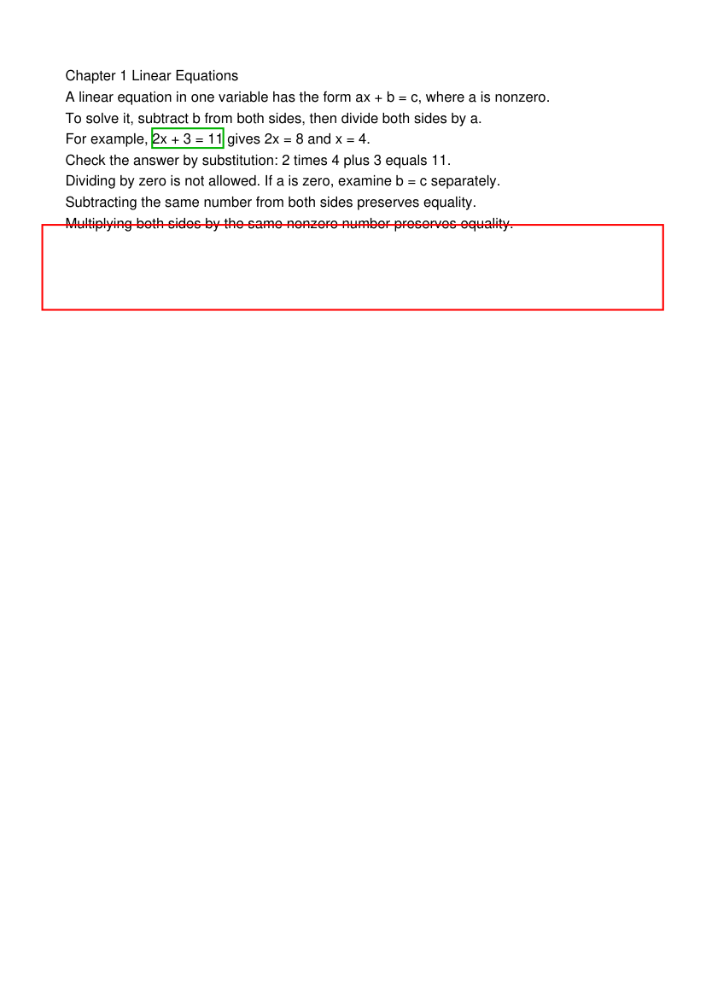

# MiniMax-M3 质量检定 v1

2026-09-12 用户授权恢复真实模型质量工作，持续迭代，逐次记录依据并提交。
旧 QG-002 / web-strict-decode-adversarial-v1 保持不可变。本记录属于
QG-MODEL-QUALITY-001；没有完成独立人工校准前不关闭质量门。

## 实测约定

- 使用环境变量 K3_API_KEY，仅向确认的 MiniMax 官方 API 发送认证头；报告和 Git 不包含凭据。
- 使用合成教材、人物、关系、场景与历史；完整领域检定使用隔离数据库，不修改用户资料。
- 分开记录直接 prompt/provider 探针、领域 Harness admission/commit/read-back 和前端展示证据。直接探针不能证明完整 Harness 通过。
- 每项先跑至少 3 次探索样本，确认协议后扩展到至少 10 个独立案例、每例 3 次；覆盖正常、冲突指令、格式、关系 grounding、长上下文与恢复。样本数是起点，不能单独证明质量足够。
- 报告成功率的分母包含全部计划样本；上游、数据、grader、度量失败单列，不能当作候选成功。记录初次成功率和修复后成功率。
- 优化前后使用相同案例配对并交错运行，保存配置、Git revision、prompt 版本、原始 usage、延迟及具体输出问题。新发现进入开发集；另保留未用于改写 prompt 的评估集。
- Markdown 需验证 JSON 外无围栏、正文实际换行、代码块/表格/数学与 Mermaid 的渲染；人格需核对措辞、关系、称呼、角色权限与不替他人发言。机器格式检查和主智能体语义评审分别报告。

## 覆盖矩阵

| 范围 | 实测重点 | 证据要求 |
| --- | --- | --- |
| Document、逐页抽取、Section、切块 | 双语、标题噪声、顺序、引用完整性 | 真实解析结果与人工可核对的合成原文 |
| OCR、Study Unit 清洗 | 扫描识别、丢字、公式、错误合并 | 真实 OCR 和清洗；M3 只作辅助评审，不冒充 OCR 引擎 |
| Planning、六个工具、Plan revision | 目标/时间约束、引用、工具参数、修改范围 | 真实 provider + 严格 proposal + 持久化读回 |
| Persona | 关键词、文本、整体/单槽辅助、关系与称呼 | 内容提案、用户字段保护、持久化投影 |
| Scene | 关键词/文本生成、层数、空间规则 | 严格树提案与领域读回 |
| Study Chat、31 个工具 | 指令、Markdown、教学/判分、引用、人格 | 工具按能力覆盖；私有答案不进入提交前公开投影 |
| Tavern | 单人/多人、续写、锚点、人格、长历史 | 验证后提交及原始失败/恢复证据 |
| Frontend decode | 对真实生成产物严格解码和渲染 | 原基线 + 新版本案例，不修改旧基线 |

## 官方依据与待验证假设

2026-09-12 读取：

1. [API 概览](https://platform.minimax.io/docs/api-reference/api-overview)：模型 ID `MiniMax-M3`，标称上下文 1,000,000 tokens。
2. [OpenAI SDK](https://platform.minimax.io/docs/api-reference/text-openai-api)：`https://api.minimax.io/v1`；M3 默认开启 thinking，`reasoning_split` 控制是否将其与正文分离。
3. [自动缓存](https://platform.minimax.io/docs/api-reference/text-prompt-caching)：512 input tokens 起，按工具→system→messages 前缀匹配，OpenAI usage 中 `prompt_tokens_details.cached_tokens` 可观测。缓存寿命随负载调整。
4. [显式缓存](https://platform.minimax.io/docs/api-reference/anthropic-api-compatible-cache)：当前支持表未列 M3，不能直接假设 M3 支持 cache_control。

优先检验稳定工具/schema/人物前缀、动态请求后置的收益。缓存字段缺失记为未知，不能记为零命中或自行估算真实计费。比较完整历史、当前最早优先裁剪、候选有来源的记忆策略；分别统计早期约定、人物关系、近期锚点、事实召回和 P50/P95。不得通过静默提高预算或丢弃约束换取性能通过。

## 轮次 0：仓库基线

- 起始 Git revision：`26dfdf9`。
- `npm run eval:harness:pr`：退出码 0，全部 14 个既有确定性套件通过，包含 Plan revision 的 7 个案例。仅证明确定性回归，未证明真实模型质量。
- 代码观察：Tavern preflight 按最早优先逐条裁剪 transcript，persona/scene 超限则拒绝。早期事实丢失及裁剪成本需实测后判断，当前未更改生产算法。
- 国际端点认证返回 401 authorized_error；[国内官方文档](https://platform.minimaxi.com/docs/api-reference/text-openai-api) 确认 `https://api.minimax.cn/v1`。国内端点最小探针返回 200、model=MiniMax-M3、正文 OK、约 1.015 秒。后续样本均使用国内端点。

## 轮次 1：Tavern 原生传输探索

命令（从 services/ai 执行）：

```bash
PYTHONPATH=. uv run python tests/acceptance/minimax_quality_probe.py --output /tmp/minimax-tavern-baseline-v1.jsonl --repetitions 3
```

[12 个原始样本](evidence/minimax-tavern-baseline-v1.jsonl)。四个固定合成案例各三次；复用生产 RemoteTavernProvider 的 prompt、decoder 和恢复，但注入 urllib 原生 HTTP，尚未覆盖 LiteLLM、领域校验和 admission/commit。

- 12/12 一次解码成功，无恢复调用；12/12 原生正文含 think 标签，因此不是直接可解析的 JSON 对象。生产宽容提取成功与严格传输格式分别报告。
- 三条 Markdown 列表 3/3、Python 围栏 3/3；称呼案例 3/3 含阿岚。主智能体检查，未做浏览器渲染或独立人工校准。
- **确认的 grounding 失败**：role_boundary 第三次编造“上回替你回了一句‘好’，你反悔了三回”。输入没有任何历史，且人格明确禁止编造具体共同经历；解码仍成功。此样本说明 schema 通过不代表关系/记忆可靠。
- 同一回复还出现“淋了雨没擦干脑子”；对温厚人物而言可能过度冒犯，列为人格评审问题，不将主观判断伪装成确定性硬门。
- 列表第二次建议雨大时在“大树下”停留，缺少雷雨边界，列为内容质量问题。
- 下一步：对照 reasoning_split；扩展未见过的 grounding 案例，再以完整领域 Harness 验证修复结果。
- 检查：14 套确定性评测通过，Tavern provider 5 项单测通过，探针 Python 编译和 git diff --check 通过。

## 轮次 2：传输核对与事实约束候选

- [reasoning_split 对照](evidence/minimax-tavern-split-v1.jsonl)：12/12 一次解码，12/12 正文直接为 JSON。原生基线中位延迟 6195ms，对照 5719ms；顺序小样本且缓存波动明显，不能宣称统计显著性能提升。
- [生产 SDK 核对](evidence/minimax-tavern-sdk-baseline-v1.jsonl)：4/4 一次解码，4/4 正文直接为 JSON，无需额外配置。LiteLLM 已处理原生推理内容，不更改生产适配器。仍出现无依据的“刚才路上碰见一阵急雨”的具体记忆。
- [grounding-experiment-v1](evidence/minimax-tavern-grounding-candidate-v1.jsonl)：在探针中追加事实来源、不得替用户决定和温厚拒绝约束，12/12 一次解码。三次边界回复未再出现智力/精神状态嘲讽；但 relationship 第二次仍编造“皖南、四天雨、卖伞”等事件。
- **结论：暂不采用候选**。JSON 成功不等于语义问题消失；扩展无历史/缺失记忆的明确上下文及新问法后再测。未修改已注册生产 prompt，因此无生产组件版本变更。
- 当前完成 40 个 Tavern 候选样本与 2 次区域连通性请求；仍未完成所有领域的 Harness 质量检定。

## 轮次 3：降低长历史裁剪的本地成本

实测发现 preflight 为每个待移除的历史消息重新序列化剩余后缀。256 条等长合成消息裁掉 235 条时，三次探索中位数约 648ms。优化为查找满足全部原有预算的最小移除前缀；保持全量快路径、空历史错误优先级和最终内容。

[30 组/长度交错配对原始数据](evidence/tavern-preflight-comparison-v1.json)，每组直接运行 Git `991876b` 的旧实现与当前实现，并断言完整 messages、retained messages、全部 report 字段相等。每种长度先暖机一组，再统计 30 组；Python/macOS/arm64 版本在原始数据中。

| 消息数 | 旧 P50 / P95 ms | 新 P50 / P95 ms |
| --- | --- | --- |
| 32 | 71.07 / 76.13 | 30.82 / 33.89 |
| 128 | 265.68 / 281.14 | 35.63 / 38.22 |
| 256 | 631.49 / 655.47 | 41.86 / 43.43 |

90/90 配对内容完全一致。256 条场景 P50 降低约 93.4%；这是本地 prompt 预算处理收益，不是 provider 时延或缓存命中收益，也没有解决被裁掉事实的召回问题。

验证：64 项 Tavern prompt/provider/API/facilitated 回归通过（包含既有穷举后缀 oracle）；新增渲染次数上限回归防止重新退化为逐条扫描；`npm run check` 通过。预算阈值和已注册 prompt 文本不变，此改动只优化相同算法行为的执行方式。

复现：

```bash
cd services/ai
PYTHONPATH=. uv run python tests/acceptance/tavern_preflight_comparison.py --samples 30 --output /tmp/tavern-preflight-comparison.json
```

## 轮次 4：空历史候选与 Persona/Scene 领域基线

[空历史候选 12 个样本](evidence/minimax-tavern-empty-history-v1.jsonl)在 grounding-experiment-v1 上明确当前无 transcript，并提供一般经验与虚构回忆的对比示例。12/12 一次解码；三个人格闲聊样本未再出现具体地名或既往共同事件。但 role_boundary 第二次出现无场景依据的“喝完这盏茶一起出门”，仍有临时场景幻觉；目前不推广生产 prompt。

[Persona/Scene 12 个领域原始样本](evidence/minimax-domain-baseline-v1.jsonl)覆盖两领域的关键词与长文本输入，各三次，使用真实 M3、生产 LiteLLM、隔离 SQLite、操作准入和 v3 trace，成功生成后实际保存并读回。

- 10/12 最终成功生成并等值读回；其中 5 个 generation trace 为 passed，5 个为 repaired。2 个失败为 `setting_model_invalid_json`（Scene 文本）与 `setting_model_invalid_payload`（Persona 关键词）。修复成功不能计作首次通过。
- 采样器最初错误要求 proposal generation 的 commit_evidence 为 committed，而生产契约正确使用 not_applicable，保存是后续独立动作。原始行的 success 因此全部为 false。保留原始文件，另提供[明确重判记录](evidence/minimax-domain-baseline-v1-regrade.json)，不覆盖历史结果；三项评分器回归验证 passed/repaired、缺失读回/trace、错误 commit policy 的区分。
- 首个尝试在模型调用前因 trace scan limit=10000 超过 100 的接口限制退出，修正采样器后换全新目录运行；属于采样器错误，不计入候选失败。
- Persona 文本第一个样本的 relationship 保留了平等研究关系，但前两张卡片分别出现“学生”，与输入“不是学生”冲突。现有 prompt 反复要求“教师人格/教材导学”，需要验证增加教学能力与人际关系分离的约束。
- Scene 成功样本存在较高修复时延（最长约 106.9 秒）。新增逐调用 usage、finish_reason 和合成候选 JSON 观测，下一批确认截断与结构错误的归因；不根据单个错误码推定原因。
- 本轮领域脚本未启用 OCR、web search，没有覆盖 Document/Planning/Study 或完整工具目录；不得据此关闭全 Harness 质量任务。隔离原始数据库保留在 `/tmp/minimax-domain-baseline-v1b/`，不提交数据库、诊断日志或凭据。

## 轮次 5：Persona 嵌套结构校验纳入有界修复

[8 个逐调用观测样本](evidence/minimax-persona-schema-observed-v1.jsonl)中，4 个回复在 finish_reason=stop 时漏掉全部卡片的 kind 字段，失败码为 setting_model_invalid_payload。它们没有触发重试：原实现只在 JSON 解析阶段使用恢复逻辑，PersonaCardBatchContentProposalV1 的嵌套严格校验发生在恢复逻辑之外。

修复把同一个严格批量 schema 校验器传入现有 Chat/Responses 恢复流程。每个传输仍最多两次调用，JSON 失败和嵌套校验失败共享这个额度；不会给失败结果补造 kind，也不接受模型生成的应用 ID。修复指令明确每张卡片的 title/kind/label/content 和 tags 类型。只有第二次完整校验成功才记录恢复成功，重复无效输出仍失败。卡片数量规则保持独立且严格。

PersonaGenerationHarnessPolicy 升为 persona-generation-harness-v2，Python 模型、工作流 manifest、TypeScript 与 golden fixture 原子更新。历史 DTO 迁移基线仍保留 v1；测试只对这项经复核的 policy 版本声明差异，模型 schema 摘要不变。

- [8 个修复后新样本](evidence/minimax-persona-schema-repair-v2.jsonl)：8/8 最终成功，7 次首次成功、1 次漏 kind 后由 M3 实际重新生成并成功。不同轮次样本有随机性，不把 4/8 → 8/8 当成已经证明的总体成功率。
- [4 个生产领域样本](evidence/minimax-persona-policy-v2.jsonl)：4/4 generation→save→read-back 成功；2 个 passed、2 个 repaired，均有真实准入和 policy v2 终态 trace，commit_evidence 仍正确为 proposal 的 not_applicable。
- 24 项 provider/persona/scene/manifest/lifecycle 测试通过，包含 Chat 和 Responses 的漏字段修复、复合 JSON→schema 失败不超过两次、重复伪造 ID 拒绝、失败不记录恢复成功。npm run check 通过。
- 完整 backend 回归 783 项通过（67.4 秒）；git diff --check 与凭据排除检查通过。

## 轮次 6：人格关系与场景精简对照（未采用）

[Persona 24 个配对样本](evidence/minimax-persona-comparison-v1.jsonl)覆盖合作研究、旅伴、平级同事与成年姐弟/姐妹关系，每类三组交错对照。旧提示 9/12 解码成功，关系约束候选 11/12；这批执行于 schema 修复前，缺字段影响了可比较样本数，不能当成语义胜率。候选多数保留称呼和人际关系，但有“妹妹”这样的性别推断，基线也出现“兄长兼师傅”等关系扩展。当前先修复已定位的结构问题，关系候选尚未进入生产。

[4 个带逐调用观测的领域样本](evidence/minimax-domain-observed-v1.jsonl)确认 Scene 两例初次回复都是 finish_reason=length 且 completion_tokens=4096，随后使用现有 6144 token 额度重试成功。

[Scene 18 个配对样本](evidence/minimax-scene-comparison-v1.jsonl)覆盖茶馆、阴天天文台、停电修伞作坊，每类三组。两边均 9/9 最终成功且各发生 12 次调用；初次截断从 3/9 变为 2/9，但候选仍有一次其他修复，P50 总调用延迟从 29415ms 变为 33982ms。精简指令没有稳定减少物体数或重复说明，不能宣称性能提升，因此不采用。全部原始输出保留以便后续按细节保留、空间约束和成本重新对照。

## 轮次 7：实际 PDF → Study Chat → 前端严格解码

[首批 12 个 Study 操作](evidence/minimax-study-baseline-v1.jsonl)使用实际生成并解析的英文线性方程 PDF，四种用户请求各三次：三条 Markdown 列表、数学与 Python 校验、不存在的教材作者/年份、等待作答的互动选择题。全部 12 个操作 committed，receipt 查询与 Session 读回相等。

- 3/3 列表请求恰好三项，3/3 作者/年份请求没有确认不存在的教材事实（主智能体审阅）；部分使用实际 read_page_range_content 工具核对。
- 3/3 Python 示例在 code rich block 中，包含实际换行和 assert，不在 reply 字段的围栏中。三段代码经过限制 AST 节点和可调用对象后执行，均验证 x=4。单看 reply 是否含 python 围栏会产生误判。
- 3/3 互动题具有持久化的公开题目投影，未将 server-only 的 grading spec 放进公开字段。仍需更广泛判分语义与真实 UI 验收。
- 采样器最初把 domain operation ID 直接用作 Harness ID，导致 terminal_traces 为空；不是产品缺失 trace。通过数据库中的真实不可变 binding 只读解析后，12/12 均有 committed v3 终态，完整证据另存为 [bindings 与 traces](evidence/minimax-study-bindings-v1.json)。脚本已改为正确解析 binding、检查全部 execution 都有终态。
- 前端两个新冻结实测用例通过：生产 Study receipt/exchange 严格解码器接受全部 12 个样本，三段代码保持 multiline rich block；加入现有 Web reliability 测试。旧 QG-002 对抗基线不变。这里没有宣称浏览器视觉验收完成。

[修正采样器后新增 4 个操作](evidence/minimax-study-observed-v1.jsonl)中，列表、代码、来源核对三例成功并带完整 v3 证据；互动题在两次实际 provider 调用后失败，receipt 正确为 uncertain，error_code=study_chat_uncertain_chat_model_invalid_payload，终态 not_committed。未对 uncertain 请求自动重放。该失败进入下一轮诊断，不能被首批 12 个成功样本覆盖。

缓存后续线索：Study 的 system 开头包含 persona/session context，历史消息在本轮教材材料前。人物/单元变化与历史构造可能缩短缓存公共前缀；需要在相同语义与工具权限下实测，不能仅凭排列猜测命中率提升。当前未调整生产 prompt 顺序。

本轮归档检查：更新后的 npm run check 通过，两个新增前端冻结实测回归通过，脚本编译和凭据排除检查通过。互动题后续诊断结果见轮次 8。


## 轮次 8：互动题失败复现与诊断归因

[3 个新会话](evidence/minimax-study-question-diagnostics-v1.jsonl)全部提交成功，共 4 次调用。其中一次初始回复记录 raw_json_object_valid=false 后重试成功；没有 proposal_schema_errors 不代表 schema 通过。空文本假说也未获得证据，严格 proposal 已先执行 strip 和 min_length=1 检查。

[6 个进一步观测会话](evidence/minimax-study-question-guards-v1.jsonl)仅 2/6 最终成功，共 15 次调用（包含工具轮次，不能全部算重试）。失败包括 JSON 解析失败、一次 length 截断、interactive_question 层 value_error。成功通过 schema 的回复均 text 非空且没有公开 grading-key 标志。保留四个失败操作的 uncertain/not_committed 证据，未重放这些操作。

诊断器后续增加生产 decoder 的接受/拒绝标志，区分合法 fenced JSON 与裸 JSON 解析；对互动题 value_error 仅保存已审阅的固定错误码白名单，不保存候选值、任意异常文本或私有判分答案。新增回归验证缺 answer_key 可定位而候选题干不泄露。当前没有放松生产校验，也没有据此宣称互动题质量通过。


## 轮次 9：Planning 领域与工具失败分别计量

[6 个真实 Planning 操作](evidence/minimax-planning-baseline-v1.jsonl)覆盖教材计划、教材来源边界、无教材 Python 目标，各两次。6/6 Plan 均 committed、API 严格模型解码并等值读回，生成 stage 均有 committed 终态。初版评分器错误要求工具 stage 也必须 committed，导致 boundary_success 全部 false；原始记录不改写，另存[重判说明](evidence/minimax-planning-baseline-v1-regrade.json)。新增评分回归确保成功提交不掩盖工具失败、缺终态或读回失败。

27 次工具 stage 中 10 次 failed，最终计划仍可提交。调用覆盖 get_study_unit_detail、read_page_range_content、revise_study_units、estimate_plan_completion 四项，尚未覆盖全部六工具。两个无教材目标的本地 trace 均显示两次 get_study_unit_detail 参数拒绝；不能用最后 Plan 成功掩盖这些浪费调用。教材计划第一轮还有多次 revise_study_units 尝试，下一轮需捕获每个操作的工具结果错误，避免 document-scoped 最新 trace 被后续计划覆盖。当前没有根据通用 stage_evidence_failed 错误码猜测精确根因。

[4 个互动题错误码样本](evidence/minimax-study-question-reasons-v1.jsonl)中 2/4 成功；两个失败操作的首次与恢复共四次响应均明确 study_question_answer_key_required。当前 CHAT_JSON_SCHEMA 将 answer_key 标为可选，提示没有解释其 server-only 属性。正在实验性验证“选择题必须填写 answer_key，但公开展示不包含答案”的补充说明；未修改生产 prompt 或校验器。


Planning 根因补充：[四个内容脱敏工具错误](evidence/minimax-planning-budget-errors-v1.json)来自两个无教材 Plan 的独立本地 trace，均为 tool_round_budget_exceeded，不是参数 JSON/schema 错误。当前 summary 的“参数拒绝”用语不够精确。manifest 默认每工具每轮一次；这两个回复同轮三次 get_study_unit_detail，后两次被正确拒绝。采样器已增加逐操作 tool_diagnostics，避免后续覆盖并保留固定错误码；未提高生产预算或放宽工具准入。


## 轮次 10：互动题私有字段提示候选

[6 个候选会话](evidence/minimax-study-question-contract-candidate-v1.jsonl)共 13 次调用，5/6 提交成功。一例两次 production_decode=rejected 后仍失败，另有三例需要恢复；其中两例初始内容被生产 decoder 判断为 plain_text，仍在后续 parse 阶段触发恢复。没有再次观测到 answer_key_required，但仍有非结构化/JSON 失败。候选仅在实验脚本中向 system/recovery 追加字段条件和服务器私有判分说明，完整 suffix 与配置限制逐行记录；真实 trace 仅证明领域生命周期，不能视作已审阅生产 prompt 的质量认证。

这批样本非交错随机对照，成功率也不稳定，因此暂不推广生产。下一轮需要配对比较，并检查“等待作答”的语义与公开投影，不能只看缺字段减少。生产严格校验保持不变。


## 轮次 11：Planning 逐操作失败与调试摘要修正

[3 个逐操作观测](evidence/minimax-planning-tools-observed-v1.jsonl)全部最终提交，工具失败分别为两次 invalid_study_unit_revision、三次 provider_tool_call_shape_invalid、两次 tool_round_budget_exceeded。真实工具错误揭示最终成功之外的成本，当前继续诊断前两类原因。

修复调试 trace_summary 把同轮/整次调用次数超限显示为对应预算限制，不再笼统显示“参数拒绝”。错误码、工具准入、预算与 provider 返回内容均保持原有契约；这是依据四次已归档预算失败做的诊断展示修正，不是模型成功率优化。另启动预算说明候选与生产对照，结果未齐前不推广提示。


预算摘要修正验证：19 项 provider/planning/manifest/采样评分回归通过；另用真实错误投影函数检查同轮与整次两类摘要，固定 error code 不变。

[6 个预算提示候选](evidence/minimax-planning-budget-candidate-v1.jsonl)中 4/6 提交成功，两个教材计划均在 provider 请求抛出 ModelRequestError 后终止，未将其重新播放。其余四个成功操作未出现预算超限；两个无教材目标将三次详情查询拆至不同轮，均未再触发同轮拒绝，但这可能增加总延迟，并不自动等于成本优化。三次 invalid_study_unit_revision 仍然存在。样本不能证明总体收益，当前不推广生产提示；下一批采样记录纯数字上游 HTTP status，以进一步区分 provider 错误，不保存任意错误消息。


## 轮次 12：严格工具信封的 index 兼容线索

[3 个信封观测操作](evidence/minimax-planning-shape-observed-v1.jsonl)中 2/3 提交成功；教材计划在 provider 请求阶段失败。无教材操作的一轮四个工具信封全部带额外 index 字段，function 内仍只有 name/arguments，四个工具均被 provider_tool_call_shape_invalid 拒绝。生产 decoder 只接受 id/type/function，已定位到这一结构差异，尚未改变严格边界。

下一批仅记录 index 的整数值和类型，核对它是否为按数组顺序排列的传输元数据，再评估在 SDK 适配层消除该兼容差异；不允许借此接受操作身份或未知字段。上一批未记录 index 值，不能据字段名推定其安全性或声称兼容修复完成。


## 轮次 13：完整工具调用的传输序号兼容

[2 个序号观测基线](evidence/minimax-planning-index-observed-v1.jsonl)均提交成功，这两个样本没有 index，不能用来证明兼容修复。

[4 个初版兼容样本](evidence/minimax-planning-index-normalized-v1.jsonl)在 position-matching 实验中进一步记录到：同一轮三个完整调用的 index 都为整数 0。初版仅删除 index 等于数组位置的字段，导致后两项仍被严格 decoder 拒绝，说明“index 代表数组位置”的推断不成立。该初版没有作为生产提交。

修正后的传输适配仅对完整 id/type/function 信封移除有界非负整数 index；保留原始 id、数组顺序、参数与所有未知字段。bool、字符串、负数、超界值、不完整调用和额外应用身份字段不会被修补，仍由下游严格 decoder 拒绝。该适配不组装流式碎片，不从 index 分配应用身份，不更改工具输入/结果或 Harness 领域契约。

32 项传输/工具投影/Planning/manifest 回归通过；完整后端 787 项通过于初版适配，随后针对重复零序号的修正重新通过 18 项传输与严格工具投影回归。新增测试覆盖 SDK 原对象不被修改、重复零序号的完整调用通过生产 decoder、非法索引和伪造身份继续保留供严格拒绝。当前新实测正在统一修正版本上验证。

用户进一步明确运行时限制也应优化。新增只读 get_study_unit_detail 同轮上限 1→3 的实验，整个操作上限仍为 4，其他工具不变；实验 trace 仅证明生命周期，不代表新预算已注册采纳。最终对照使用统一传输实现、交错顺序，比较 provider 轮次、时延和预算失败，而非只比较提示词。


## 轮次 14：提高只读详情工具同轮容量

[3 组交错对照](evidence/minimax-planning-round-pairs-v1.jsonl)保持同一提示、修正后的 index 适配和合成目标，只改变 get_study_unit_detail 的同轮上限 1→3。六个操作均提交并等值读回；基线每例两次预算拒绝，共 6 次，候选 0 次。两边 provider 请求总数都为 8，不宣称减少模型轮次。端到端中位时延 36,276ms→26,560ms，但三组中一组候选更慢，小样本不能证明稳定时延收益。主智能体检查两边计划均遵守先列表后字典、不预设循环基础；这不是独立质量认证。

[先行四例](evidence/minimax-planning-detail-parallel-v1.jsonl)同样全数提交且工具失败为 0，但执行时使用较早的 position-matching 传输适配，保留作补充证据，不混入三组主对照。

采用范围仅为 Planning get_study_unit_detail 每轮最多三次；整次操作仍最多四次，其他 36 个工具仍每轮一次，执行顺序仍串行、按 provider_call_order，不增加执行线程。Python manifest、共享 TypeScript 与 golden fixture 原子修改；结构差异检查确认仅该条目的预算字段变化。没有改变输入/结果 schema 或默认全局预算。

旧 pilot 把第二次详情调用拒绝写入开发者回归用例，导致初次 check 失败。历史 pilot-eval-cases-v1、其评审摘要和旧 baseline 保持原样；新 planning-detail-budget-regression-v2.json 验证第四次拒绝，并以 developer_authored 回归取代旧预算用例参与当前执行。原 held-out 内容和评审摘要不变。新 baseline 单独保存于 planning_tool_eval_detail_budget_v2，明确使用 PlanningDetailBudgetMaintainerReview，不伪称新回归经过独立评审；通过率阈值仍为 1.0。新测试还验证前三次允许、第四次拒绝、下轮仅余一次总额度及其他工具上限不变。

[正式预算的两个新操作](evidence/minimax-planning-detail-budget-production-v2.jsonl)没有实验覆盖，2/2 提交并等值读回，工具失败为 0。后续仍需覆盖更大教材与长期成本，当前没有关闭 QG-MODEL-QUALITY-001。

验证：npm run check 通过（包含当前 pilot、stage 和 Plan revision gates）；完整后端 789 项通过。上述正式预算样本在提交前运行，git_revision 表示基线 bfab1ca，实际测试版本包含本轮 manifest 与回归迁移修改；不是单独 checkout 基线的结果。


## 轮次 15：Study 静态 system 前缀候选（不采用）

[12 个交错新会话](evidence/minimax-study-cache-pairs-v1.jsonl)，基线和候选各六例。候选仅把原 system 开头的 persona/session 占位块移至结尾，完整静态内容、工具和历史消息顺序不变；本地核对 system 字符数与行内容多重集合完全一致，实验未修改生产提示。

两边 6/6 提交并读回一致，全部恰好三条 Markdown 列表。基线六次 provider 请求，五次缓存 128 token、一次未知；候选七次请求，五次 128、一次 0、一次 5367。高命中出现在同一操作的工具调用后续请求中，不是跨会话首次调用的稳定收益。不得把缺失 usage/prompt_tokens_details 计为零。基线/候选操作中位时延 4909.5/4679ms，样本小且候选多一次工具调用，不据此宣称稳定性能优化，暂不采用排序改动。

下一轮使用 98 条合成长历史对照完整历史、最近八条、实际模型摘要加最近八条；分别计量事实召回和摘要生成成本。该实验只验证 provider 上下文策略，不伪造领域准入，也不声称实现了生产压缩器。


## 轮次 16：真实摘要的成本和保留边界

[首轮历史实验](evidence/minimax-history-retention-v1.jsonl)只做裸 JSON 解码，三个摘要都未解码，因此 summary_tail 未执行；共九次真实调用。保留这些采样器边界失败，不伪称三例摘要召回失败。后续使用生产兼容 envelope 提取，同时分别记录严格 JSON 与兼容结果，不覆盖原样本。

[兼容解码后的十二次调用](evidence/minimax-history-retention-envelope-v2.jsonl)使用 98 条约 12.8k 输入 token 的合成长历史。完整历史和真实摘要加最近八条均 3/3 精确保留地点/暗号，最近八条均诚实回答未知。中文和称呼偏好也保留，但尚未覆盖中途更新、撤销、矛盾或更多人格风格。三个摘要中两例、九个回答中四例带 JSON 围栏；response_format=json_object 不能单独作为严格格式遵循证明。兼容提取没有将围栏样本计作严格 JSON 成功。

完整历史输入为 12,766 token；summary_tail 为 1328–1347 token，然而每次实际摘要生成本身消耗 12,190 输入 token。摘要/完整回答/摘要后回答的中位延迟分别 2445/1648/1221ms；单轮总成本与时延并不更低，需要多次复用才可能摊薄。实验没有生产准入、没有注册压缩器，不据此声称部署了无损摘要或长期缓存收益。

## 轮次 17：用户电子书压力测试启动

[Downloads 十本 PDF 元数据与抽样](evidence/minimax-download-pdf-inventory-v1.json)覆盖原生文字、扫描加文字层和纯扫描，中英法三种语言。已抽样渲染第21页核对原生英文排版、法文扫描与中文双页扫描，不以文字抽取替代版面核验。

已启动 532 页 Additive Combinatorics 原生文字、736 页 Groupes Algebriques 法文文字层、297 页巴别塔之后中文纯扫描的真实 Document→Planning 流程。英文全书解析初始测量 3350ms、12 个 Study Unit；其他最终结果仍在采集中，不先判质量通过。原 PDF 和 OCR 全文留在用户文件与隔离运行目录中，不提交进仓库。


## 轮次 18：真实书本、图片调用与研究驱动对照

[532页英文书](evidence/minimax-book-english-native-v1.jsonl)成功提交12章计划，但仍有4次详情工具预算失败；计划生成耗时125462ms，不把提交成功当作工具质量通过。[736页法文书](evidence/minimax-book-french-layer-v1.jsonl)文字层解析得到44个Study Unit，记录的解析墙钟时间75097ms，随后Planning失败。多个本地压力进程重叠运行，不能将这些墙钟数值当作隔离性能基准。

297页中文纯扫描实验已人工终止：已检查当前默认 onnxtr PARSeq 配置使用 VOCABS["french"]，不含中文字形。继续全书运行不能证明中文OCR质量。中断未及时结束工作线程后，核实进程身份并终止该实验及其子进程；没有生成或宣称成功计划。原文件未改动。下一步需要支持中文的OCR/原生页图路径，而不是把乱码当教材上下文。

[202页英文书图片工具试验](evidence/minimax-book-image-tools-v1.jsonl)明确打开 openai_plan_model_multimodal：六个Planning工具实际提供给M3，模型调用 read_page_range_images，第二次provider请求实际发送2张页图并成功返回；第三次携带累计4张页图时返回HTTP400，操作uncertain。它证明实际图片传输，不证明图片改善最终计划，因为此例没有最终计划。未自动重放该uncertain操作。新增受限错误诊断用于后续定位400，密钥和data:image内容移除。

用户要求评估图片证据收益与人格关联。已开始同书2×2对照：图片开/关、严谨导师/探索型同行；共同目标和书本保持一致，记录实际图片数、工具结果、计划章节覆盖、证据准确性，以及检查点/证明/探索例子等教学活动是否体现人格。事实结构必须忠于教材，不能以人格为由捏造章节或共同经历。

公开研究（2026-09-12检索arXiv API，以下为摘要层面的线索，尚未复现实验）：

- [Agentic Context Engineering: Evolving Contexts for Self-Improving Language Models](https://arxiv.org/abs/2510.04618v3)：强调结构化增量更新，避免反复整体改写导致细节流失。对应后续“约定更新/撤销＋增量事实记录”对照，不直接将其基准收益套到本项目。
- [Resolving Evidence Sparsity: Agentic Context Engineering for Long-Document Understanding](https://arxiv.org/abs/2511.22850v1)：SLEUTH从长文档中筛选相关文字与视觉证据、减少冗余。对应“全文/目录页图/按需局部图像”的质量与成本对照，而不是简单增加全部图片。
- [AgroTools](https://arxiv.org/abs/2605.22366v1)：将工具执行过程与最终任务成功分别评量。这里继续分别统计工具拒绝、证据获取与计划正确性，不用最终commit掩盖过程失败。

尚未引入多智能体架构，也不根据论文摘要宣称独立质量认证。历史QG-002冻结基线保持不变。


## 轮次 19：图文工具消息顺序与计划人工审查

[四个人格/图片开关样本](evidence/minimax-book-persona-image-pairs-v1.jsonl)已完成。严谨人格在计划中体现“定义、先修检查、证明、错因自测”；探索型同行体现问题、直觉例子、讨论与迁移。但两个多模态开启样本虽然提供了页图工具，实际 image_parts_sent 全为0。它们只证明工具可用，不可用于证明图片改善计划。

本批用例还存在页码定位缺陷：Higher Order Fourier Analysis 的 PDF 第5页是版权页，第6页是献词，Contents 实际在第8页。旧目标中“第5–6页目录”的假设错误，保留原批结果并排除其作为主要图片收益对照，不改写成成功实验。后续改用经核对的第8页。

人工审查严谨/无图片计划发现 §1.6 focus 写入“Galileo / Leibniz 步进”。对本书202页原生文字逐页做不区分大小写检索，两个人名均无命中，标记为缺少教材证据的内容，不因角色教学风格符合而判定事实质量通过。部分有限域/整数逆猜想活动还需要数学层面的复核；不能只按章节标题一致判为准确。

代码审查发现独立的协议缺陷：同一 assistant 轮中多个工具返回时，read_page_range_images 的 user-role 附件被立即插入，后续 tool 结果仍未发送。修复改为先按原调用顺序写完全部 tool 结果，再写全部图片附件。保留工具相关ID与图像顺序，不丢弃图片，不增加provider重试。新增混合图/文/图回归严格检查下一次请求的角色与ID顺序。

[正确目录页与顺序修复后的首次操作](evidence/minimax-book-image-order-repair-v1.jsonl)实际发送两张图像后最终提交（7次provider调用）。这验证了合法图文路径，但尚未取得原HTTP400的详细原因，不能宣称所有400均由顺序导致。第二个样本HTTP409且零provider调用：前次生成修改了Study Unit，采样器仍拿初始Document.updated_at准入。它是采样器的过期版本问题，不是M3失败。脚本现于准入前获取当前文档版本，并记录当时Study Unit数量；新复测使用独立新文档。

15项相关回归、完整后端790项通过。当前未完成图片收益的因果判断，后续保持目标、人格与源文档一致，并按实际图像接收分组审查计划内容。

## 轮次 20：修复阶段的证据丢失与中段约定撤销

上一轮采样器的版本读取修复用了不存在的 GET /documents/{id}，独立新文档复测在模型调用前404退出；改为仓库已有的 GET /documents/{id}/status。保留这次采样器缺陷，不记为候选模型失败。

[正确读取版本后的首个提交](evidence/minimax-image-repair-evidence-loss-v1.jsonl)耗时75330ms，五次请求图像数为[0,2,2,2,0]。最后一次严格schema修复重建上下文，只保留初始/修订单元与未通过的计划，丢失已取得的页图及工具正文。修复为在进程内保留完整assistant工具调用、全部tool结果、图片附件，重建当前Study Unit上下文后将证据加入修复请求。修复仍无工具执行、无fallback，最多一次；不把图像或原始工具正文加入Harness安全trace。这是证据连续性修复，尚不能宣称事实准确率提高。

该计划仍有实质内容问题：§1.5摘要把有限域逆猜想概括为norm与nilsequence的对应；教材PDF第85页将有限域Gowers范数联系到polynomial phases，第103页才说明整数/循环群情形需要扩展到local polynomials、bracket polynomials或nilsequences。§1.1与§2.1还把章起始页当作节起始页：目录给出的书内页分别为2和130，对应PDF第13与141页，而计划为12与140。故本例不能判事实质量通过，图片接收与persona风格符合都不足以抵消这些错误。

法文736页失败已进一步定位为 harness_runtime_wall_time_budget_exceeded：八次provider调用，最后finish_reason=stop、completion_tokens=6567，并非输出长度截断。当前记录显示整个模型工具循环返回之后才由外层检查总预算，后续需要评估循环内预算保护和证据选择效率；不能简单归因于44个Study Unit过多。

[新增104条长历史实验](evidence/minimax-history-updates-v1.jsonl)在中段更改地点、撤销暗号，并在后段引用已作废旧记录但不恢复。十次真实调用中，完整历史3/3保留最新地点和撤销状态；摘要生成只有1/3兼容解码成功，该摘要后回答两项正确，另外两次summary_tail未执行，不能从单个成功样本声称稳定压缩。最近八条全部不知道地点；暗号恰好也回答“未知”，不算记住撤销的独立证明。所有统计保留裸JSON与兼容解码区别，摘要生成成本单列。

研究补充：[Lost in the Middle](https://arxiv.org/abs/2307.03172v3)摘要指出相关证据位置会影响长上下文检索表现。这里据此扩展中段更新与撤销用例，未复现论文基准，也不把旧模型的退化结论直接套用到M3。

证据连续性与当前单元约束的6项定向测试、完整后端790项通过。另启动相同源文档/目标/人格/六工具集的首轮tool_choice文字或图片对照，记录实验配置，结果未收齐前不作收益结论。

## 轮次 21：图片实收对照与循环内时间预算

[证据保留修复后的真实提交](evidence/minimax-retained-image-repair-v1.jsonl)耗时45423ms，五次请求图像数[0,2,2,2,2]，确认strict repair仍携带图片。仍有三次工具失败，不当作过程全部通过，也不以两次不同模型输出的耗时差宣称优化速度。

[首轮tool_choice对照](evidence/minimax-evidence-choice-pairs-v1.jsonl)四例全部完成，三例提交、一例章节切片超出范围而失败。两例指定read_page_range_images的首个返回均选择了其他文字工具，所有请求图像数为0。因此这批实验的预期图像干预未生效，不能支持图片收益判断；只记录应用adapter入口的tool_choice，尚未验证SDK发出的线缆请求，不先归罪于模型或网关。后续采用显式目录文字/相同文字加页图的provider输入干预，以实际image_parts_sent验证接收；实验材料不冒充生产工具检索或授权artifact重放证据。

[重复生成旧版本样本](evidence/minimax-image-confirm-v3.jsonl)第二次操作耗时457146ms、16次provider请求，最后JSON解码失败。外层总预算无法阻止模型回调内部继续发起请求，错误返回时还可能先报告schema错误。修复将运行期预算检查作为请求局部作用域传入同步回调，在ProviderTransport每次SDK调用前（含自身重试）检查，预算过期直接保留本地runtime错误，不映射为上游错误。嵌套阶段保留父检查，作用域退出后恢复，防止污染后续操作。

该保护不抢占已经发出的请求，也不声称中断第三方SDK内部不可见重试或自动传播到任意新线程。确定性回归覆盖真实Harness callback内第一次请求消耗完期限后第二次不再发出、传输重试不越过预算、子作用域不能替换父期限、异常后不泄漏过期状态。14项定向回归、完整后端793项通过。

## 轮次 22：摘要字符串实测修复与正文证据粒度候选

[摘要格式诊断复测](evidence/minimax-history-updates-diagnostics-v2.jsonl)三次摘要均带JSON围栏且字符串内部英文双引号未转义，生产兼容envelope提取也无法解码。记录仅含合成对话的有限final-content片段，不抓取reasoning字段，不用正则猜测引号语义。新实验约束直接输出JSON、字符串内引用用「」或正确转义，并保留最新约定及撤销状态。

[摘要字符串约束候选](evidence/minimax-history-json-candidate-v1.jsonl)三次摘要均严格JSON有效，三次summary_tail均保留最新地点及暗号撤销；没有额外修复请求。它是该合成fixture上的改善，不是生产压缩器上线或独立泛化认证。摘要仍有3480–10952ms成本，首轮摘要加回答不能简单当作比完整历史更便宜；后续继续测量复用与增量更新。最近八条的暗号“未知”仍不算独立的撤销记忆成功。

[法文长书预算保护版复测](evidence/minimax-french-budget-guard-v2.jsonl)五次provider请求、71807ms后以schedule_chapters.0.anchor_page_start:outside_unit失败，operation为not_committed。本轮没有触及总期限，因此不作为真实超时保护触发的证据，也不以比旧样本快就声称性能提升。严格不变量阻止了错误页锚点提交，页码质量问题仍待修复。

显式目录文字/文字加图的人格对照目前已收到三个提交，图片组每次请求确实携带一图。人工审查仍见明显问题：严谨图片计划把目录中的书内26、45等直接作为PDF章节锚点；探索图片计划引入“Cang–Sinai”替代证明，202页原生文字中cang和sinai均无命中。新候选明确目录仅支持名称/顺序/书内起始页，具体证明方法须有正文依据，所有page字段使用PDF物理页，并区分章与小节起点。已启动相同图文证据、人格、目标的两组交错候选/基线实测；结果未收齐前不修改生产提示词。

## 轮次 23：消除Chat Completion隐藏SDK重试

[本机HTTP 503故障注入](evidence/minimax-sdk-retry-observed-v1.json)通过实际安装的LiteLLM/OpenAI兼容路径验证：仓库记录3次传输attempt，默认SDK实际发出9次HTTP请求；显式num_retries=0、max_retries=0后，实际请求降为3。这里没有调用外部模型，也没有使用真实密钥，不把本地延迟差当作M3性能收益。

Chat Completion适配现在明确关闭SDK内部重试，由ProviderTransport统一重试和执行Harness预算检查。[生产路径与恢复场景复测](evidence/minimax-sdk-retry-production-v2.json)确认持续503仍为3次HTTP请求且错误分类不变；503一次后恢复的两种配置都用了2次HTTP请求并返回相同内容，但生产路径将两次尝试都纳入传输记录。Responses与Embedding不在这次验证范围，未宣称消除其SDK内部重试。28项定向回归、完整后端793项通过。

## 轮次 24：详情工具页范围错误与候选提示词审查

[显式目录图文×人格四例](evidence/minimax-injected-page-pairs-v1.jsonl)全部结束：严谨文字、严谨图文、探索图文提交；探索文字在221488ms触发外层时间预算失败。图片组均实际收到图片，但已提交结果仍有页码混用和无依据人名，不能得出图片改善内容质量的稳定结论。风格差异可见，但事实准确性单独判定。

[证据粒度候选四例](evidence/minimax-grounding-pairs-v1.jsonl)两例候选提交、两例基线超时。候选的10个小节起始页均按PDF13/37/56/70/85/103/120/141/160/173排列，然而正文仍不可靠：第一例将§1.5写为“低Gowers norm”与结构的对应；第二例把一般大范数的逆结论写为“接近”多项式相位。教材PDF第86页区分接近满范数的99%问题（接近相位）与一般正下界的1%问题（相关性），不能混用。因此暂不采用整段候选为生产提示词，也不以提交率2/2替代事实审查。以上为维护者基于原书的审查，不是独立数学专家认证。

排查发现一个确切检索缺陷：revise_study_units拆成小节后，多个单元保留同一父Section ID；详情工具先按父ID选全部chunks，再取最前六段，完全忽略当前单元页范围。[真实生成的12个单元重放](evidence/minimax-detail-page-scope-before-v1.json)中，72段预览有58段与对应单元页范围完全无交集；例如§1.5的85–102页单元返回12–14页的内容。该重放证明详情构造函数的输出错误，不声称每一段都已在此前实际provider请求中发送。

修复先按当前Study Unit的页范围筛选重叠chunks，再在其中优先匹配来源Section；如果匹配元数据没有本地证据则使用页范围内的其他chunks，没有任何页证据则返回空。[同样12单元修复后重放](evidence/minimax-detail-page-scope-after-v1.json)62段预览全部有页范围交集，§1.5改为85–87页；跨页chunk仍保留真实起止页，不伪装为已按页裁剪文本。三项新回归在旧实现全部失败、修复后全部通过；9项定向、完整后端796项通过。另启动实际Planning流程，记录成功详情工具返回的单元页与预览页，继续评估内容改善。

## 轮次 25：Planning正文实收与Study原生图片传递

[两例真实Planning详情复测](evidence/minimax-detail-scope-live-v1.jsonl)均提交。第一例只完成明确要求的三处核查中的§1.5；第二例完成§1.5、§1.6、§2.3三处，四次成功详情返回的预览页均与当前单元范围有交集。两例§1.5计划能明确区分99%与1%逆问题；第二例§1.6列出原文的local polynomials、bracket polynomials、nilsequences，§2.3回到原文duality实例。第一例未核查的§1.6/§2.3仍有推测证明路线，不能判全书事实通过；正文获取和实际任务遵循继续分开统计。

[Study六例工具扩展](evidence/minimax-study-tool-expansion-v1.jsonl)覆盖会话记忆写后读回、教材文字和教材页图，各两例。全部持久化，但记忆回复多出前后说明；一例文字任务在明确不要出题时生成互动题，并被题目文本清理压成一行；两例页图任务最终只有metadata，没有image_url消息部件，且都写了四条列表而非要求的两条。因此提交成功不是质量成功。

代码确认Study的read_page_range_images与read_projected_pdf_images保存了application_result中的渲染图片，但provider投影仅保留图片数量和页码，循环没有添加原生图片。修复在多模态启用时把已完成图片工具的本地PNG加入request-local消息，并补齐metadata页码；一轮全部tool receipts完成后才附图，修复请求继续保留图片。公开trace仍只保留metadata，未把图像写入安全trace。单元回归覆盖两种PDF图片工具混合调用、消息顺序、严格回复修复保图、公开trace不含base64；20项定向、完整后端797项通过。

[修复后两例真实Study页图调用](evidence/minimax-study-image-delivery-v2.jsonl)均实际发送一图并提交，两例恰好两条Markdown列表、无互动题。样本很小，仅确认图片链路与本次指令结果，不宣称跨任务稳定质量提升。已启动记忆/正文/页图三类任务的基线与格式澄清候选对照，区分JSON外壳约束与text字段的Markdown要求。

## 轮次 26：格式候选对照与互动题Markdown清理修复

[三类Study任务各两次基线/候选，共12次操作](evidence/minimax-study-format-pairs-v1.jsonl)全部提交。候选澄清JSON外不输出Markdown、text内部仍遵守学习者的条数与换行要求、角色动作使用独立字段、明确不要出题时不出题。[针对本fixture的逐行复核](evidence/minimax-study-format-pairs-v1-grade.json)中，基线1/6、候选4/6为恰好两个非空无序列表行且没有额外段落。候选对记忆任务的寒暄有效，但仍出现文字任务六条、图片任务四条；不当作完整指令遵循解决方案，也不把该简单逐行检查称为通用Markdown解析器或独立评审。

另有确定的应用层破坏：_sanitize_reply_text_for_question在存在互动题时把所有空白合并为空格，使两行列表变成“- 第一条。 - 第二条。”，Python围栏与缩进也被压平。修复只去除首尾空白，保留内部换行与缩进；既有题干/选项重复内容清理逻辑未扩展。两项新回归在旧实现都失败，修复后通过；22项定向、完整后端799项通过。

[真实互动题＋Markdown两例](evidence/minimax-study-question-markdown-v2.jsonl)使用明确的私有判分契约与格式候选，均提交；两次原始proposal文本都为一处换行、两条列表，最终Session回复也保持两条列表，互动题仍存在且私有答案不进入证据文件。它证明应用层保留格式；由于使用了明确记录的候选提示，不宣称默认提示词的稳定生成率。已启动格式澄清与“工具后重申本轮原始要求”的交错对照，继续测试上下文位置是否改善剩余条数错误。

## 轮次 27：重申用户要求没有增加本批格式通过数

[三类任务十二次操作](evidence/minimax-study-request-placement-v2.jsonl)全部提交。[逐行格式复核及输入量](evidence/minimax-study-request-placement-v2-grade.json)显示，仅格式澄清和工具后再附本轮原始要求均为4/6符合恰好两条列表且无额外段落；重申组的文字任务两例通过，但图片任务两例都未通过。没有净通过数收益，不把这个额外重复策略加入生产，也不据此声称“最新位置”策略对其他任务无效。输入token与请求数保留在分组记录中，未用交错小样本推断稳定时延或缓存收益。

## 轮次 28：工具覆盖、状态操作与附件视觉定位

新增可重跑的覆盖汇总：按已准入Harness operation ID去重，避免同一实验在多个证据文件重复导出而膨胀样本数；没有工具结果时记为未知，直接provider实验不计入领域准入覆盖。[当前覆盖表](evidence/minimax-tool-coverage-v1.json)显示Planning为6/6，Study由本轮前7/31增至17/31。该指标只要求工具ok与领域boundary_success，不代表语义、图像实收或独立质量验收。

[九次状态工具操作](evidence/minimax-study-state-tools-v1.jsonl)全部提交：三次read→update(+5)→read均从0到5；三次要求单次+100且不可拆分都保持0，没有执行越界写入；三次日期输出与采样窗口的本地日期及CST一致。超限回复虽执行正确，却冗长并反复建议用户已排除的分拆方案，保留为对话质量问题。

[六次附件操作](evidence/minimax-study-attachment-tools-v1.jsonl)全部提交。两次PDF投射后读取文字和图像均实际发送图像；两次高亮再清理都以空overlays读回。其中一例重复清除三次，且PDF阅读任务两例都没有遵守两条列表要求。图片框选两例工具ok、状态提交，但[几何复核](evidence/minimax-image-annotation-baseline-review-v1.json)与真实方程区域的交集都为0；一例PDF阅读中自主增加的框选也落在正文下方。不能把成功调用当作视觉定位成功。



研究线索：[Set-of-Mark Prompting](https://arxiv.org/abs/2310.11441v2)摘要介绍给分割区域加视觉标记以辅助定位。这里没有复现其分割器或GPT-4V结果，只据此探索原图加均匀坐标网格：不提供目标框、不使用正确答案，仍由模型选择归一化坐标。[四次交错对照](evidence/minimax-study-grid-pairs-v1.jsonl)与[原始几何指标](evidence/minimax-study-grid-review-v1.json)显示，原图两例IoU为0.0713/0，网格两例为0/0.0476，四例均未达到“已提交、恰好一个框、IoU≥0.5”标准，网格未采用。评审只针对同一合成PDF栅格化得到的图片，原PDF坐标仅用于事后评分，不作为模型输入；不是通用视觉定位或独立评审认证。

下一步继续补足尚无成功执行证据的Study工具，并区分文字锚点定位、无文字层图片定位、prepared状态下重复写工具的行为。没有因本轮无有效视觉候选而放宽坐标正确性标准。

## 轮次 29：填空题真实提交与答题前泄露

[默认提示六例](evidence/minimax-study-fill-blank-default-v1.jsonl)全部调用填空题工具并提交互动题，随后向真实attempt接口分别提交4、四、5，各两次。六次判分均符合合成方程2x+3=11的答案，同一请求重复提交返回相同结果且Session revision只增加一次。但公开题干/回复五例直接给出4或四，另一例提前讲出两边减3、再除2的解法。结构上移除私有判分字段没有解决自然语言泄露。

[私有字段与格式示例约束候选六例](evidence/minimax-study-fill-blank-contract-v2.jsonl)明确禁止把正确答案当格式例子、答题前展示解法，仍有三例公开给出答案。其中一例连互动题都没有，却称题目已准备好；其真实提交返回404，不计为判分通过。其余五例判分与重复提交均正确。[事后检查](evidence/minimax-study-fill-blank-review-v1.json)只对本合成fixture扫描答案字面值，不冒充通用语义泄露检测；维护者复核默认组无字面答案的那例仍提前给出解法。候选尚未采用为生产修复，两个连续批次也不被解释为因果或稳定泛化结论。

探针新增失败后的只读operation receipt与terminal trace回查，不自动重放失败或不确定操作。答题流程只提交已知合成答案，不读取私有grading spec；证据保留公开题目、回复及提交之后的判分结果。覆盖统计将成功的ask_fill_blank_question纳入领域准入工具覆盖，但不把工具成功或Chat提交等同于有效互动题和保密质量。另已启动六例交错对照，检查明确prepared表示待提交、不是失败，是否减少重复清除工具。

## 轮次 30：prepared状态解释没有减少本批重复写入

[六例交错对照](evidence/minimax-study-prepared-pairs-v1.jsonl)均完成PDF投射、高亮指定文字、清除，最终overlays为空。候选在工具后明确ok=true且prepared是待提交集合、committed=false不是失败、无需重复执行相同写入，同时提醒独立配额和总预算。[工具请求复核](evidence/minimax-study-prepared-review-v1.json)显示基线三例各清除一次，候选两例一次、一例两次；没有支持减少重复调用的收益，未采用生产提示修改。不把几秒到几十秒的单次时延波动解释为缓存或性能提升。

当前成功工具加领域提交的覆盖为Planning 6/6、Study 19/31，新增填空题与focus_projected_pdf_page。填空题泄露和图像定位错误仍未解决，覆盖上升不是质量认证。下一轮继续检查工具结果的信息质量：当前填空题工具返回的是泛化模板与占位式答案，最终具体题目依靠主模型重写；其作用和可靠性需要单独对照，而非只增加提示词。继续补足场景、计划确认与实际Tavern领域准入测试。

## 轮次 31：显式取消题目被工具模板覆盖

[生产解析器确定性回放](evidence/minimax-question-placeholder-replay-v1.json)显示：调用填空工具后，模型明确给出interactive_question=null，应用仍回填通用题目“围绕2x+3=11，求x的深度理解表述是______”；该模板对正确数值4判为不匹配。这是注入provider响应以隔离解析语义的反例，不计为M3实测发生频率，也不记录内部判分值。

原因是proposal序列化使用exclude_none丢失了显式null，提取函数随后回退到工具结果。修复保留模型明确填写的null，并让它优先于旧工具草稿；缺省字段的兼容回填仍需后续审查，不能把本修复称为完整出题质量解决方案。新回归在旧实现失败，修复后23项定向测试与完整后端800项通过。

[六例交错工具可用性对照](evidence/minimax-study-question-tools-pairs-v1.jsonl)使用同一个不强制调用工具的请求和相同题目约束，只改变是否向provider提供两种出题工具。两组三例都直接输出题目，基线也没有使用出题工具，因此不能推断调用工具本身的收益或损失。六例实际提交4均判正确并通过幂等回查；[字面答案检查](evidence/minimax-study-question-tools-review-v1.json)中工具可用组0/3、去除组1/3泄露。去除组还有提前讲解操作步骤的问题，未采用工具禁用策略。

## 轮次 32：场景工具缺少后续操作必需的身份

[六例真实场景操作](evidence/minimax-study-scene-tools-v1.jsonl)全部提交Chat，但三个“修改白板→新增验算卡→删除验算卡”任务均未完成：白板描述都未改，两例卡片残留。三个导航任务最终选中验算角，一例却报告仍在自习室；大量重复新增、读取与移动请求继续存在。工具调用成功、Chat提交和用户目标完成必须分开。

代码定位到工具契约信息损失：read_scene_overview的领域结果含完整scene_tree与selected_scene_id，provider适配仅保留标题、路径、object_names；新增物品返回的object_id和新增场景返回的added_scene_id也被丢弃。后续update_object_description/delete_object却要求object_id。这解释了模型无法从工具回执取得必要身份的机制，但现有公开trace已脱敏，不能据此断言每一次失败请求使用了哪个错误ID。下一步修复有界的场景/物品身份投影，维持公开trace脱敏，并记录provider实收身份与真实复测结果。

## 轮次 33：恢复场景工具的可操作身份

场景工具的V1结果DTO新增带默认值的可选身份字段：当前场景ID、最多128个场景的ID/父ID/标题、最多128个物品的ID/所属场景/名称/描述。列表截断明确标记truncated；既有provider字节预算继续执行，超预算不伪装成功。写工具补齐selected_scene_id、added_scene_id、object_id，供后续调用引用。身份来自应用领域结果，不由模型分配，公开与trace投影仍脱敏；既有manifest及参数golden检查通过。

[旧投影函数隔离回放](evidence/minimax-scene-projection-before-v1.json)在三项新断言中均未通过；这不是完整旧checkout测试。修复后42项契约/投影/效果定向回归及完整后端803项通过，包含父子身份、物品描述、新增操作目标、公开脱敏和有界列表截断。

[六例真实复测](evidence/minimax-study-scene-tools-v2.jsonl)在实际provider边界额外记录合成场景身份，确认模型收到了后续操作所需字段。[状态与工具复核](evidence/minimax-study-scene-review-v2.json)显示，白板修改/验算卡新增后删除从0/3达到3/3；导航三例均显式成功调用move_to_scene并正确报告最终位置。六例都没有工具错误。它们是相同fixture的先后批次，尚不构成跨任务独立认证。

指令遵循仍单独记分：物品任务一例仅在操作前读取场景，漏了要求的最终读回；另一例回复多出开场白。最终状态正确不能替代这些要求。当前Study成功工具加领域提交的覆盖增至25/31；待继续覆盖计划读取/修改/确认、长期记忆、定时续接、图像生成，并补充真实Tavern领域流程与长上下文测试。

## 轮次 34：计划确认边界与续接内容偏移

[六例真实Study计划提案](evidence/minimax-study-plan-confirmation-v1.jsonl)使用显式标记的合成计划前置数据，分别测试标题修改与仅完成第一项排期；每类批准两例、拒绝一例，并重复提交同一决定。[状态检查](evidence/minimax-study-plan-confirmation-review-v1.json)中六例均恰好一份提案，确认前计划完整读回不变，批准仅应用对应修改并增加一次revision，拒绝保持计划原样，重复决定返回相同结果。前置计划不是本轮模型生成证据，Chat的Harness trace也不自动证明确认接口拥有独立Harness准入身份。

六例回复都说明待确认，没有提前宣称修改生效；格式仍不通过：三例标题请求均超出一句话，三例进度请求均在两条列表之外增加说明段落。没有因为状态正确而放宽格式要求。

[三例续接安排与取消](evidence/minimax-study-follow-up-v1.jsonl)都仅生成一条60秒后的pending记录，实际取消API均成功且Session读回一致。测试没有启动浏览器定时器，不声称验证了到时投递。第一例hidden_message擅自换成教材没有的分式方程(3x−5)/2=(x+7)/4，其他例子也使用“刚才解出的x”“60秒前那道题”等未经当前会话支持的经历表述。后续应测试实际隐藏消息投递时是否延续这些错误，而不是只看记录是否成功创建。

Study成功工具加领域提交覆盖增至29/31，仍缺retrieve_memory_context和generate_projected_image；真实Tavern领域流程、语义与人格质量、长上下文缓存/压缩仍持续迭代。本轮仅扩展探针与证据，无生产代码修改。

## 轮次 35：真实Tavern领域链路与取消后迟到续接

[六次真实Tavern Run](evidence/minimax-tavern-domain-v1.jsonl)包含三次直接对话与三次双角色轮次，共提交九条角色消息。不同于此前直接provider实验，这次经过Room/Run准入、每个actor的v3 trace、Message提交与HTTP transcript读回；六次同一请求重放均返回相同结果且没有额外provider调用。多人请求故意反向提交目标ID，服务器仍按cast顺序执行，后一位的reply anchor及addressed target都指向前一位。

[逐条格式与链接检查](evidence/minimax-tavern-domain-review-v1.json)九条均恰好两个无序列表行。人格差异在本fixture中可见：顾言先核时间/预算，林岚侧重光线和街景；两人仍共享测试helper的Socratic slot与grounded system prompt，不把本结果当作人格泛化认证。事实/约束质量仍有问题：最后一轮顾言建议单程一小时、休息二十分钟、原路返回，合计至少140分钟，超出用户120分钟限制；林岚未指出超时，并在未知城市下给出“河道西段、四点侧光”等缺少场地依据的细节。因此格式与身份通过不等于行程可行。

[三例取消后迟到投递](evidence/minimax-study-follow-up-late-v2.jsonl)先真实安排60秒续接、取消，再模拟客户端发送scheduled_follow_up。三例均没有provider调用、Session保持不变；HTTP200返回的是not_committed操作回执，持久化错误为study_chat_not_committed_follow_up_not_pending。回执通过重开服务后的只读查询再次确认，未重放失败操作。这里只验证后端取消保护，正常到期的客户端计时与续接内容尚需继续测试。

## 轮次 36：正常到期续接的独立准入与内容核对

[三组安排→到期投递](evidence/minimax-study-follow-up-delivery-v1.jsonl)共包含六次真实Study操作：先让M3安排10秒续接，实际等待记录的due_at，再原样投递生成的hidden_message。安排与投递分别记录操作身份、provider调用和v3 trace；投递调用没有混入安排操作的调用计数。[读回检查](evidence/minimax-study-follow-up-delivery-review-v1.json)三例均提交，恰好一条续接由pending转为completed，无新续接或互动题；同一投递请求重放均返回相同回执，没有再次调用模型。

这次用户请求明确指定教材方程2x+3=11，要求先询问是否求出x、不假设已经做题。三例最终回复都先询问该方程的求解状态，没有另换方程、提前给答案或声称用户已经完成。它说明本批明确约束被传递到了实际回复，不证明默认模糊续接请求的幻觉已修复；生产提示未修改，也没有将本批与之前不同请求直接解释为因果对照。测试通过真实时间等待后调用后端API，尚未覆盖浏览器计时器或关闭页面行为。

## 轮次 37：跨会话记忆来源修复与截断反例

[三例短消息跨会话检索](evidence/minimax-study-cross-memory-v1.jsonl)每例先真实写入旧约定，再在独立会话更新地点并撤销暗号，最后在第三个会话调用retrieve_memory_context。三例均回答新地点白桦阅览室、旧地点与晴鸟暗号已撤销，但均未满足仅两条列表的格式约束。领域回复的memory_trace出现空session_id、snippet、created_at及零分数，虽然模型仍读到了检索正文。

问题来自工具canonical结果使用memory_id/content，而回复记忆DTO需要session_id/snippet等领域字段。修复从request-local application_tool_results提取记忆证据，保留原领域来源，而不是把provider投影当作领域记录。新回归在旧实现失败，修复后18项定向及完整后端804项通过。[两例真实复测](evidence/minimax-study-memory-provenance-v2.jsonl)均保留来源ID、非空片段、时间与分数，最新约定判断正确；冗长说明仍存在。此修复没有把敏感正文加入安全Harness trace。

[长消息反例](evidence/minimax-study-cross-memory-long-v1.jsonl)把最新地点与撤销信息放在约500字消息末尾，实际保存成功，但新会话只回答旧地点青石阅览室及旧暗号晴鸟，并声称没有撤销记录。[候选构造函数回放](evidence/minimax-memory-truncation-replay-v1.json)确认原消息包含白桦阅览室，180字snippet却没有新地点或撤销信息。这个检索压缩损失尚未修复，下一步比较保留完整短更新、首尾摘要或按查询选择片段的策略，不能靠增加模型轮次恢复未提供的信息。

另一长消息样本在准备更新会话时失败并终止后续批次；[只读回执](evidence/minimax-memory-long-seed-failure-v1.json)为uncertain、safe_to_retry=false，错误为study_chat_uncertain_chat_model_invalid_payload。没有重放该操作，也不把未发生的检索当作失败样本。探针现在逐次保存准备会话回执，避免类似失败只留下进程日志。Study工具成功加领域提交覆盖达到30/31，图像生成工具及更广泛语义质量仍待验证。

## 轮次 38：同源记录的记忆摘录对照

[六次真实检索对照](evidence/minimax-memory-excerpt-pairs-v1.jsonl)复用同两条已保存的合成准备会话，每个操作独立复制数据库，在三个摘录策略间反转第二轮测试顺序。所有组都只允许这两个来源参与检索，避免先前测试回复污染结果；实验明确记录该筛选和摘录改动，不宣称生产配置已采用。

[维护者逐条复核](evidence/minimax-memory-excerpt-review-v1.json)中，前180字为0/2、180字首尾拼接为0/2、最多1600字前缀为2/2正确保留新地点及撤销暗号。首尾拼接的尾部来自模型先前的冗长回复，出现新地点但没有完整撤销语义，仍把旧约定当作当前有效内容。1600字策略保留了原更新，但仍是前缀截断，不能解决任意长度或位于中部的信息丢失。

两次前180字总prompt tokens为22678，两次1600字为29242，增加6564（约29%）；首尾组29059且其中一例多调用一次工具，不能把其总量差全归为摘录大小。provider报告的cached_tokens按样本原样保存，未凭小批结果声称缓存收益。六例都在两条列表之外增加说明，格式问题未解决。暂不把1600字改成生产默认值，下一步重点比较按用户/助手来源分配额度与按查询选择完整语句，避免把模型冗长复述挤占为事实更新保留的空间。

## 轮次 39：按消息来源分配记忆摘录额度

[六次同源对照](evidence/minimax-memory-role-pairs-v2.jsonl)比较合并前1600字、用户800字加助手160字、仅用户800字。[逐条复核](evidence/minimax-memory-role-review-v2.json)三组均2/2正确回答最新地点与撤销暗号，但均有额外说明或嵌套列表。仅保留用户消息会丢掉助手提出且尚待确认的建议，因此采用保留两种来源的候选。

生产候选构造现在分别截取用户输入最多800字、助手回复最多160字，保留各自来源标签和截断省略号。当前fixture两条摘录总长从1841字降为921字；同批合并1600字组总prompt tokens为37857，按来源组33534，两组均5次provider请求，减少4323（约11.4%）。该比较只相对于较大摘录候选，不声称比旧180字生产策略更省token；缓存计数保留但不推断稳定命中收益。

[两次生产实现实测](evidence/minimax-memory-role-production-v3.jsonl)均提交并正确保留新地点/撤销暗号；使用相同来源筛选，不注入候选摘录。三个最初新增回归在旧实现均未通过；测试覆盖较长用户更新、助手建议来源和各自长度上限。另补充自动续接/session prelude来源检查：这些内容虽存放在learner_message字段中，却明确标成“自动输入（非用户发言）”，不冒充用户原话。

四项摘录定向回归与完整后端808项测试通过。这仍是有界摘录改进，超过800字的用户更新、助手160字之后的事实及更复杂跨消息撤销关系仍可能丢失，不以当前fixture通过宣称完整记忆可靠性。后续继续测试查询相关片段、更新位置迁移及更多语言。

## 轮次 40：图像生成能力边界与交错思考文档核查

[三例工具不可用实测](evidence/minimax-image-capability-unavailable-v1.jsonl)启用M3多模态输入并要求生成投射教学图，三次provider均未收到generate_projected_image工具，三次回复都明确说未生成，最终投射状态均为空。它验证当前配置下的诚实反馈，不计为第31个工具生成成功，也没有放宽模型能力门控。

[官方能力核查](evidence/minimax-official-capability-review-v1.json)：[图片生成指南](https://platform.minimaxi.com/docs/guides/image-generation.md)使用独立image-01模型和/v1/image_generation接口；[模型概览](https://platform.minimaxi.com/docs/guides/models-intro.md)也把image-01/image-01-live与M3分别列出。仓库当前RemoteImageProvider则使用Responses的image_generation工具与模型名单，不能仅因M3支持图片理解就把它加入名单。尚未调用image-01，生成图片的质量、保护工件与效果提交仍待独立适配验证。

另外，[M3工具使用指南](https://platform.minimaxi.com/docs/guides/text-m3-function-call.md)要求多轮工具调用回传完整response_message，尤其thinking/reasoning_details，并说明reasoning_split。此前只比较了单轮Tavern的split格式；Study当前工具循环重建assistant消息时只保留content/tool_calls。因此下一步做受控回传对照，记录字段是否存在及是否传回，不把思考正文写入公开trace或实验证据。官方建议本身不作为质量改善结论。

## 轮次 41：多轮 reasoning 字段回传对照与实际发送核验

[首批八例](evidence/minimax-reasoning-echo-v1.jsonl)在记忆写入读回、PDF图片读取两种任务中交错比较reasoning_split与split加请求内reasoning字段回传，第二轮反转顺序。[补充四例](evidence/minimax-reasoning-echo-v2.jsonl)在HTTPX发送边界只记录字段名称和图片数量，确认echo后续请求实际包含reasoning_content、reasoning_details；split组assistant历史没有这些字段。图片任务工具返回后两组均观察到原生image_url部分。没有记录请求体、凭据或思考正文，也不把发送证据解释为服务端如何处理这些字段。

[维护者复核](evidence/minimax-reasoning-echo-review-v2.json)中两组各6/6提交；明确要求的工具完成为split 5/6、echo 6/6，split一例未调用图片工具。严格仅两行列表为1/6与2/6；允许嵌套列表、只要求两条顶层列表且无外部说明时为2/6与3/6。原请求未规定必须扁平列表，因此分别报告这两个指标，不把所有嵌套列表直接判错。echo一例额外生成互动题；记忆请求并未明确禁止出题，此项单独报告而不冒充违反明确禁令。图片回复中的求解和代入计算均正确，但该合成文本图不构成图片相对纯文本的收益证据。

split总计13次请求、79806输入token、7886输出token；echo共15次请求、92154输入token、5674输出token。缓存计数原样保留，存在缺失且没有控制冷暖缓存。样本小、实际调用路径和provider报告输入量不同，不能据此宣称稳定缓存或延迟收益。补测echo记忆回复仍出现开场白和四条列表，未复现首批两例的格式表现。

本轮仅提交实验探针与证据，不更改生产默认行为。候选回传的是reasoning字段加原有content/tool_calls，不等同官方推荐的完整response_message回传。当前结果没有证明其能稳定修复格式遵循；后续需在更长工具链、不同人格和复杂约束上复核，并保持思考内容只存在于请求内存中。

## 轮次 42：教学方法与任务边界的交叉对照

[十二例交叉实测](evidence/minimax-persona-task-boundary-v1.jsonl)固定人格名称、关系、摘要等，只切换Socratic与直接解释教学插槽，并分别保留生产提示或加入“人格不扩大本轮输出范围”的候选。四种配置各测一次三条列表纯文字任务、两次两条列表图片工具任务；图片第二轮反转顺序。[逐条复核](evidence/minimax-persona-task-boundary-review-v1.json)全部提交且无互动题，算式求解与代入均正确。

纯文字4/4严格符合三条列表；图片任务仅1/8严格符合两行，允许二级列表且无外部说明时2/8符合，但其中一例未调用图片工具、实际未发送图片。因此同时满足读取图片和两条顶层列表只有1/8。候选提示下Socratic首例通过、复测仍输出标题与五条列表；直接解释加候选两例均有额外内容。没有稳定改善，不将该候选写入生产，也不能把问题归因于某一种人格。这个任务高度约束最终格式，不足以判断人格是否丰富自然，亦不比较图片相对纯文本的信息收益。

本轮补查[Mem0论文v1](https://arxiv.org/html/2504.19413v1)：作者在LoCoMo上使用GPT-4o-mini，报告相对其OpenAI memory基线的LLM-as-a-Judge指标提升26%，相对full-context降低91%的p95延迟和超过90%的token成本。这些是作者在特定数据与设置下的结果，不是M3实测、独立复现或本仓库预期收益；不同对比基线不能合并解释。可借鉴的是把事实提取、更新与检索分开，并覆盖单跳、跨记录和时间关系问题。

[Anthropic上下文工程实践](https://www.anthropic.com/engineering/effective-context-engineering-for-ai-agents)建议压缩先保证关键信息召回，再去掉冗余，并讨论持久笔记与旧工具结果清理。这里将其作为实验设计建议，而非通用性能定律：后续应特别测试撤销事实、中段更新、时间顺序及必要图片证据是否被清理，不直接全量删除旧工具结果或新增模型摘要持久写入。

## 轮次 43：保留跨会话记忆的来源记录时间

[两次旧实现实测](evidence/minimax-memory-record-time-baseline-v1.jsonl)先在独立真实Study会话分别记录青石、白桦两个地点，再明确要求仅根据记录时间判断最新约定。领域memory_trace有时间，初始模型记忆上下文和retrieve_memory_context的canonical投影却均未传递created_at。第一例靠助手先前“覆盖”的措辞猜对地点，未遵守仅按时间判断；第二例如实表示缺少时间戳、无法判断。第二轮检索还包含此前测试回复，因此不能将两轮直接视为同源对照。

修复保留已有记录时间：MemoryHitResultV1添加有长度上限、默认空字符串的created_at，canonical工具适配传递该字段，初始build_memory_context也包含时间。没有为旧记录造时间、没有修改历史记录或模型输出schema，公开/安全trace仍保持原有脱敏。created_at表示来源记录创建时间，不宣称是事件发生或约定生效时间。

[四次同源消融](evidence/minimax-memory-record-time-pairs-v2.jsonl)复用首轮两个真实保存的准备会话，固定检索来源；移除组只在SDK发送前删除初始context与工具结果里的记录时间，保留组运行新生产投影。第二轮反转顺序。[维护者复核](evidence/minimax-memory-record-time-review-v2.json)保留组2/2根据21:02:03晚于21:01:48判断白桦阅览室，移除组2/2明确无法严格按时间判断；四次均完成真实准入、提交和读回。这证明当前fixture中被丢弃的时间信息可恢复任务能力，不证明所有时间推理可靠，亦不把谨慎弃答判为内容幻觉。

三个新增回归在旧实现失败，覆盖初始context与canonical投影保留来源时间、无时间时不凭空填值、公开trace不暴露新增字段。35项定向和完整后端811项测试通过。后续需要区分“晚录入的旧事件”和“较早录入的未来生效约定”，不能简单把所有问题都按created_at排序。

## 轮次 44：中法文记忆的生效日期边界

[四次真实检索](evidence/minimax-memory-effective-date-v1.jsonl)各在隔离目录先写入10月1日起生效的复习安排，再在另一会话补记9月1日的历史地点，最后询问10月2日应该去哪里；中文、法文各两例，第二轮反转语言顺序。准备会话各有独立准入回执，其调用与主检索操作分别保存，不混算工具覆盖。

[逐条复核](evidence/minimax-memory-effective-date-review-v1.json)4/4选择白桦阅览室或salle Bouleau，没有因为后写入的历史事实改选青石或Pierre-Verte。四例均说明生效日期，但法文首例用“覆盖历史补记”的措辞不够精确，历史事实并没有被取消；法文第二例直接在回复暴露两个内部session ID，虽然未违反本次明示格式，属于不必要的实现细节。未因地点正确就判整段表达质量完美。

本批用户明确提示区分记录时间与生效时间，不能据此断言模型会自行处理所有隐含时间关系；亦非无时间戳对照。没有追加生产提示补丁，继续保留这些具体边界和措辞问题作为后续回归材料。

## 轮次 45：中文扫描页的 OCR 能力与语言诊断修复

[默认识别器及实际第21页检查](evidence/minimax-ocr-language-capability-v1.json)确认PARSeq默认126字符字表不含汉字。人工查看《巴别塔之后》该扫描跨页，包含英文对白、大量中文译文与评论，原生文字层为空。真实ONNXTR调用经CPU回退后输出2024字符、0汉字，却返回completed；这个状态只代表有非空识别结果，不代表完整识别了中文部分。约11.4秒为本次观测，不作隔离性能基准；书页正文未提交。

此前OnnxtrOcrEngine在成功、失败、不可用时都标language_hint=multilingual，DocumentParser又无视engine结果固定写ocr_language=multilingual。修复不再凭空声明语言：ONNXTR无语言检测时保持null，Parser仅汇总引擎明确提供的语言提示；多个不同提示才写multilingual。API字段保持原有nullable string，未改变识别模型或宣称新增中文OCR能力。

两项新增测试在旧实现失败，覆盖不可用引擎不声明语言、Parser保留未知或明确fr提示。定向5项、完整后端813项通过。中文字符仍未识别，这是尚未解决的实质能力缺口；下一步用该实际扫描页比较OCR文字与OCR文字加原生图片对规划内容的影响，并审查人格关联，而不是把诊断修复当作OCR质量通过。

## 轮次 46：扫描页规划的主动图片获取与版面误读

[四例真实Planning](evidence/minimax-babel-agentic-image-v1.jsonl)使用原书物理第21页复制成的一页PDF，OCR默认配置不变，切换证据核对型导师与探索阅读同行。目标为本页30分钟阅读。[审查标准](evidence/minimax-babel-review-criteria-v1.json)覆盖来源、时间、页码、人格活动与实际图片接收；[源页核对](evidence/minimax-babel-source-review-v1.json)确认中文译文从左下续接右上，脚注1解释particle，而非biscuit box。

两例名义文字组都主动调用read_page_range_images，后续实际收到图片；加图组也有一例再次调用页图。因此四例都有图片，这说明模型在OCR不足时会主动补视觉证据，但不能算图片开关的有效对照。各组重新解析还会使Study Unit清理结果变化，后续需要固定处理后的文档上下文。

[逐条复核](evidence/minimax-babel-agentic-image-review-v1.json)4/4提交，结构页锚点均为上传片段物理第1页。人格活动差异可见：导师侧重引文/译注核对，同行偏比较与讨论。两例明确分配的分钟合计30，另两例只声明30分钟、分配不完整。事实质量均有问题：一例把左右连续译文分成“译文A/译文B”并安排不存在的版本对照；另一例加入本页没有的《罗密欧与朱丽叶》《大卫·科波菲尔》例子；还有剧名/幕数扩写及脚注错配。即使某些外部剧名常识可能正确，也不满足“只依据本页”的要求。

探针新增可选物理页、文本阅读人格、双方同样移除页图工具的证据控制，以及原图加同分辨率左右裁剪候选。另准备复用已处理文档并在内存比较去掉人格后的初始上下文，不保存原文或以裸摘要代替受保护证据。候选均为实验注入，不是生产工具或prompt采用；后续结果单独记录。

## 轮次 47：控制图片获取后的正文补全与否定关系错误

[六个实验单元](evidence/minimax-babel-visual-control-v2.jsonl)双方都不提供read_page_range_images，分别注入无图、原图、原图加左右裁剪；两种阅读人格分别测试。实际每次请求的图片数对应0、1、3。[维护者复核](evidence/minimax-babel-visual-control-review-v2.json)5/6提交，严谨原图组以plan_proposal_schema_invalid:$:plan_model_invalid_json终止、未提交；工具阶段没有失败，不把此例算语义质量通过或继续重放。

两例无图计划集中于英文对白的爱意确认与修辞，未覆盖中文评论的历史语义，其中探索组诚实标记中文不可辨。探索原图组开始覆盖“时期性”和particle/dreadfully脚注；探索裁剪组也覆盖评论与脚注，分配6+6+8+10分钟，但把评论归为译者、把“理解即翻译”倒置为“翻译即理解”，表达仍不够忠实。

严谨裁剪组虽然读出康格里夫、马里沃与1930等细节，却把正文明确肯定的时期性改成“康格里夫与马里沃式对话不可能具有1930年时代感”，并让学习者证明这一错误前提。已放大原页评论逐句复核：正文先比较对话的精妙，再明确说它表现出1930年的感觉；不是“不可能具有”。不能因识字更多或图片更多就声称理解更好，也不采用自动增加裁剪图的生产策略。

本批重新解析的Study Unit可能变化，尚不足以隔离图片的因果收益。已启动同一完成文档快照的六组复测，创建新的真实Planning操作；在内存中比较去掉persona字段后的初始JSON上下文，只保留相等性与五工具目录，不记录原文。当前结果不用于缓存或延迟收益结论。

## 轮次 48：固定文档上下文的图片/人格复测

[六个新准入操作](evidence/minimax-babel-fixed-source-v3.jsonl)各自复制同一个已完成文档快照，使用新的请求身份；没有重放源计划请求或重复解析。[初始上下文核对](evidence/minimax-babel-fixed-context-v3.json)6/6在去掉persona字段后完全相等，均提供相同五工具目录，图片实际为0、1、3张。快照本身仍带有此前由OCR与规划形成的Study Unit，这批只能控制它一致，不能证明其提纲没有偏差。

[维护者复核](evidence/minimax-babel-fixed-source-review-v3.json)5/6提交，严谨裁剪组仍以plan_model_invalid_json未提交。严谨无图和原图组分别有1次、2次revise_study_units工具失败（invalid_study_unit_revision），最终计划提交不掩盖工具失败。后续需记录不包含原文的具体约束错误，再检查恢复反馈是否足够。

无图两例都围绕英文对白，缺少中文评论核心。探索原图组提及历史语义，却把“时期性”改写为timelessness和1930/1992二选一；严谨原图组仍主要安排人物爱意确认。探索裁剪组正确识别译文左下至右上的续接与评论结构，但把“时期性”读为“时朝性”，并加入原页没有的“耽溺、恭顺、勉为其难”作为译文例子。两例明确分配合计30分钟，其余成功样本分配不完整；人格活动差异持续可见，但不足以抵消来源错误。

这批同源证据支持“图片可补回部分OCR遗漏内容”，不支持“图片或裁剪稳定改善完整计划质量”。暂不增加生产默认图片数。下一步把逐字视觉转写与规划概括分开检测，区分识字、证据组织和语义推断问题；转写实验不计为已采用的Document/OCR Harness。

## 轮次 49：分离视觉转写、思考预算与 JSON 包装问题

[十二次直接provider诊断](evidence/minimax-visual-transcription-diagnostics-v1.jsonl)要求M3按阅读顺序逐字转写同一书页，保持语言，不生成计划；比较原图和原图加裁剪。默认adaptive、6400输出额度的首批4例均未通过严格解码，其中3例reasoning用满额度；启用reasoning_split的补充2例也都用满6400额度、正文为空。split只分离字段，不减少思考，本批尚不能评价这些失败样本的识字正确率。

[官方Chat API](https://platform.minimaxi.com/docs/api-reference/text-chat-openai.md)确认M3支持thinking.type=disabled，默认adaptive；reasoning_split不负责关闭思考。使用extra_body传入disabled后，HTTPX发送边界确认该字段、split与6400额度实际发送。四次约5–6秒返回，reasoning_tokens为0，但仍严格JSON失败；该批未保存正文，不能追认全是代码围栏原因。

另两次补充诊断只在明确disabled且返回零reasoning token、无think标签时把最终正文留在临时目录：原图例是合法JSON外包单层json围栏，裁剪例直接合法，原始严格通过为1/2。对原图仅去掉外层围栏后，严格Transcription schema也通过；这次局部兼容恢复没有被改记成原始格式通过。

[源页对照复核](evidence/minimax-visual-transcription-review-v1.json)两份可用转写均保留原文对1930时期性的肯定，分别有626、624个汉字；但仍存在“确实→确凿”、漏字、“更加隐晦→更黝酶”等错误。不能宣称完整OCR准确，也不能因关闭思考更快就对所有工作流采用。转写和无思考正文仅留临时目录，未提交书页全文或reasoning；这还是直接provider诊断，不是Document/OCR Harness准入与生产采用。

已将恢复后的原图转写明确标成“自动转写、可能有错字”，与原图一起注入两个人格的同源Planning，测试先识字再概括的效果。规划探针还开始只记录白名单约束错误码，帮助定位revise_study_units失败，不记录工具参数或教材正文。

## 轮次 50：自动转写加原图的规划结果与恢复信息丢失

[两次同源Planning](evidence/minimax-babel-transcription-planning-v4.jsonl)把上一轮经单层围栏恢复的转写标注为可能有错字，与原图一起提供；仍使用相同文档快照和五工具目录。[初始上下文核对](evidence/minimax-babel-transcription-context-v4.json)两个人格去除persona后相等，额外转写作为实验资料单独注入。

[维护者复核](evidence/minimax-babel-transcription-planning-review-v4.json)2/2提交，均包含中文按语中的时期性核对，没有再次把1930时期性改成否定。探索人格安排词语比较与讨论，5+12+8+5分钟合计30；严谨人格侧重引文、语境、脚注核对，但未细分30分钟。仍有具体错误：探索例把英文原文与汉译称作“两种译法”（原先对lovelier的错误判定已在轮次52复核撤回）；严谨例要求在左栏对白中定位仅在本页评论出现的biscuit box。两例不足以声称稳定改善，转写成本也未计入Planning请求总量，不采用默认模型OCR。

探索例再次出现invalid_study_unit_revision，新增provider诊断仍拿不到detail。追查确认canonical错误结果拥有path/detail，但_provider_result_projection在所有工具失败时全部删除。实际工具回归复现两个同页Study Unit被拒绝，canonical给出study_unit_2_overlaps_previous，模型却只收到笼统错误。正在修复provider可见的字段路径与白名单机器错误码，保持trace/public脱敏并过滤任意异常正文；真实恢复压力对照另行记录。

## 轮次 51：保留工具修复证据，但不夸大自动恢复效果

修复provider错误投影：保留既有typed path，并仅传递经过列举的校验类型或格式受限的Study Unit页范围错误码；任意异常正文、文件路径等detail仍不传递。trace/public继续独立脱敏。函数schema、六工具目录、预算与最终计划不变量没有放宽，也没有新增模型可写的应用状态字段。

两项回归在旧实现失败：实际revise_study_units校验返回study_unit_2_overlaps_previous，provider却没有detail；参数类型错误的path/detail也丢失。修复后同时验证被拒绝修订不改变原单元、公开trace不暴露路径/细节、未知异常正文不进入provider。34项定向、完整后端816项测试通过。

[四次真实恢复压力任务](evidence/minimax-planning-error-evidence-v1.jsonl)明确要求先尝试把同一物理第1页拆成两个Study Unit，若被拒绝则按实际约束纠正；各操作复用同一隔离文档。交错比较删除修复字段与保留机器码。[复核](evidence/minimax-planning-error-evidence-review-v1.json)隐藏组各2次非法修订，保留组3次、4次；四例都没有一次成功修订，虽然最终有效计划均提交。保留组还尝试了超出PDF页数的页2，被同样拦截。机器码在provider投影中存在，不代表模型能正确采取恢复行动，也不能宣称本批减少了失败或调用量。

保留修复信息解决的是确定的数据丢失问题；真实恢复质量仍未通过。已另测含真实物理页总数、不可重叠规则以及“同页主题在schedule_chapters拆分”的明确反馈候选，未将它作为生产默认加入本次修复。

## 轮次 52：明确恢复指引能停止重复拒绝，计划内容仍需核对

[两次真实候选操作](evidence/minimax-planning-recovery-hint-v2.jsonl)在实际页范围错误后提供物理页总数、不可重叠约束和同页主题使用schedule_chapters的替代方案。各只出现一次初始预期非法修订，随后没有重复拒绝；provider请求分别为2次、6次。与轮次51机器码组3次/4次非法修订相比，这支持继续验证明确恢复指引，但样本少、顺序未随机，不能声称稳定收益。

[最终计划复核](evidence/minimax-planning-recovery-hint-review-v2.json)两例都保留原来有效的一个Study Unit，分别生成2个、5个子章节，结构锚点均为物理第1页。没有一次成功revise_study_units调用，因此这里只证明使用替代编排完成计划，不把它称作成功提交修订单元。两例都有严谨人格的引文/语境核对活动，但未完整分配30分钟；第一例把10个发言回合写成9个、脚注“微粒”写成“颗粒”，第二例把“时期性”写成“周期性”。恢复行为改善不等于计划事实通过。

本轮重新查看完整书页并复核轮次50生成结果，确认原文既有looking very lovely，也有growing lovelier and lovelier；探索计划只要求比较lovelier这一词，没有误引前一分句。此前“原页没有lovelier”的维护者判定是误报，已在原审查文件撤回并保留更正说明。“两种译法”与biscuit box定位问题仍成立。人工评审也需要回到源证据校准。

本轮没有采用生产恢复提示。下一步将受限恢复指引通过应用拥有的typed metadata传递，验证实际runtime到provider路径和未知错误脱敏，再做生产路径复测；候选覆盖仍需扩展至其他页数与任务。

## 轮次 53：正式工具恢复指引与成功修订后的内容污染

页范围恢复采用应用拥有的可选`PlanningPageRangeRecoveryV1`：实际runtime从当前文档取物理页数，canonical adapter严格校验，provider只对已识别的修订页范围错误生成固定说明，提示不可重叠、不可杜撰页码及同页主题使用schedule_chapters。任意异常正文、未知恢复类型和额外字段不能成为恢复指令。trace/public继续省略恢复元数据；工具参数、共享目录、调用预算、API DTO及最终页范围不变量不变。

28项定向测试验证实际拒绝不改变单元、页数和指引能经过runtime到provider、无元数据时不编造页数、错误类型/零页数/字符串页数/额外字段被拒绝、公开投影脱敏。完整后端817项测试通过。生产代码改变的依据是轮次51机器码不足以及轮次52明确指引可停止重复非法调用，不是放宽校验。

[正式恢复路径的两次真实Planning](evidence/minimax-planning-recovery-production-v3.jsonl)都先出现一次重叠拒绝，随后各有一次成功修订，最终提交一个有效Study Unit及2个/11个同页子章节。provider分别调用6次、7次；不能声称减少总调用量。两次复用同一隔离文档，第二次可能读到第一次修订，因此不是独立固定输入重复样本；页图注入和移除图片工具仍为实验控制。

[内容复核](evidence/minimax-planning-recovery-production-review-v3.json)显示成功修订也能写入错误摘要：首例把“时期性”写成“期待性”，第二例仍保留这个词，尽管另外又提及正确的“时期性”。另有中文开场译文左右栏定位错误、“丹朱→丹麦”、把页边数字17混入“月光”释义等问题；两例均没有完整分配30分钟。恢复指引改善了有效修订路径，不能替代源内容核对。后续需专门检测修订摘要的错误是否跨计划传播，并扩展到其他PDF页数与人格。

## 轮次 54：同源摘要错误传播的独立副本对照

新增`minimax_planning_summary_pairs.py`，从轮次53最终完成的同一文档分别复制四个实验单元，两种人格各比较生产提示与“生成摘要仅作导航、回到页图核对”的候选后缀。初始JSON去掉persona后在内存比较，记录是否出现已确认错误词“期待性”，不保存原文。各单元独立复制，避免上一单元修订影响下一单元。该来源数据库是轮次53第二次操作后的状态，不能把source_report引用的第一条历史操作误认为当前摘要的唯一来源。

本批临时输出`/tmp/m3-summary-verification-v1`；完整结果尚在运行，不据首例采用生产prompt。已完成首个严谨基线，初始上下文错误词存在；最终overview和任务继续使用“期待性”，且脚注1出现biscuit box错配。没有无摘要干预，因此仅凭这例不能区分摘要传播与独立视觉误读。候选对照结果待完整复核。

同时修正历史错误证据消融开关，使其在新增生产recovery_guidance后连同path/detail一起删除恢复说明。此前轮次51运行时尚无该新字段，历史记录不变；本轮摘要对照不使用该开关。两份探针通过Python编译检查。本轮没有生产代码修改。


轮次54完整结果：[四个操作](evidence/minimax-summary-verification-v1.jsonl)均提交并读回一致，[初始上下文核对](evidence/minimax-summary-verification-context-v1.json)去除persona后4/4一致，均含错误词“期待性”、相同五工具与一张同源页图。[维护者复核](evidence/minimax-summary-verification-review-v1.json)四份计划均保留“期待性”；严谨候选同时出现正确的“时期性”，却未清除错误词，并补入本页未提供的Private Lives/Coward和归化/异化标签。基线另有相似性、脚注错配问题。探索两例分别8+12+10及12+15+3分钟，均合计30；严谨两例没有完整分配。人格分别体现比较/自解释与引文/论据核对，但事实质量未通过。该核对后缀没有解决已测问题，不加入生产默认。

[Anthropic上下文工程文章](https://www.anthropic.com/engineering/effective-context-engineering-for-ai-agents)本轮在线查阅，建议保留轻量定位并按需取回内容，压缩先保召回再提高精度，结构化笔记与近期原始文件配合。它是工程经验，不是M3或本项目效果证据。本批提示失败也不能证明回查机制无效：模型能看到页图，却没有可靠地区分摘要与原文。下一步可把生成摘要的来源与原页定位显式分开，比较“保留摘要/移除摘要/局部文字证据”并用页图复核；同时把这些策略迁移到长会话压缩测试，统计保留关键事实、回查成本与实际缓存token，而非只比较摘要长度。

## 轮次 55：移除摘要后的错误概念替换

摘要对照探针新增`--remove-summaries`：在SDK边界删除初始study_units内部及严格识别的Planning工具JSON结果中的summary字段；人格摘要、原始chunk正文、助手历史均保留。每次请求仅记录已知错误词出现在哪些消息角色中，避免工具把摘要重新带回却仍声称完全删除。字段范围检查确认人格与正文保留、原输入对象不被修改。生产上下文和持久化不变。

四组同源副本运行于`/tmp/m3-summary-removal-v2`。已完成探索移除组，两次请求均不含“期待性”；生成计划也不含该词，但转而把本页不存在的“非认真暧昧性”当作引文与核心问题，且未完整分配30分钟。因此已观察到“删掉已知错误词”与“恢复正确概念”是不同指标。完整四组仍待复核，不采用默认删除摘要。

历史轮次20/22已覆盖单次压缩中的更新、撤销和过期引用；后续长历史测试应扩展为多次增量压缩，以及区分撤销状态和缺失记录，不能重复计算既有覆盖。


轮次55完整[四组结果](evidence/minimax-summary-removal-v2.jsonl)均提交，[输入观测](evidence/minimax-summary-removal-context-v2.json)显示删除前去掉persona的上下文一致。两例移除组不再使用“期待性”，但[人工复核](evidence/minimax-summary-removal-review-v2.json)分别出现不存在的“非认真暧昧性”和“1992年译本”解释；两例基线仍使用错误词。四例时长均未完整分配，探索基线还把连续译文当成两个译本。摘要移除有助于区分错误输入路径，但没有产生事实合格计划，暂不采用。

## 轮次 56：三轮压缩后的撤销状态损失

新增`minimax_incremental_memory_probe.py`，[十五次真实请求](evidence/minimax-incremental-memory-v1.jsonl)比较三轮文字摘要、带来源字段的状态摘要和完整历史，两次重复交错顺序。中途更改地点并撤销暗号，最后引用过期记录、更改称呼。最终code_status区分revoked与unknown，避免把没有暗号错误地当作记得撤销。

[逐阶段审查与成本](evidence/minimax-incremental-memory-review-v1.json)首个文字链第三次压缩把“已撤销”简化为“当前无有效暗号”，最终状态回答unknown；地点与新称呼正确，关系虽多写“非师生”仍语义正确，不能只用整字典相等评定所有字段。第二个文字链、第二个结构化链及两个完整历史回答均保留撤销状态。结构化首例第一轮schema失败，后续未执行；未留正文，不能推断具体失败类型。另一个结构化链正确保留地点/暗号来源u2、更新偏好来源u3。

五个最终回答均需要兼容JSON提取，严格JSON成功为0/5；摘要成本单列且计入各组总量，不宣称压缩节省首轮总成本或稳定提高缓存。此为合成provider诊断，不是生产压缩器采用。下一轮补充结构化schema错误的字段路径/类型诊断，并检测更多次更新和撤销后的新约定。


## 轮次 57：显式 Schema 修复格式，撤销语义仍会误判

探针新增受限校验诊断，仅保存字段路径和错误类型，不保存失败响应或推理。[14次基线复测](evidence/minimax-incremental-memory-diagnostics-v2.jsonl)定位到preference.value:string_type，另一结构化链第三轮JSON提取失败，均不继续伪造下游样本。基线四个已执行最终回答语义正确，但均非严格JSON。

[18次显式JSON Schema候选](evidence/minimax-incremental-memory-schema-v3.jsonl)完整三轮压缩和回答全部通过严格JSON与契约。这只证明本批格式改善，候选额外schema文本和未随机化批次不支持稳定成本或性能收益。

[逐字段复核](evidence/minimax-incremental-memory-schema-review-v3.json)候选六个最终回答中4个语义正确；第一轮文字/结构化压缩后的回答均把撤销状态判为unknown，尽管最终摘要明确保留“已撤销”或status=revoked。这次错误位于答案解释，不能归为压缩丢字。第二轮两种压缩回答只是“平等同行关系”“平等同行，非师生”的措辞差异，不能因为整字典不完全相同就判事实失败；原始exact指标保留，另附语义分项。

来源字段也需拆清：候选结构化第二轮保留旧暗号值、revoked状态，source_id却为u1；它可能指值的来源，而撤销来自u2。单一source_id未明确区分值来源和状态来源，本批不把它武断判成来源错误，后续分别建模再检验。未采用生产压缩器或更改业务契约。


## 轮次 58：状态语义与来源拆分候选通过撤销和重新启用用例

实验契约将value_source_id与status_source_id分开：旧暗号值由u1给出，u2撤销；归档或再次确认不覆盖事件来源。同时为状态枚举补充语义：revoked为明确撤销且无新有效约定，unknown仅为无足够记录，code写未知不强制status=unknown。这是实验DTO与提示改进，不向生产写入新的记忆状态。

[保持撤销18次调用](evidence/minimax-memory-status-v4.jsonl)和[第四轮启用新暗号22次调用](evidence/minimax-memory-renewal-v5.jsonl)全部严格JSON与schema通过。[字段及成本审查](evidence/minimax-memory-state-semantics-review-v5.json)12个最终回答的地点、暗号值、状态、新称呼与平等同行关系均正确；“平等同行（非师生）”按等价语义计入。结构化链保留值来源u1、撤销来源u2，启用新暗号后两者都改为u4，没有固守旧撤销状态。

本批每条件仅两条合成链，且同时修改状态说明与来源结构，不能独立归因或宣称泛化。preference仍把语言、称呼、关系合并成一个值，单个来源对无法完整表达每个子事实的不同出处；后续需要原子事实粒度。摘要创建输入量与延迟均计入成本，缓存按provider原报告保留，不声称稳定缓存收益。探针通过Python编译和schema/四阶段fixture检查；无生产Harness采用声明。

## 轮次 59：六次摘要复用减少输入量，但没有降低延迟

新增`minimax_memory_reuse_probe.py`，复用轮次58已成功的四轮结构化摘要，不重新生成摘要；交错比较同一合成长历史和该摘要的六个后续问法。将此前实际四次摘要生成成本只计一次。首批[12次请求](evidence/minimax-memory-reuse-ambiguous-v1.jsonl)漏掉address等字段的中文释义，模型多次把address理解为地址；这是探针指令歧义，不归为压缩丢失。保留原始失败并恢复字段含义，明确address为用户称呼。

[修复后12次请求](evidence/minimax-memory-reuse-explicit-v2.jsonl)两组各6/6严格JSON、字段语义通过。[完整成本核算](evidence/minimax-memory-reuse-review-v2.json)完整历史输入107822 token，摘要复用回答3218加四次摘要生成20402，共23620，约少78.1%。然而完整历史累计22085ms，摘要回答48306加摘要生成18773，共67079ms；本批总时延约3倍，不能说压缩更快。

完整历史后3次实际报告缓存17792、17972、17970 token，前3次仅128；摘要组一例cache usage缺失，其余为256或384。缺失不补零，不把总输入减少当作同等比例计费降低。缓存未控制冷暖、模型延迟有波动，摘要还选自一个已成功链，因此只报告这次观测，不宣称稳定收益或泛化。本轮没有生产压缩器采用；后续需要在领域任务中验证复用频率、成本和质量，不能仅凭摘要更短上线。

## 轮次 60：真实 Study 中部更新的截取与检索遗漏

新增cross_session_memory_middle，更新位于3705字合成消息第1825字符处，前后均有重复学习材料。两例各在独立会话先写旧约定、再写更新，四个种子操作均已提交；要求只回复收到，但模型不一定服从。随后在新Study会话检索当前约定，并要求两条Markdown列表。

[两次目标操作](evidence/minimax-study-memory-middle-v1.jsonl)第一例提交，却只返回旧地点青石阅览室和旧暗号晴鸟，未保留撤销状态，且增加标题、开场和额外段落。第二例终态为uncertain，错误study_chat_uncertain_chat_model_invalid_payload，无提交回复，不把它算作记忆语义失败或擅自重试同一操作。

[实际摘录复核](evidence/minimax-study-memory-middle-review-v1.json)发现两条用户更新均落在800字前缀之外。第一例种子助手违背“只回复收到”而复述更新，使906字最终摘录仍含新地点与撤销，但目标工具只命中旧记录；因此该例不能简单归因于截取丢字，还需审查候选排序。第二例助手确实只答收到，814字最终摘录丢失更新，但目标无有效输出，不能断言模型如何解释。初始假设经实际源记录校正，后续用同源候选分别测试保留原文片段与检索选择，避免把两者混为一个问题。

本轮探针通过Python编译检查，无生产修改；尚未优化800字之外更新的检索与保留。原始seed与目标操作分开保存，Embedding请求未计入观测调用量。


## 轮次 61：修复中文回退检索与进程随机排序

本地复现轮次60种子：旧tokenizer把连续汉字整段当作词，含更新摘录与原查询没有共同token；旧约定仅有一个共同token。再用PYTHONHASHSEED=1/2/3运行，同一更新的cosine分别约0.0093、0.0101、0，来自hash碰撞，第三个进程会被score<=0直接排除。该证据证明回退排序不稳定，但不倒推上轮未知hash种子。

生产回退现将中文分成相邻双字片段，Unicode NFKC/casefold保留法文重音词，并用稳定blake2b索引替代进程随机hash。外部Embedding接口、原800/160字截取额度、来源标签、时间和领域契约保持不变。新增中文改述重合、法文重音与全角归一、不同进程seed向量一致性回归；旧实现不满足这些要求。8项定向、完整后端820项测试通过。

[两次真实Study复测](evidence/minimax-memory-fallback-production-v2.jsonl)从同一已完成文档复制并只选择相同两个种子会话。[复核](evidence/minimax-memory-fallback-review-v2.json)每例实际执行3次本地嵌入，均返回旧约定和更新，新地点白桦阅览室与旧地点/暗号撤销均回答正确。旧记录分数仍较高，但更新不再消失。两例仍有额外开场、嵌套列表或多余条目，Markdown要求未通过。

本修复解决回退词法匹配和进程稳定性，不解决没有助手复述时的800字外更新丢失。当前向量仍是有碰撞的词法近似，不把它说成语义Embedding；远端Embedding请求未计量，实际回退调用仅记录字符数，无新增内容摘要或持久化哈希。下一步继续测试有界原文窗口选择，保持否定与撤销上下文。


## 轮次 62：查询原文窗口取回中部更新，但单窗口有反例

新增实验`memory_query_window.py`，按查询词法重合选择连续原文窗口，优先保留前句限定并扩展相邻句，仍限800字且以省略号标出缺口。不拼接不连续短语、不生成摘要。边界检查保留“旧记录，不恢复”及“当前全部撤销”等相邻限定，短文本原样保留，超长无断句仍回退前缀。

[四次真实Study对照](evidence/minimax-memory-query-window-v1.jsonl)选用轮次60第二组助手只回复“收到”的已提交种子。旧目标uncertain不重试；新目标各有独立会话和操作。[复核](evidence/minimax-memory-query-window-review-v1.json)均提交，查询窗口两例正确回答白桦阅览室、旧地点和晴鸟暗号撤销；生产前缀一例无法确认更新，一例继续认定旧约定有效。四例均未满足仅两条扁平Markdown列表，附加开场、收尾或嵌套内容仍在。

主动构造另一个本地反例：消息开头给旧约定，中间200句材料，末尾更正并撤销。单窗口保留797字，只含旧约定而遗漏新地点和撤销。故当前候选只证明可以恢复这一中部更新，不具备生产采用依据；下一步应保留多个带原始位置标记的证据窗口并检测冲突，不能将“更相关的一个窗口”当成完整最新事实。

探针新增source-index，允许从已提交种子构造新目标，即使原目标没有result；种子与目标边界分开，不把uncertain改记为成功。实验通过编译及边界/长度检查，无生产逻辑改动。


## 轮次 63：多位置原文窗口与真实对照的适用边界

实验候选最多选择三个不重叠的句子邻域，保留相邻限定，每段标明规范化文本字符位置，总长仍不超过800字，并明确“未覆盖全文”。本地旧约定—200句材料—更正反例中，同时保留两个位置的旧内容和撤销；没有通过拼接短语生成新事实。该检查不等于所有长消息均能完整保留。

[新真实种子与基线](evidence/minimax-study-memory-distant-v1.jsonl)写入同消息远处更正，助手仅回复收到，生产前缀目标仍误答旧约定有效。[四个窗口目标](evidence/minimax-memory-multi-window-v2.jsonl)比较同一已提交种子的单窗口和多窗口，全部成功提交并正确回答白桦地点和晴鸟撤销。

[逐条复核](evidence/minimax-memory-multi-window-review-v2.json)发现本次单窗口也取中了更正句；真实fixture措辞和完整查询与此前本地反例不同，不能把4/4通过说成多窗口优于单窗口。四例仍有嵌套列表或额外段落，Markdown未通过。实验下一步应让真实种子和查询精确复现遗漏条件，再引入多次更新、法文和归档引用；本轮尚不采用生产默认窗口。

探针通过Python编译、窗口位置/长度及本地反例检查。最多三个窗口、长无断句和多处冲突仍是显式限制；没有注册生产压缩或新增可持久化模型事实状态。


## 轮次 64：精确复现证据遗漏后，多窗口恢复了更正

新用例在写入前用同一完整查询验证：单窗口不含白桦及撤销，多窗口同时包含。[真实种子](evidence/minimax-study-memory-window-counterexample-seed-v1.jsonl)写入后助手仅回复收到，[包含实际助手回复的预检查](evidence/minimax-memory-window-contrast-proof-v3.json)再次确认差异仍成立，避免上一批因措辞变化或助手复述使两组都收到更新。

[四个新Study操作](evidence/minimax-memory-window-counterexample-v3.jsonl)均提交。[结果审查](evidence/minimax-memory-window-counterexample-review-v3.json)单窗口0/2正确，两例均继续使用青石阅览室和晴鸟；多窗口2/2正确，均识别白桦替换及旧地点/暗号撤销。此为选定反例上的恢复证据，不是自然任务成功率或稳定泛化证明。

格式与事实分开：单窗口第二例恰好两条列表，却事实错误；多窗口两例事实正确，但有开场、嵌套或额外撤销清单，不满足格式约束。下一步可考虑将多窗口作为有界原文检索候选进入更广泛回归：包括中部更新、法文、否定、归档和多于三个相关位置。尚未改动生产默认，先明确其可能遗漏的范围。


## 轮次 65：四次更新与末尾窗口预留的收益和遗漏

本地中英法/归档压力检查发现，原三窗口只选前三处高相关信息，会漏掉第四处短更正。法文例还重复选了练习材料邻域。候选优先保留最后一个有查询词重合的位置，再按相关度补足窗口，并跳过已选邻域内相同句子。它只选择证据，不把最后出现的文字自动视为有效事实。

初版末尾预留在归档例漏掉前面的“不恢复约定”，因此增加预算内相邻句扩展；本地复核保留有效白桦约定、旧青石引用及归档限定。窗口仍最多三个、每段200字、总长800字，长句和多处事实遗漏尚未消除。

[四更新真实种子](evidence/minimax-study-memory-four-updates-v1.jsonl)助手只回复收到。[含实际助手回复的输入对照](evidence/minimax-memory-tail-window-contrast-v4.json)原三窗口不含最终南门，末尾预留包含。[四个新Study操作](evidence/minimax-memory-tail-window-v4.jsonl)均提交，[复核](evidence/minimax-memory-tail-window-review-v4.json)基线0/2正确，停留于白桦/春风；候选2/2正确识别南门和全部暗号撤销。

候选却遗漏了中间白桦/春风，因此撤销清单只列出青石/晴鸟和红杉/晨星，四次变更历史并不完整。四例Markdown仍有标题、嵌套或额外段落。故本轮只证明末尾证据保留对该最终状态有帮助，不宣称完整任务通过或生产采用。下一步按总字符预算分配更多短窗口，减少把预算耗在重复材料上；同时保留足够限定句，继续测试归档与否定。


## 轮次 66：按总预算保留原文证据，接入生产检索

选择规则改为先让相关句及相邻限定进入预算，再扩展周边上下文；合并重叠邻域，并把位置标记也计入800字总额，不再固定只能三个窗口。四更新种子的797字摘录包含青石/晴鸟、红杉/晨星、白桦/春风和最终南门/全部撤销。仍明确标注节选并非全文。

[四个候选对照](evidence/minimax-memory-budget-candidate-v5.jsonl)均提交，两种规则最终状态均正确；总预算组两例列全三组已撤销旧约定，旧三窗口组两例缺白桦/春风。随后将规则移到生产`memory_excerpt.py`，由retrieve_memory_hits把实际查询传到候选构造，再用于Embedding输入和返回摘录。助手160字额度、用户800字额度、来源标签和记录时间保留；未增加模型生成摘要或改动共享API/模型proposal契约。

[两次生产路径复测](evidence/minimax-memory-budget-production-v6.jsonl)仅固定种子会话选择，没有覆写候选摘录；实际本地回退各执行3次，均提交并正确返回最终南门/暗号全撤销以及全部三组旧约定。[完整复核](evidence/minimax-memory-budget-review-v6.json)同时保留限制：六个回复均有额外标题、嵌套或多条内容，Markdown仍不合格。

13项定向回归验证实际查询→候选→Embedding→返回路径、完整四更新、原文位置一致性、不重排内容、归档限定、法文撤销、短文本及无匹配回退；完整后端825项通过。测试文件改为直接验证生产选择函数后，13项再次通过。单次本地诊断约2千/2万/20万字输入耗时1.3/6.9/67.5ms，不能代替批量会话性能门禁。

采用依据是已确认的800字外信息丢失、多轮同源恢复与边界回归，并非泛化证明。词法不匹配、超长无断句和相关信息超出总预算仍可能丢失；节选不是完整记忆。后续需检查跨语言查询与大量会话成本，并独立推进Markdown约束。


## 轮次 67：固定记忆证据下的两行输出形状

检查生产提示发现system/tool_followup/recovery中的“不要markdown”与text内部允许Markdown并存。此前轮次26的追加澄清没有稳定通过，因此本次实验直接把外层规则改为“不要在JSON对象外使用Markdown”，并为当前明确要求两条列表的任务提供两行形状：每行以减号空格开头，不添加标题/寒暄/结尾/嵌套，多项事实以分号合入行内。人格称呼可置于列表项，动作情绪留在独立字段。该形状仅适用于这个明确任务，不加入通用生产默认。

[四个真实Study操作](evidence/minimax-memory-format-shape-v1.jsonl)基线—候选—候选—基线交错运行，实际候选摘录4/4完全相等，操作/会话身份不同。[逐行复核](evidence/minimax-memory-format-shape-review-v1.json)全部提交；候选2/2恰好两行，基线0/2。四例均包含最终南门及三组旧地点/暗号，候选未靠删除撤销记录满足格式，且把“小林”称呼放进列表项内。

事实边界仍有问题：回复将“未去过”的断言扩展到南门或所有地点，而最早用户声明绑定的是青石。这不是格式校验能证明的内容，不把两行通过记为整个事实质量通过。前几轮“最新状态/撤销”指标只覆盖地点、暗号与变更清单，不能推广为所有附带断言正确。后续应同时测试两行和三行、图片工具后输出，以及禁止扩展缺失经历的约束；本轮不采用通用两行模板。

新增可复现固定种子格式探针并通过Python编译检查。候选同时改变外层JSON措辞和具体形状提示，不能独立归因到其中一项；没有更改生产prompt或commit边界。

## 轮次 68：拆开 JSON 外层措辞与两行形状的影响

[八个同源新 Study 操作](evidence/minimax-memory-format-ablation-v2.jsonl)按基线、外层措辞、形状、组合、组合、形状、外层措辞、基线运行；记录18次SDK聊天调用，Embedding不包含在内。八例候选摘录完全相同。七例提交；组合组第二例因chat_model_invalid_payload进入uncertain，无可评分回复，不重试原操作。

[逐条审查](evidence/minimax-memory-format-ablation-review-v2.json)：原提示0/2恰好两行，单独澄清JSON外层0/2，单独形状2/2，组合1/2（另一例uncertain）。这比轮次67更支持具体形状的贡献，但每组仅两例，不能证明外层措辞没有价值或稳定泛化。仍不把两行模板加入通用生产默认。

七个有效回复均包含最终地点和三组旧约定；其中六个把旧地点的未到访断言扩展到了新地点或所有地点。基线第一例明确限定“没有记录显示”，未判作显式从未到访断言。形状组第一例还添了未经要求的唤起方式和未出过题的断言，因此格式通过不等于指令及事实质量通过。新增探针消融模式及下一批事实范围候选，通过仓库虚拟环境编译；没有生产提示修改。

为后续主动探索查阅[LongMemEval论文摘要](https://arxiv.org/abs/2410.10813)与[Anthropic上下文工程文章](https://www.anthropic.com/engineering/effective-context-engineering-for-ai-agents)。前者区分抽取、跨会话推理、时间推理、知识更新、拒绝无依据回答，并将系统拆成索引/检索/读取；摘要报告其基准中持续交互记忆准确率约下降30%，不是本项目或M3测量。后者建议压缩先保证相关信息召回，再减少冗余，并讨论清理旧工具结果和结构化笔记；属于工程建议，不能代替本项目实测。当前证据表明检索保留完整更新之后，读取阶段的对象/时间绑定仍可失败，下一批将单独验证该环节。

## 轮次 69：通用事实范围提醒仍未稳定阻止经历扩展

两组都使用轮次67的两行形状与JSON外层澄清，候选额外要求事实绑定原文对象/时间，地点更新不自动转移经历，未记录不等于未发生。[四个真实新操作](evidence/minimax-memory-fact-scope-v1.jsonl)按对照—候选—候选—对照运行，均提交且摘录相同。

[复核](evidence/minimax-memory-fact-scope-review-v1.json)四例都恰好两行、保留全部约定历史。对照两例仍断言未去过新地点或任何地点；候选第一例只说没有到访证据，第二例仍说“你们尚未去过那里”。故通用范围提醒仅1/2避免该错误，不能视为已修复，也不采用生产默认。需要更广的对象替换、时间更新、明确发生/明确否定/未知对照，避免为一个地点fixture硬编码答案。与此同时继续图片工具后的格式泛化检查，不把这一个记忆例的局部改进当成全Harness通过。

## 轮次 70：主动复现原文选择器的三个边界遗漏

[四个无provider合成诊断](evidence/minimax-memory-selector-limits-v1.json)发现：2422字无句末标点消息漏掉末尾更新；2427字消息虽有完整短更正句，却因前面的2400字长句让整个相邻窗口超预算而回退前缀，同样遗漏。第三例中文查询检索4156字法文消息，无词法重合而漏掉末尾Bouleau更正；同文法文查询能保留。输出全部受800字限制。

新增可复现诊断脚本，明确这是局部选择结果，既不调用M3，也不表示真实目标回复已失败。单次耗时仅诊断信息，不是大量会话性能门禁。这里还没有修复：按固定字符硬切会切掉限定，自动翻译查询会增加调用/缓存成本，缩小相邻句也可能再次丢失归档否定。后续候选必须同时证明新更新保留与限定不丢失，不能只为这些字符串改变规则。

## 轮次 71：图片工具后两行/三行形状的迁移测试

新增图片格式探针，用相同合成教材分别要求两条和三条Markdown列表，两种行数各有两例原提示和两例仅追加形状提示，交错运行。[八个真实 Study 操作](evidence/minimax-image-format-shapes-v1.jsonl)均提交，18次SDK聊天调用；八例都请求read_page_range_images，后续SDK请求均含一张图片（部分再调用工具，使图片被重复发送）。此处原Study文字也含方程信息，不能作为图片比文字更有用的证据。

[结果审查](evidence/minimax-image-format-shapes-review-v1.json)候选4/4满足指定行数，基线两行0/2、三行2/2；八例都正确解出x=4并代入检验、没有互动题。与记忆实验共同支持具体形状能改善这一类约束，但仍只是显式测试任务上的模板，不能直接变成所有回复的生产规则。候选两例每个列表项都称“小林”，显得机械，格式成功也不等于人格自然。

三行候选首例额外调用update_affinity_state，将好感度增加1，理由是学习者主动要求核对证据、结构化讲解。工具在本会话可用，属于当前关系维护能力范围，不凭“用户没点名这个工具”就判作越权；但该附带写入与格式指标分开记录。探针编译通过，未改变生产提示、工具授权或调用轮次。后续需探索通用格式契约、不同人格以及实际计划任务，避免只把固定行数样本调好。

## 轮次 72：英文插画规划——图片减少噪声活动，但引入视觉误读

换用Downloads中的Macbeth改编本原物理9–10页（印刷7–8）制作临时两页PDF。先阅读正文和页图，记录[预设审查标准](evidence/minimax-macbeth-planning-rubric-v1.json)，再运行准备与四组对照。原文/图片只保留临时目录；仓库保留模型计划和质量证据。这是两页图文能力检查，不当作整本92页压力测试。

[准备操作](evidence/minimax-macbeth-prepared-v1.jsonl)成功提交，[复核](evidence/minimax-macbeth-prepared-review-v1.json)发现把插画的OCR噪声AAV等写进摘要，并安排5分钟抄录。这份完成后的文档成为所有组共同源状态；不把初始错误隐藏或误称为纯原始文本。扩展原图片对照探针以接受实际任务和证据页码，旧默认保持不变，编译通过。

[四个新Planning操作](evidence/minimax-macbeth-image-persona-v1.jsonl)比较严谨/探索人格×文字/文字加第2页图片，[初始上下文](evidence/minimax-macbeth-image-persona-context-v1.json)除人格外完全一致，五工具目录相同。四例均提交且物理锚点在1–2范围。

[逐项审查](evidence/minimax-macbeth-image-persona-review-v1.json)：两份纯文字计划都继续把OCR碎片当插图观察活动；两份图片计划的today_tasks不再安排抄这些碎片，而改用实际图文比较。探索图片计划明确保留I think的年龄不确定性，也列出持械人形、旗帜等可观察元素；但其生成章节标题仍含AAV，所有组继承的Study Unit摘要都尚未清理。严谨图片计划又把中央持剑战士称作“持杖身影”，经局部放大核实可见剑刃和护手，属于新视觉事实错误。四例均未直接断言图中人物就是Macbeth。

时间方面，严谨文字8+10+8+4、探索图片连续0–30分钟五段、严谨图片2+5+8+8+5+2均合计30；探索文字只有总时长，没有阶段分配。人格在实际活动上可辨：严谨组偏抄录核对/证据分类，探索组偏平等比较/多种解释讨论。该差异不能覆盖事实和可执行性缺陷。

因此本批支持图片能减少这个源状态下的OCR噪声活动，却不能证明整份计划质量净收益稳定，亦未通过所有审查项。每配置一例、图片在SDK边界注入，不等于生产自动检图默认已采用。后续需重复对照，并验证局部放大、受约束观察与明确证据来源是否能避免“看见图却叫错物件”，同时检查摘要污染的消除路径。

## 轮次 73：将读图工具的页数上限落实到页码准备阶段

核对图片分辨率时发现生产read_page_range_images使用144 DPI，但页码先执行list(range(...))再截取最多4页。模型参数契约允许正整数page_end；构造10**30的安全反例，旧实现在实际渲染前抛出OverflowError。该反例不会先分配巨量内存，也不声称M3在真实调用中输出过此值。

现改为直接截取惰性range再遍历，保留现有页序、1–4张额度、缺页行为和144 DPI。不把调用上限当成事后输出上限；准备过程也应受相同额度约束。[验证证据](evidence/minimax-image-page-budget-regression-v1.json)记录旧实现3项中2项错误，修复后38项相关回归通过，完整后端828项通过。测试覆盖实际六页PDF、巨大结束页、指定2张、有限结束页与巨大起始页；再通过严格Planning参数模型构造巨大页码后，3项重新通过。

此修复降低异常页码的溢出/内存风险，不改变模型提案、共享schema或图像识别质量。PDF本身的超大页面像素仍是另一个资源边界，不在此处宣称解决。实验用100/180 DPI与生产144 DPI的差异已明确，质量实验不会直接改生产渲染默认。

## 轮次 74：同人格100/180 DPI对照未证明提高分辨率有稳定收益

[四个新操作](evidence/minimax-macbeth-resolution-v1.jsonl)固定严谨人格、共同准备文档与任务，按100—180—180—100 DPI运行，初始非人格上下文全部相同。实际本地图尺寸分别555×849与999×1527；上游是否再次缩放未知。生产工具是144 DPI，本实验仍为SDK注入，不直接改变默认。

[复核](evidence/minimax-macbeth-resolution-review-v1.json)三例提交，高分辨率首例经两次stop回复后以plan_model_invalid_json未提交，无最终计划可评分。检查复制目录的planning_trace文件发现它属于旧准备计划，不能当作该失败操作的原始输出；没有推断未知JSON错误细节。

100 DPI首例具体阶段合计29分钟，第二例schedule写2分钟复盘、today_tasks写5分钟，前后不一致。180 DPI成功例5+10+10+5=30，保留I think，斧/盾/旗/岩石等描述与图像相符，但仍把AAV当成含义未知的文字，并把两句原文称为三句。100 DPI也有明确把AAV标成解析噪声的回复。因此不能说提高分辨率修好了物件误认或OCR污染；没有再次提“杖”也不等于明确认出了剑。

100 DPI两例首轮输入4485/4483 token，180 DPI为5889/5892，约多1400；四例工具路径7/7/3/7次SDK调用，总输入45365/60232/20544/48988。局部全后端测试与部分请求同时运行，延迟只作观测，不用于性能优劣判断；不同工具轮数与缓存轨迹也使总输入无法直接归因到分辨率。缓存字段原样保留，缺失不补零，没有计费收益结论。

新增有界DPI实验参数（默认仍100）和可复现同人格对照探针，编译通过；另支持后续通过生产读图工具取图，并记录每次SDK实际图像尺寸，不在仓库保留图片或模型思考。下一步用144 DPI生产工具链复核，继续区分主动取证与实验直接注入。
