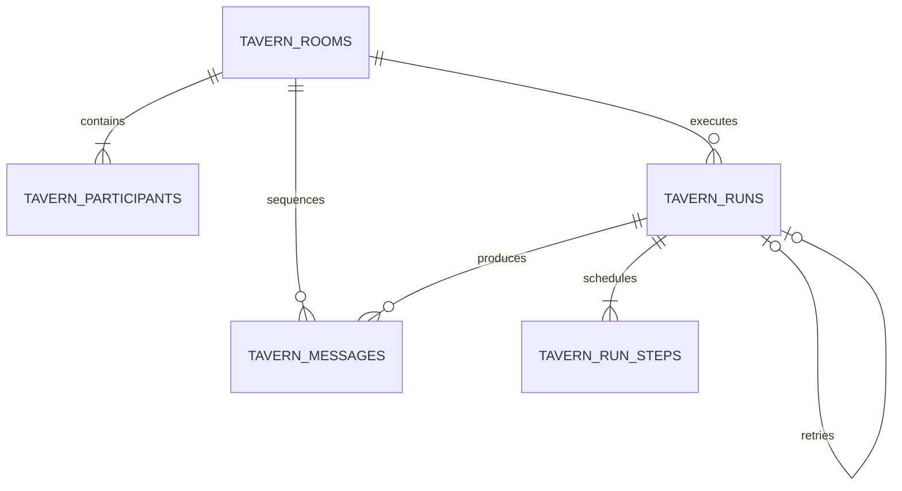

# Tavern Architecture

## Purpose

The Tavern is a separate interaction domain for conversations with saved personas and for user-directed interaction between personas. It reuses persona and scene snapshots, but it does not inherit the textbook, plan, citation, or Study Unit requirements of a Study Session. Its validation uses the repository-wide harness trace contract defined in `harness-engineering.md`; the harness is not Tavern-only.

Tavern CRUD, direct single-persona turns, facilitated multi-persona turns, explicit continuation, partial failure evidence, scoped child retry, database-clock leases, heartbeat and owner/claim fencing, bounded takeover claims, resume, cancel, an authoritative retry-chain recovery view, structured mutation errors, provider-preflight prompt budgets, and the browser Tavern Workspace are implemented. Truly cancelable provider transport, v3 trace migration/protected replay, and the full eval matrix remain separate iterations.

## Canonical vocabulary

- `Tavern Room`: a durable conversation container with an optional scene, a cast, a monotonic revision, and a monotonic message sequence.
- `Tavern Participant`: a room-scoped persona snapshot. `persona_snapshot` and `prompt_hash` keep an existing room stable when the source persona is later edited.
- `Tavern Message`: an append-only user, persona, director, or system message. The server owns `author_kind`, persona attribution, and sequence assignment.
- `Tavern Run`: one idempotent generation attempt. A run records its trigger, server-owned schedule, context digest, lineage, terminal sequence, status, and harness traces.
- `Tavern Speaker Step`: one normalized scheduled actor attempt. Its state is `pending`, `generating`, `completed`, `failed`, `blocked`, or `canceled`.
- `Harness Trace`: repository-wide validation/repair evidence attached to a generated persona message and summarized by its run.

## Normalized storage

The migration creates:

- `tavern_rooms`: title, scene snapshot, harness policy, status, revision, last sequence, and creation-request digest.
- `tavern_participants`: ordered cast with immutable persona snapshot and prompt hash; unique per room/persona.
- `tavern_messages`: append-only content with unique `(room_id, sequence)`.
- `tavern_runs`: unique `(room_id, idempotency_key)` generation attempt plus unique optional `parent_run_id` for one direct child retry.
- `tavern_run_steps`: composite `(run_id, step_index)` schedule with unique persona/message ownership, prompt hash, reply anchor, status, error, per-actor trace, database-clock lease owner/expiry, and bounded claim count.

Fresh SQLite and PostgreSQL schemas enforce the retry self-foreign-key. The local SQLite compatibility migration rebuilds earlier `tavern_runs` tables instead of only adding a column, preserves existing run-step rows, restores the self-FK, and finishes with `PRAGMA foreign_key_check`. Message/run/step cross-references that remain application-level constraints are tracked under `SCH-TAV-001`.

Tavern messages intentionally do not use the legacy aggregate `LocalJsonStore.save_list` path. That path rewrites complete collections and cannot provide safe concurrent append semantics.

## Contract boundaries

Python contracts live in `services/ai/app/models/tavern.py`. Shared frontend contracts live in `packages/shared/src/tavern.ts`. Browser wire validation lives in `apps/web/lib/tavern-decode.ts`, and monotonic message/run reconciliation lives in `apps/web/lib/tavern-workspace-state.ts`.

The model-owned `TavernActorReply` is deliberately smaller than a persisted message. The model may propose text, performance state, and addressed participants. It never owns:

- speaker/persona identity;
- room ID or message sequence;
- run status or room revision;
- committed scene, relationship, or memory mutations.

Those fields are assigned and validated by the server-side harness.

## Required transaction flow

1. Transaction A atomically claims `expected_room_revision`, verifies the idempotency key and normalized request digest, optionally appends a real user message, creates the pending run, and inserts its immutable speaker steps.
2. The server claims exactly one step. Actor model work happens outside a database transaction and uses read-only bounded context.
3. The harness validates strict shape, speaker identity, targets, scheduled reply linkage, persona boundaries, length, and prompt-material leakage.
4. A short transaction appends only that validated persona message, assigns the next room sequence, links it to its step, and either advances or completes the run.
5. Steps execute sequentially. The next actor reads the prior committed message and replies to it; the service does not hold an in-process room lock across model I/O.
6. On failure, prior completed actor messages remain, the current step becomes `failed`, later steps become `blocked`, and the run becomes `failed` or `partial`. Unvalidated output is never committed.
7. A heartbeat renews a generating step from a separate thread while synchronous provider work is in flight. Renew, takeover, complete, and fail all use the database clock plus owner and claim-epoch fencing; an expired owner cannot revive or commit.
8. Each step has at most three ownership claims: the initial claim and two crash takeovers. Exhaustion atomically persists an operational `lease_recovery` failure trace, preserves completed messages, blocks later steps, and terminates the run as `failed` or `partial`.

Room update, turn start, and destructive deletion compete through the same database-owned claim. SQLite does not rely on `SELECT FOR UPDATE`; PostgreSQL and SQLite therefore expose the same revision/run-in-progress conflicts. Permanent deletion is rejected while a run is pending.

## Product-level interaction modes

- `direct`: exactly one selected persona and either a `user_message` or `continue` trigger.
- `facilitated`: two to four selected personas and either a `user_message` or `continue` trigger.

`target_persona_ids` is a participant set, not a caller-owned sequence. `schedule-v1` filters the room roster and preserves `TavernParticipant.display_order`; permuting the same target set therefore replays the same idempotent request. A future user-authored order must use a new explicit contract instead of overloading this field.

`continue` must anchor the current latest message and does not fabricate a visible user/director message. Each persona still speaks at most once per run. The first reply points to the user/continue anchor; every later reply points to the preceding committed persona message.

The UI derives the mode from recipient selection. Internal scheduling details and raw harness codes remain folded under `Reliability Details`. `Interaction Composer` reads the authoritative recovery projection rather than inferring lineage from the bounded recent-run list: it names unfinished roles, explains that committed replies will not be regenerated, starts the leaf-scoped child retry without using the current recipient selection, and renders a completed child as “recovered” without another retry action.

## Browser Tavern Workspace

`/tavern` exposes the seven standard blocks used by product and test discussions:

- `Tavern Header`: page identity, active room title, create action, and current status;
- `Tavern Session Panel`: recent rooms and room switching; archive/restore currently belongs to `Tavern Header`, while broader room management is not implemented;
- `Tavern Setup Panel`: title, optional scene, 1–6 persona multi-select, and idempotent creation;
- `Tavern Conversation Panel`: ordered user/director/persona/system transcript and backward paging;
- `Participant Roster`: cast, target selection, and per-persona generation state;
- `Interaction Composer`: visible message, hidden next-round guidance, recipient preview, send/continue, cancel-receipt controls, and a visible scoped-recovery callout for the latest eligible facilitated run;
- `Reliability Details`: collapsed run/step/check evidence; raw provider/debug material belongs in the global Debug Overlay.

One selected target starts a direct run; two to four targets start a facilitated run in server-owned display order. Guidance is carried as hidden orchestration context and is never appended as a visible director message. Continue anchors the latest visible message without fabricating a user turn.

Responsive DOM order follows the current task rather than desktop column order. Without an active Room, Session and Setup precede a compact empty Conversation and the disabled Composer/Roster are not rendered. With an active Room, Composer/Roster/Recovery precede Conversation and Session on narrow viewports; desktop grid placement remains Session, Conversation, Composer. The create action scrolls to and focuses the Setup title.

`Participant Roster` treats server speaker steps as authoritative whenever they exist. The pre-response projection marks only the first display-order target as generating and later targets as pending. When there is no active run, terminal step labels are explicitly scoped to the previous round instead of looking like current generation state.

The client requests a 40-message tail and uses `next_before_sequence` to prepend older pages. It binds async work to the active room/mutation operation, merges messages by sequence and identity, prevents terminal runs from regressing to pending, preserves idempotency drafts across uncertain failures, and rejects malformed Tavern aggregates through a typed `TavernDecodeError`.

Keyboard handling suppresses Enter while a composition is active (including key code 229 and the composition-end trailing event); Shift+Enter inserts a newline. The responsive DOM order follows the primary mobile reading/focus flow, with explicit desktop grid placement.

Static/state tests, populated real-backend wire acceptance, keyboard composition fencing, authoritative recovery/roster derivation, structured mutation-error and provider-call fencing, keyboard focus return, and an earlier 390px no-overflow inspection have passed. A non-implementer live matrix covered direct/facilitated/partial/resume/cancel state, recovery lineage, refresh, retry badges, 502 read-back, and failure cases. Tavern navigation, action buttons, Setup inputs/selects, older-message control, and provider details now have 44px static touch-target contracts; the v0.2.1 acceptance environment could not expose a dedicated 390×844 browser viewport, so a fresh device-level visual/touch measurement is not claimed. `UX-001` remains open for the no-Persona/no-Room viewport, device-level IME, and full focus-order acceptance. The optional `TAVERN_TEST_API_URL` decoder fixture is skipped unless a populated backend with messages and a terminal run is explicitly supplied.

## Performance boundaries

- At most 6 participants per room.
- At most 4 generated persona messages per run.
- Message reads support forward, backward, and latest-page cursors and are capped at 200 rows per request; every returned page stays in ascending transcript order.
- Room history uses `tavern-room-list-v1`: default 30/max 50 summaries, `(updated_at DESC, id DESC)` opaque cursor paging, `limit + 1`, and batched participant/message-count aggregation in at most four SQL statements. A descending composite index serves the stable ordering. The browser appends and deduplicates pages, pins independently loaded selected Room detail, and caps summary buttons at 100 rather than rendering the full history.
- `tavern-prompt-budget-v1` runs before every provider implementation. Canonical system/user plus possible schema-recovery messages are at most 256 KiB UTF-8 and use a deterministic conservative input estimate of at most 48k tokens. Scene snapshots are at most 64 KiB with a maximum Scene-layer recursion depth of 8; transcript JSON is at most 128 KiB; Persona instruction and cast JSON are each at most 64 KiB.
- Transcript pressure is recovered only by sorting committed messages by `(sequence, id)` and removing the oldest first. Scene, Persona, cast, or final-total overflow raises a stable `tavern_prompt_*` error before the provider boundary. Successful preflight records budget version, original/final bytes, token estimate, and removed-message count; rejected preflight records the failed partition plus numeric actual/limit. Both legacy v1 trace shapes remain content-free and are not v3 replay/eval evidence. Real-tokenizer/provider p50/p95 and regression thresholds remain under `HRN-TAV-PERF-001`.

## Runtime and recovery implementation

`POST /tavern/rooms/{room_id}/turns` accepts a discriminated `input` trigger plus `direct` or `facilitated` mode. Room creation and turns require idempotency keys. Every mutating run start uses a database-level revision CAS and rejects another pending run. Update/delete still use a small local coordination lock, but generation never keeps it across provider latency.

The Tavern-specific persona compiler is separate from the teaching compiler. It keeps persona anchors, relationship, address, slots, and relevant additional setting, while explicitly removing the requirement to force conversation back to textbooks or learning tasks. Persona fields are user-editable, so compiled persona material is passed as delimited low-trust data; only invariant platform rules and the strict output schema occupy the system layer.

Actor generation requests strict `TavernActorReply` JSON in which every declared property is required and exposes only model-owned text/performance/target proposals. The semantic harness then checks speaker attribution, target membership, the required prior-speaker target, length, prompt-material leakage across every persisted display field, and non-empty output. `tavern-speaker-identity-v2` centrally compiles every other participant's display name, Persona ID, and collision-reviewable ID alias (for example `persona-b` → `b`); it allows ordinary third-person mentions but identifies quoted/Markdown/script speaker labels, attributed quotations, and other-role inner activity across Unicode colon variants. Identity comparison uses whole-string compatibility/caseless normalization plus a reviewed set of invisible default-ignorable format controls, while deterministic repair maps the match back to the original text before truncation and then re-scans every model-owned display/performance field; an empty or remaining violation fails closed. Transport/schema recovery is merged into the persisted trace; exhausted decode and provider failures also produce failed traces. Failed output is not stored as a persona message. Recent-run history remains a bounded debug window (default 50). `GET /tavern/rooms/{room_id}/run-recovery` independently loads complete room lineage, validates a single linear child chain per root, and returns a bounded set of root summaries whose `leaf_run` determines `active`, `recoverable`, `recovered`, `completed`, or `canceled` state.

`POST /tavern/rooms/{room_id}/runs/{run_id}/retry` accepts only terminal `failed` or `partial` sources. It creates a child run for failed/blocked actors, never appends another user message, never repeats completed actors, and permits at most one direct child. Retry is rejected when the room is archived or when revision, terminal sequence, versioned context digest, participant set, or participant prompt hash has changed. The source run remains immutable and terminal.

`POST /tavern/rooms/{room_id}/runs/{run_id}/resume` resumes pending steps, skips already committed steps, rejects active leases, and takes over expired leases within the claim budget. `POST /tavern/rooms/{room_id}/runs/{run_id}/cancel` is idempotent for an already-canceled run and atomically fences both commits and future recovery. The synchronous LiteLLM transport cannot yet abort an already-issued request: cancel prevents its output from committing and prevents later transport/schema fallback calls, but the in-flight request may continue until its provider timeout. This is an explicit best-effort boundary tracked by `TAV-CANCEL-TRANSPORT-001`.

The initial failing HTTP request returns `502` after failure evidence is committed. Tavern mutation failures use a structured detail envelope with `code`, `run_id`, `child_run_id`, `current_revision`, and `recovery_action`. Only `replay_same_request` authorizes the API client to repeat the exact URL/body once with the original revision and idempotency key; the resulting typed `200` envelope reads the already-terminal run without invoking the model again. Clients still inspect `run.status` and do not equate HTTP `200` with a completed generation.
