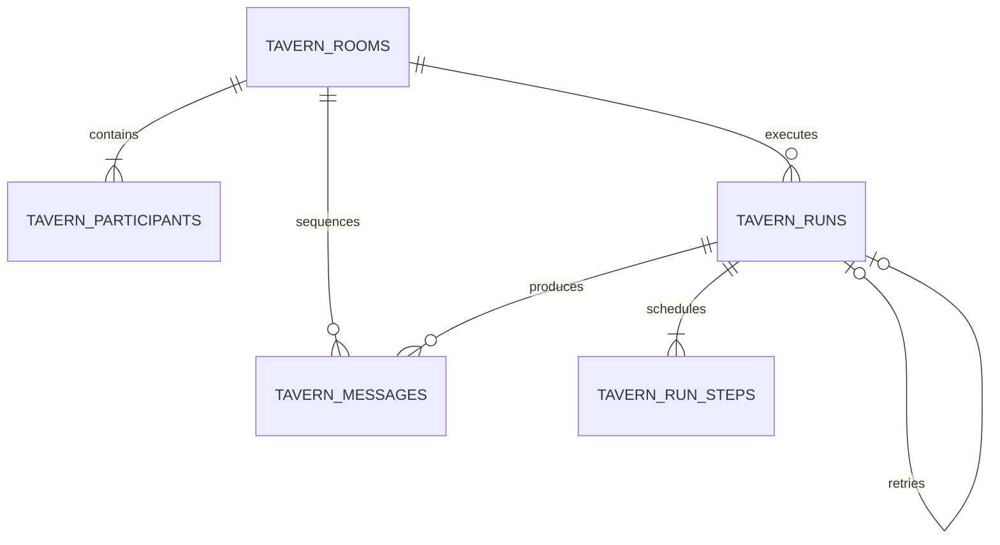

# Tavern Architecture

## Purpose

The Tavern is a separate interaction domain for conversations with saved personas and for user-directed interaction between personas. It reuses persona and scene snapshots, but it does not inherit the textbook, plan, citation, or Study Unit requirements of a Study Session. Its validation uses the repository-wide harness trace contract defined in `harness-engineering.md`; the harness is not Tavern-only.

The schema landed before the runtime/API so the persistence and harness boundaries could be reviewed independently. Tavern CRUD, direct single-persona turns, facilitated multi-persona turns, explicit continuation, partial failure evidence, scoped child retry, stale-run takeover, bounded claims, resume, and cancel are now implemented. The browser workspace, truly cancelable provider transport, prompt budgets, and eval matrix remain separate iterations.

## Canonical vocabulary

- `Tavern Room`: a durable conversation container with an optional scene, a cast, a monotonic revision, and a monotonic message sequence.
- `Tavern Participant`: a room-scoped persona snapshot. `persona_snapshot` and `prompt_hash` keep an existing room stable when the source persona is later edited.
- `Tavern Message`: an append-only user, persona, director, or system message. The server owns `author_kind`, persona attribution, and sequence assignment.
- `Tavern Run`: one idempotent generation attempt. A run records its trigger, server-owned schedule, context digest, lineage, terminal sequence, status, and harness traces.
- `Tavern Speaker Step`: one normalized scheduled actor attempt. Its state is `pending`, `generating`, `completed`, `failed`, `blocked`, or `canceled`.
- `Harness Trace`: repository-wide validation/repair evidence attached to a generated persona message and summarized by its run.

## Normalized storage

The migration creates:

- `tavern_rooms`: title, scene snapshot, harness policy, status, revision, last sequence, and creation-request digest.
- `tavern_participants`: ordered cast with immutable persona snapshot and prompt hash; unique per room/persona.
- `tavern_messages`: append-only content with unique `(room_id, sequence)`.
- `tavern_runs`: unique `(room_id, idempotency_key)` generation attempt plus unique optional `parent_run_id` for one direct child retry.
- `tavern_run_steps`: composite `(run_id, step_index)` schedule with unique persona/message ownership, prompt hash, reply anchor, status, error, per-actor trace, database-clock lease owner/expiry, and bounded claim count.

Fresh SQLite and PostgreSQL schemas enforce the retry self-foreign-key. The local SQLite compatibility migration rebuilds earlier `tavern_runs` tables instead of only adding a column, preserves existing run-step rows, restores the self-FK, and finishes with `PRAGMA foreign_key_check`. Message/run/step cross-references that remain application-level constraints are tracked under `SCH-TAV-001`.

Tavern messages intentionally do not use the legacy aggregate `LocalJsonStore.save_list` path. That path rewrites complete collections and cannot provide safe concurrent append semantics.

## Contract boundaries

Python contracts live in `services/ai/app/models/tavern.py`. Shared frontend contracts live in `packages/shared/src/tavern.ts`.

The model-owned `TavernActorReply` is deliberately smaller than a persisted message. The model may propose text, performance state, and addressed participants. It never owns:

- speaker/persona identity;
- room ID or message sequence;
- run status or room revision;
- committed scene, relationship, or memory mutations.

Those fields are assigned and validated by the server-side harness.

## Required transaction flow

1. Transaction A atomically claims `expected_room_revision`, verifies the idempotency key and normalized request digest, optionally appends a real user message, creates the pending run, and inserts its immutable speaker steps.
2. The server claims exactly one step. Actor model work happens outside a database transaction and uses read-only bounded context.
3. The harness validates strict shape, speaker identity, targets, scheduled reply linkage, persona boundaries, length, and prompt-material leakage.
4. A short transaction appends only that validated persona message, assigns the next room sequence, links it to its step, and either advances or completes the run.
5. Steps execute sequentially. The next actor reads the prior committed message and replies to it; the service does not hold an in-process room lock across model I/O.
6. On failure, prior completed actor messages remain, the current step becomes `failed`, later steps become `blocked`, and the run becomes `failed` or `partial`. Unvalidated output is never committed.
7. A heartbeat renews a generating step from a separate thread while synchronous provider work is in flight. Renew, takeover, complete, and fail all use the database clock plus owner and claim-epoch fencing; an expired owner cannot revive or commit.
8. Each step has at most three ownership claims: the initial claim and two crash takeovers. Exhaustion atomically persists an operational `lease_recovery` failure trace, preserves completed messages, blocks later steps, and terminates the run as `failed` or `partial`.

Room update, turn start, and destructive deletion compete through the same database-owned claim. SQLite does not rely on `SELECT FOR UPDATE`; PostgreSQL and SQLite therefore expose the same revision/run-in-progress conflicts. Permanent deletion is rejected while a run is pending.

## Product-level interaction modes

- `direct`: exactly one selected persona and either a `user_message` or `continue` trigger.
- `facilitated`: two to four selected personas and either a `user_message` or `continue` trigger.

`target_persona_ids` is a participant set, not a caller-owned sequence. `schedule-v1` filters the room roster and preserves `TavernParticipant.display_order`; permuting the same target set therefore replays the same idempotent request. A future user-authored order must use a new explicit contract instead of overloading this field.

`continue` must anchor the current latest message and does not fabricate a visible user/director message. Each persona still speaks at most once per run. The first reply points to the user/continue anchor; every later reply points to the preceding committed persona message.

The UI derives the mode from recipient selection. Internal scheduling details and raw harness codes remain folded under Reliability Details instead of becoming primary controls.

## Performance boundaries

- At most 6 participants per room.
- At most 4 generated persona messages per run.
- Message reads support forward, backward, and latest-page cursors and are capped at 200 rows per request; every returned page stays in ascending transcript order.
- Room history lists use batched participant and message-count queries rather than loading transcripts.
- Long-context summary/embedding work is deferred; raw history must remain bounded by a prompt budget before it is enabled.

## Runtime and recovery implementation

`POST /tavern/rooms/{room_id}/turns` accepts a discriminated `input` trigger plus `direct` or `facilitated` mode. Room creation and turns require idempotency keys. Every mutating run start uses a database-level revision CAS and rejects another pending run. Update/delete still use a small local coordination lock, but generation never keeps it across provider latency.

The Tavern-specific persona compiler is separate from the teaching compiler. It keeps persona anchors, relationship, address, slots, and relevant additional setting, while explicitly removing the requirement to force conversation back to textbooks or learning tasks. Persona fields are user-editable, so compiled persona material is passed as delimited low-trust data; only invariant platform rules and the strict output schema occupy the system layer.

Actor generation requests strict `TavernActorReply` JSON in which every declared property is required and exposes only model-owned text/performance/target proposals. The semantic harness then checks speaker attribution, target membership, the required prior-speaker target, length, prompt-material leakage across every persisted display field, and non-empty output. Transport/schema recovery is merged into the persisted trace; exhausted decode and provider failures also produce failed traces. Failed output is not stored as a persona message, and recent-run history makes the evidence recoverable after refresh.

`POST /tavern/rooms/{room_id}/runs/{run_id}/retry` accepts only terminal `failed` or `partial` sources. It creates a child run for failed/blocked actors, never appends another user message, never repeats completed actors, and permits at most one direct child. Retry is rejected when the room is archived or when revision, terminal sequence, versioned context digest, participant set, or participant prompt hash has changed. The source run remains immutable and terminal.

`POST /tavern/rooms/{room_id}/runs/{run_id}/resume` resumes pending steps, skips already committed steps, rejects active leases, and takes over expired leases within the claim budget. `POST /tavern/rooms/{room_id}/runs/{run_id}/cancel` is idempotent for an already-canceled run and atomically fences both commits and future recovery. The synchronous LiteLLM transport cannot yet abort an already-issued request: cancel prevents its output from committing and prevents later transport/schema fallback calls, but the in-flight request may continue until its provider timeout. This is an explicit best-effort boundary tracked by `TAV-CANCEL-TRANSPORT-001`.

The initial failing HTTP request returns `502` after failure evidence is committed. Replaying the identical turn/retry idempotency key returns a typed `200` recovery envelope containing the same terminal run; this deliberate recovery contract lets a client recover after losing the first response without invoking the model again. Clients must inspect `run.status`, not equate HTTP `200` with a completed generation.
