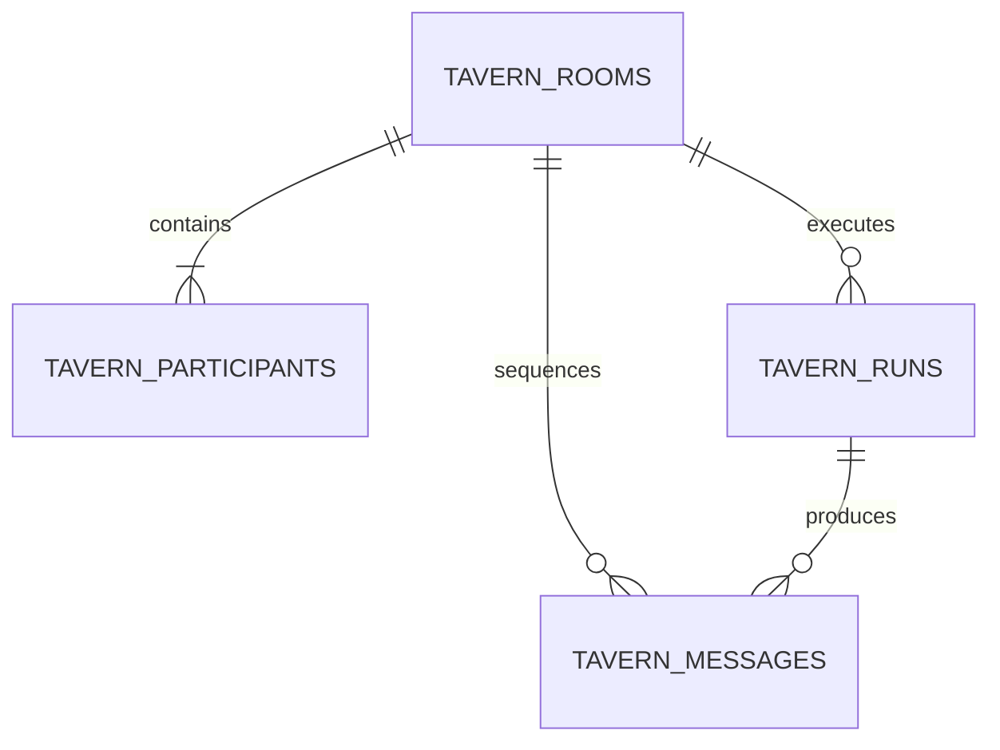

# Tavern Architecture

## Purpose

The Tavern is a separate interaction domain for conversations with saved personas and for user-directed interaction between personas. It reuses persona and scene snapshots, but it does not inherit the textbook, plan, citation, or Study Unit requirements of a Study Session. Its validation uses the repository-wide harness trace contract defined in `harness-engineering.md`; the harness is not Tavern-only.

The first schema landed before the runtime/API so the persistence and harness boundaries can be reviewed independently. User-facing routes remain follow-up work until the complete turn flow is validated.

## Canonical vocabulary

- `Tavern Room`: a durable conversation container with an optional scene, a cast, a monotonic revision, and a monotonic message sequence.
- `Tavern Participant`: a room-scoped persona snapshot. `persona_snapshot` and `prompt_hash` keep an existing room stable when the source persona is later edited.
- `Tavern Message`: an append-only user, persona, director, or system message. The server owns `author_kind`, persona attribution, and sequence assignment.
- `Tavern Run`: one idempotent user-triggered generation attempt. A run records scheduling input, status, generated message IDs, failure state, and harness trace.
- `Harness Trace`: repository-wide validation/repair evidence attached to a generated persona message and summarized by its run.

## Normalized storage

The migration creates:

- `tavern_rooms`: title, scene snapshot, harness policy, status, revision, and last sequence.
- `tavern_participants`: ordered cast with immutable persona snapshot and prompt hash; unique per room/persona.
- `tavern_messages`: append-only content with unique `(room_id, sequence)`.
- `tavern_runs`: unique `(room_id, idempotency_key)` generation attempt and recovery trace.

Tavern messages intentionally do not use the legacy aggregate `LocalJsonStore.save_list` path. That path rewrites complete collections and cannot provide safe concurrent append semantics.

## Contract boundaries

Python contracts live in `services/ai/app/models/tavern.py`. Shared frontend contracts live in `packages/shared/src/tavern.ts`.

The model-owned `TavernActorReply` is deliberately smaller than a persisted message. The model may propose text, performance state, and addressed participants. It never owns:

- speaker/persona identity;
- room ID or message sequence;
- run status or room revision;
- committed scene, relationship, or memory mutations.

Those fields are assigned and validated by the server-side harness.

## Required transaction flow

1. Transaction A locks the room, checks `expected_room_revision` and the idempotency key, appends the user message, and creates a pending run.
2. The director/actor model work happens outside a database transaction and uses read-only context.
3. The harness validates speaker identity, targets, persona boundaries, length, and strict response shape.
4. Transaction B locks the room, appends only validated persona messages with unique sequences, and completes the run.
5. On failure, the user message and failed run remain explainable; unvalidated persona output and partial state effects are not committed.

## Product-level interaction modes

- `direct`: exactly one server-scheduled persona message.
- `facilitated`: two or more selected personas respond in a visible deterministic order, each at most once in the MVP.

The UI derives the mode from recipient selection. Internal scheduling details and raw harness codes remain folded under Reliability Details instead of becoming primary controls.

## Performance boundaries

- At most 6 participants per room.
- At most 4 generated persona messages per run.
- Message reads are cursor-based and capped at 200 rows per request.
- Room history lists use batched participant and message-count queries rather than loading transcripts.
- Long-context summary/embedding work is deferred; raw history must remain bounded by a prompt budget before it is enabled.
